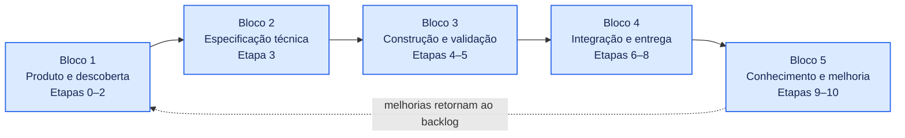
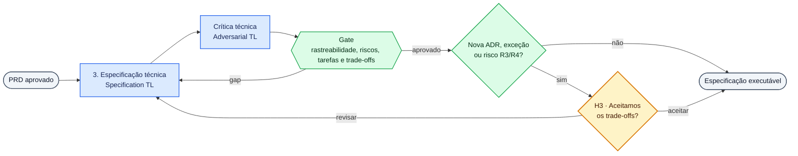
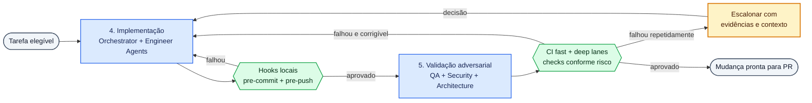
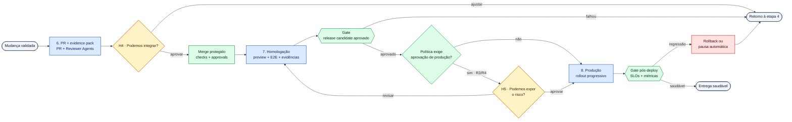

# Agent Team — jornada por fases

> Visão fragmentada do [fluxo completo](end-to-end-journey.md), desenhada para análise por partes e uso em slides. Os contratos de interação entre os agentes estão no [mapa de workflows](../workflows/README.md).

## Mapa dos blocos

---

## Bloco 1 — produto e descoberta

### Escopo

- Workflows: [intake](../workflows/00-intake-and-triage.md), [discovery e research](../workflows/01-discovery-and-research.md) e [planejamento de produto e UX](../workflows/02-product-and-ux-planning.md)
- Etapa 0: backlog e triagem
- Etapa 1: discovery multiagente
- Etapa 2: planejamento de produto
- Checkpoints humanos: H1 e H2
- Artefatos principais: `PB.md` e `PRD.md`

```mermaid
flowchart LR
    IN([Problema ou oportunidade])

    S0["0. Backlog e triagem<br/>Intake + PM Agents"]
    G0{{"Gate<br/>contexto, owner, duplicidade e risco"}}

    S1["1. Discovery<br/>PM + UX Spec + Tech Lead"]
    G1{{"Gate<br/>problema, usuário, experiência e viabilidade"}}
    H1{"H1 · Vale investir?"}

    S2["2. Planejamento<br/>PM + Adversarial PM"]
    G2{{"Gate<br/>clareza, aceite, escopo e métricas"}}
    H2{"H2 · É isto que<br/>construiremos?"}

    OUT([PRD aprovado])

    IN --> S0 --> G0
    G0 -- "incompleto" --> S0
    G0 -- "aprovado" --> S1 --> G1
    G1 -- "gap" --> S1
    G1 -- "aprovado" --> H1
    H1 -- "ajustar" --> S1
    H1 -- "adiar" --> S0
    H1 -- "avançar" --> S2 --> G2
    G2 -- "ambiguidade" --> S2
    G2 -- "aprovado" --> H2
    H2 -- "revisar" --> S2
    H2 -- "aprovar" --> OUT

    classDef agent fill:#dbeafe,stroke:#2563eb,color:#172554,stroke-width:1.5px;
    classDef automation fill:#dcfce7,stroke:#16a34a,color:#052e16,stroke-width:1.5px;
    classDef human fill:#fef3c7,stroke:#d97706,color:#451a03,stroke-width:2px;
    classDef terminal fill:#f1f5f9,stroke:#475569,color:#0f172a,stroke-width:1.5px;
    class S0,S1,S2 agent;
    class G0,G1,G2 automation;
    class H1,H2 human;
    class IN,OUT terminal;
```

### Foco da discussão

- O problema está claro antes de discutir solução?
- Usuário, experiência e viabilidade foram analisados juntos?
- O adversarial PM encontrou ambiguidades reais?
- Os humanos decidiram valor e escopo, não detalhes operacionais?

---

## Bloco 2 — especificação técnica

### Escopo

- Workflow: [especificação técnica](../workflows/03-technical-specification.md)
- Etapa 3: especificação e crítica técnica
- Checkpoint humano: H3 condicional
- Artefatos: `PLAN.md`, `ADR.md`, `SPEC.md`, `TASKS.md` e `CHECKLIST.md`

### Foco da discussão

- A solução responde ao PRD sem ampliar o escopo?
- Alternativas e trade-offs foram registrados?
- As tarefas podem ser implementadas e validadas isoladamente?
- H3 está reservado a decisões realmente estruturais ou arriscadas?

---

## Bloco 3 — construção e validação

### Escopo

- Workflows: [implementação autônoma](../workflows/04-autonomous-implementation.md) e [validação adversarial](../workflows/05-adversarial-validation.md)
- Etapa 4: implementação autônoma
- Etapa 5: validação adversarial
- Intervenção humana somente por exceção
- Saída: mudança pronta para PR

### Foco da discussão

- Quais falhas podem ser corrigidas automaticamente?
- Quais checks pertencem ao hook local ou à CI?
- A deep lane é acionada por risco e paths alterados?
- O escalonamento entrega uma decisão objetiva ao humano?

---

## Bloco 4 — integração e entrega

### Escopo

- Workflows: [PR e merge](../workflows/06-pr-and-merge.md), [homologação](../workflows/07-release-candidate-validation.md) e [produção e observação](../workflows/08-production-release-and-observation.md)
- Etapa 6: PR e decisão de merge
- Etapa 7: homologação automatizada
- Etapa 8: produção e observação inicial
- Checkpoints humanos: H4 e H5

### Foco da discussão

- O evidence pack permite review sem ler todo o diff?
- H4 varia corretamente conforme a classe de risco?
- A homologação comprova critérios de aceite?
- Deploy e rollback foram automatizados antes de reduzir H5?

---

## Bloco 5 — conhecimento e melhoria contínua

### Escopo

- Workflows: [curadoria de conhecimento](../workflows/09-knowledge-curation.md) e [telemetria e melhoria contínua](../workflows/10-continuous-improvement.md)
- Etapa 9: conhecimento específico da entrega
- Etapa 10: Auto Dream semanal
- Checkpoint humano: H6 condicional ou por amostragem
- Saídas: `MEMORY.md` e demandas de melhoria

```mermaid
flowchart LR
    IN([Entrega e sessões concluídas])
    S9["9. Conhecimento da entrega<br/>Knowledge Agent"]
    OBS["Sessões + feedback + gates<br/>falhas + retries + métricas"]
    WEEK([Agenda semanal])
    S10["10. Auto Dream<br/>análise do sistema de trabalho"]
    CRITIC["Critic Agent<br/>confirma ou contesta conclusões"]
    SENSITIVE{"Memória sensível, P0/P1<br/>ou mudança de gate?"}
    H6{"H6 · O sistema aprendeu<br/>corretamente?"}
    TYPE{"Resultado analisado"}
    MEMORY["Aprendizado validado<br/>atualizar MEMORY.md"]
    DEMAND["Falha ou atrito<br/>gerar demanda no backlog"]
    BACKLOG([Próximo ciclo])

    IN --> S9 --> OBS
    IN --> OBS
    WEEK --> S10
    OBS --> S10 --> CRITIC --> SENSITIVE
    SENSITIVE -- "sim" --> H6
    SENSITIVE -- "não ou amostragem" --> TYPE
    H6 -- "aprovar" --> TYPE
    H6 -- "mais evidências" --> S10
    TYPE -- "funcionou" --> MEMORY
    TYPE -- "deu errado" --> DEMAND
    MEMORY -. "contexto reutilizável" .-> BACKLOG
    DEMAND -- "melhoria priorizável" --> BACKLOG

    classDef agent fill:#dbeafe,stroke:#2563eb,color:#172554,stroke-width:1.5px;
    classDef automation fill:#dcfce7,stroke:#16a34a,color:#052e16,stroke-width:1.5px;
    classDef human fill:#fef3c7,stroke:#d97706,color:#451a03,stroke-width:2px;
    classDef knowledge fill:#f3e8ff,stroke:#9333ea,color:#3b0764,stroke-width:1.5px;
    classDef terminal fill:#f1f5f9,stroke:#475569,color:#0f172a,stroke-width:1.5px;
    class S9,S10,CRITIC agent;
    class SENSITIVE,TYPE automation;
    class H6 human;
    class OBS,WEEK,MEMORY,DEMAND knowledge;
    class IN,BACKLOG terminal;
```

### Foco da discussão

- O aprendizado possui evidência e contexto de aplicação?
- O Critic Agent é independente de quem gerou a conclusão?
- Problemas recorrentes viram demandas acionáveis?
- H6 protege somente mudanças sensíveis sem virar gargalo?
- As melhorias retornam efetivamente ao backlog?

---

## Legenda comum

- **Azul:** Agent Teams e agentes especializados
- **Verde:** automações, gates, hooks e decisões por política
- **Amarelo:** decisão ou intervenção humana
- **Roxo:** conhecimento, telemetria e melhoria contínua
- **Vermelho:** recuperação ou rollback
- **Cinza:** entrada ou saída do bloco

## Uso sugerido

- Usar o mapa dos blocos para apresentar a jornada completa
- Usar um bloco por slide durante o detalhamento
- Discutir primeiro objetivos e decisões humanas
- Depois detalhar agentes, automações e gates
- Manter a numeração alinhada ao fluxo completo
