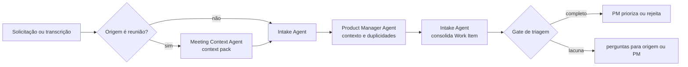

# Workflow — intake e triagem

Transforma uma solicitação bruta em um Work Item rastreável, sem permitir que triagem automática se torne decisão de prioridade.

| Aspecto | Contrato |
|---|---|
| Entrada | solicitação, incidente, feedback, oportunidade ou context pack de reunião |
| Consolida | Intake Agent |
| Colaboram | Meeting Context Agent quando a origem for reunião; Product Manager Agent para enriquecer contexto de produto |
| Saída | Work Item com problema, origem, produto, owner, duplicidades, dependências, risco preliminar e lacunas |
| Owner humano | Product Manager |
| Gate | problema, rastreabilidade, responsável e contexto mínimo explícitos |

## Sequência

1. O Meeting Context Agent, se acionado, separa fatos, decisões provisórias e itens que exigem confirmação; seu output é somente contexto de entrada.
2. O Intake Agent normaliza a demanda, vincula fontes e procura duplicidades e dependências.
3. O Product Manager Agent complementa valor, stakeholder, produto afetado e perguntas de negócio, sem definir a prioridade final.
4. O Intake Agent consolida um único Work Item e registra a origem de cada afirmação relevante.
5. O PM decide priorizar, devolver para esclarecimento ou encerrar.

## Escalonamento

Escalar ao PM quando o problema não puder ser identificado, houver conflito entre solicitações ou a prioridade exigir julgamento. Duplicidade não autoriza encerrar um item sem vínculo explícito ao item que o absorveu.
