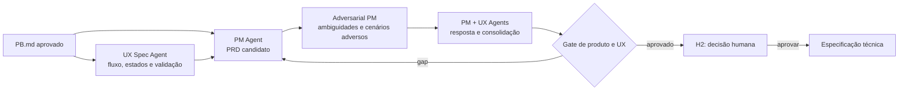

# Workflow — planejamento de produto e UX

Converte o problema aprovado em escopo, experiência e critérios de aceite coerentes. Produto e UX são coautores de artefatos distintos; o PM consolida o compromisso de produto.

| Aspecto | Contrato |
|---|---|
| Entrada | `PB.md`, decisão H1, evidências de usuário e restrições conhecidas |
| Consolida | Product Manager Agent para `PRD.md`; UX Specification Agent para UX spec |
| Colaboram | Adversarial Product Manager; agentes de research, conteúdo e prototipação quando necessários |
| Saída | `PRD.md`, jornada e fluxo desejados, UX spec, protótipo proporcional, critérios de UX e aceite |
| Owners humanos | PM para produto e UX para experiência |
| Gate | rastreabilidade `PB → PRD`, gaps críticos tratados, sucesso mensurável |

## Sequência

1. O PM Agent propõe objetivo, escopo, fora de escopo, métricas e critérios de produto no `PRD.md`.
2. O UX Specification Agent define jornada, fluxos, estados, conteúdo, acessibilidade, hipóteses e plano de validação; restrições descobertas devem retornar ao PRD.
3. Pesquisadores, UX writers e agentes de prototipação só entram por necessidade explícita e entregam insumos ao UX Agent, não versões concorrentes da fonte canônica.
4. O Adversarial PM avalia problema, métricas, escopo implícito, casos-limite e coerência entre PRD e UX spec.
5. PM e UX Agents registram a resposta a cada finding; o PM consolida o `PRD.md` e H2 fixa o compromisso.

## Escalonamento

Escalar aos owners quando produto e experiência exigirem trade-off de escopo, faltar evidência para hipótese crítica ou houver objetivo incompatível. Nenhum agente aprova seu próprio artefato; H2 aprova decisão, não edição linha a linha.
