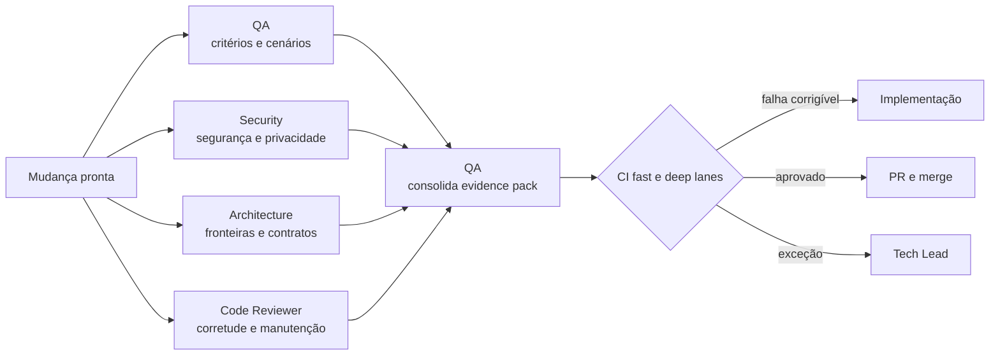

# Workflow — validação adversarial

Valida a mudança por perspectivas independentes e converte achados em um evidence pack único. Os reviewers não assumem que o resultado dos testes do autor é suficiente.

| Aspecto | Contrato |
|---|---|
| Entrada | diff, PRD, UX spec, SPEC, `CHECKLIST.md`, resultados locais e risco |
| Consolida | QA / Validation Agent |
| Colaboram | Security Review; Architecture Review; Adversarial Code Reviewer |
| Saída | checklist comprovado, findings classificados, evidências reproduzíveis e recomendação de gate |
| Owner humano | Tech Lead; PM e UX para seus critérios |
| Gate | todos os checks obrigatórios aprovados e nenhum bloqueador aberto |

## Sequência

1. O QA Agent deriva cobertura da `CHECKLIST.md` e executa cenários nominal, erro, recuperação, regressão e casos-limite.
2. Security, Architecture e Code Reviewer investigam em paralelo seus domínios e apresentam findings com evidência, severidade, impacto e ação sugerida.
3. O QA Agent consolida sem silenciar divergências, mapeando cada critério para evidência ou gap.
4. CI decide os checks requeridos pela classe de risco e pelos paths alterados. Findings corrigíveis voltam à implementação; toda correção material recebe nova validação proporcional.

## Escalonamento

Escalar falso positivo, exceção, requisito ausente ou divergência sem regra de desempate. O QA Agent não pode fechar sozinho um achado de outro reviewer sem evidência de revalidação.
