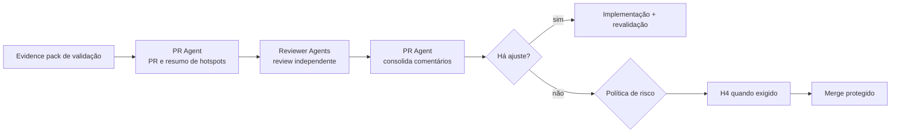

# Workflow — PR e merge

Empacota a mudança validada para uma decisão de integração proporcional ao risco. A PR não é uma segunda implementação: é a síntese auditável das evidências e dos hotspots.

| Aspecto | Contrato |
|---|---|
| Entrada | diff validado, commits, CI, checklist e evidence pack de validação |
| Consolida | PR Agent |
| Colaboram | Reviewer Agents e Code Owners exigidos pela política |
| Saída | PR rastreável, descrição de risco, aprovações válidas e decisão de merge |
| Owner humano | Tech Lead ou Code Owner conforme risco |
| Gate | CI verde, branch atualizada, aprovações exigidas e nenhuma exceção pendente |

## Sequência

1. O PR Agent gera descrição, comportamento alterado, risco, arquivos sensíveis, evidências, rollback e itens fora de escopo.
2. Reviewer Agents revisam corretude, segurança, arquitetura, testes, documentação e observabilidade dentro do próprio contrato, sem reproduzir o pacote inteiro de validação.
3. O PR Agent registra cada comentário e rota correções para implementação. Mudança material invalida aprovações e evidências afetadas.
4. H4 e o merge protegido obedecem à política R0–R4; o agente apenas prepara a recomendação.

## Escalonamento

Escalar quando uma aprovação exigida estiver indisponível, houver exceção de política, conflito de review ou CI não reproduzível. A ausência de resposta nunca conta como aprovação.
