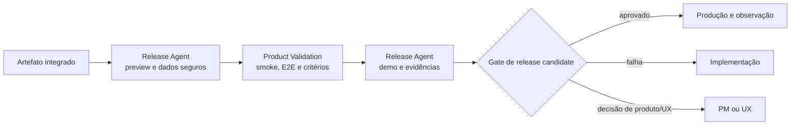

# Workflow — homologação

Confirma, em ambiente representativo, que a mudança integrada entrega os critérios de produto e experiência. Release prepara o ambiente; Product Validation consolida o aceite funcional.

| Aspecto | Contrato |
|---|---|
| Entrada | artefato imutável integrado, critérios de aceite, ambiente de preview/staging e dados seguros |
| Consolida | Product Validation Agent |
| Colabora | Release Agent |
| Saída | release candidate aprovado ou devolvido, demo/evidências e pendências registradas |
| Owners humanos | PM para valor; UX para experiência; stakeholder quando necessário |
| Gate | critérios de aceite validados ou plano de correção explícito |

## Sequência

1. O Release Agent cria o ambiente a partir do artefato imutável e fornece dados de teste seguros.
2. O Product Validation Agent confirma critérios de produto e UX por smoke, E2E, comparação visual e demonstração quando aplicável.
3. O Release Agent anexa a evidência de ambiente e execução; o Product Validation Agent consolida aceite ou gaps.
4. Falha de implementação retorna ao workflow de implementação; decisão de escopo ou experiência retorna aos seus owners e às etapas de produto/UX quando necessário.

## Escalonamento

Escalar se ambiente, dado de teste, critério de aceite ou comportamento esperado estiver ausente. Homologação não compensa requisito indefinido por aprovação informal.
