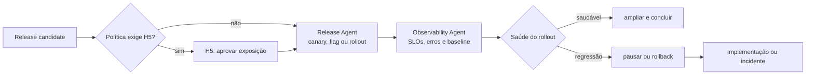

# Workflow — produção e observação

Libera um release candidate com exposição controlada e usa sinais operacionais para avançar, pausar ou reverter. O Release Agent executa a política; o Observability Agent interpreta e evidencia a saúde.

| Aspecto | Contrato |
|---|---|
| Entrada | release candidate aprovado, rollout/rollback, SLOs, alertas e autorizações |
| Consolida | Release Agent |
| Colabora | Observability Agent |
| Saída | versão liberada, health report, changelog e rollback/pausa quando aplicável |
| Owner humano | Tech Lead; PM coaprova R3/R4 |
| Gate | ambiente autorizado, migração compatível e janela pós-deploy sem regressão relevante |

## Sequência

1. O Release Agent verifica artefato, ambiente, secrets autorizados, migração, backup e capacidade de rollback.
2. H5 é aplicado conforme o risco; R3/R4 requerem aprovação explícita antes de produção.
3. O Release Agent executa a estratégia autorizada. O Observability Agent compara erros, latência, SLOs e métricas de produto com o baseline.
4. Sinal de regressão dispara pausa ou rollback conforme política, com evidence pack para o Tech Lead; estabilidade completa a janela pós-deploy.

## Escalonamento

Escalar quando rollback automático não for seguro, os sinais forem contraditórios ou o impacto exceder o plano de mitigação. O agente não pode manter exposição crescente diante de alerta crítico não explicado.
