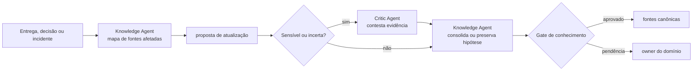

# Workflow — curadoria de conhecimento

Mantém as fontes canônicas alinhadas à entrega sem transformar memória temporária em verdade permanente. A crítica independente é obrigatória para alteração sensível ou conclusão de baixa confiança.

| Aspecto | Contrato |
|---|---|
| Entrada | decisões, PR, release, evidências de homologação, incidentes e fontes canônicas afetadas |
| Consolida | Knowledge Agent |
| Colabora | Critic Agent quando a mudança for sensível, contraditória ou de baixa confiança |
| Saída | documentação e conhecimento reutilizável atualizados, ou proposta explícita para revisão |
| Owner humano | owner do domínio alterado |
| Gate | rastreabilidade, atualidade e ausência de contradições não resolvidas |

## Sequência

1. O Knowledge Agent relaciona mudança e evidência às fontes canônicas afetadas e identifica conteúdo obsoleto ou contraditório.
2. Ele propõe a atualização com origem, data, contexto de aplicação e limites de validade.
3. Para memória sensível, baixa confiança ou contradição, o Critic Agent verifica se a conclusão é sustentada; hipótese inconclusiva permanece identificada como tal.
4. O Knowledge Agent consolida somente o que passou pelo gate e entrega links para auditoria ao owner do domínio.

## Escalonamento

Escalar ao owner se não houver fonte canônica definida, se a evidência conflitar ou se a alteração puder afetar política, segurança ou decisão vigente.
