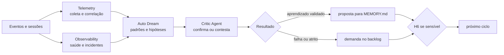

# Workflow — telemetria e melhoria contínua

Converte o histórico do sistema de trabalho em aprendizado validado ou demanda priorizável. Telemetry fornece dados íntegros; Auto Dream formula conclusões; Critic impede que um padrão aparente vire regra sem evidência.

| Aspecto | Contrato |
|---|---|
| Entrada | sessões, gates, retries, feedbacks, incidentes, métricas de custo/qualidade/autonomia e demandas anteriores |
| Consolida | Auto Dream Agent |
| Colaboram | Telemetry Agent, Observability Agent e Critic Agent independente |
| Saída | proposta de atualização de memória, demanda de melhoria, relatório semanal e hipóteses em observação |
| Owner humano | trio; PM ordena backlog; owner do domínio decide a execução |
| Gate | evidência, contexto, confiança, privacidade e contradições tratados |

## Sequência

1. Telemetry coleta eventos correlacionáveis e remove secrets e dados pessoais antes da análise. Observability acrescenta sinais de saúde, incidentes e rollbacks.
2. Auto Dream agrupa os dados por etapa, causa e impacto, compara com baseline e separa padrão, hipótese e ocorrência isolada.
3. O Critic Agent avalia conclusão, evidências, contradições e generalização indevida; é independente do Auto Dream.
4. Auto Dream consolida dois destinos: aprendizado com contexto e validade para `MEMORY.md`, ou demanda de melhoria com sintoma, evidência, impacto, causa provável, critério de aceite e owner recomendado.
5. H6 revisa mudança sensível de memória, P0/P1 e alteração de gate; itens de baixo risco podem seguir por amostragem.

## Escalonamento

Falha de coleta abre alerta, não conclusão silenciosa. Baixa confiança mantém hipótese em observação; contradição bloqueia atualização automática. O Auto Dream não aprova alterações nos próprios gates.
