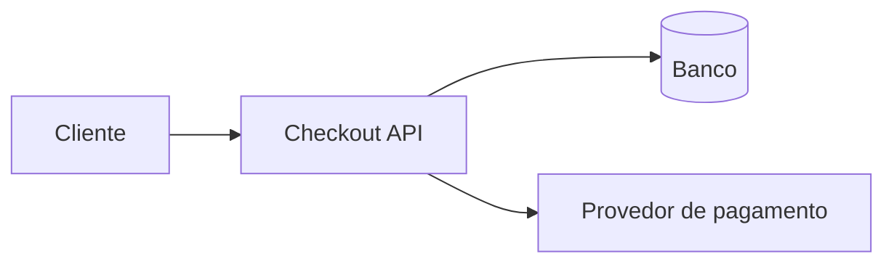

# Estado atual da arquitetura

O `checkout-api` expõe a criação de pagamentos, persiste seu estado e chama um provedor externo. A idempotência será aplicada na fronteira da aplicação e garantida por uma restrição única no armazenamento.

O diagrama registra a topologia, não o estado operacional dos checkouts locais.
