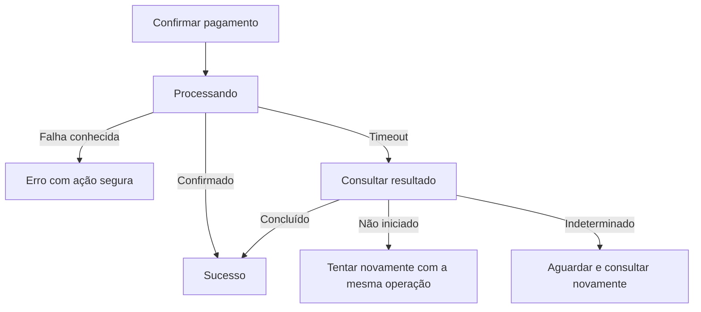

# Fluxo de retry do pagamento

```mermaid
flowchart TD
    A["Confirmar pagamento"] --> B["Processando"]
    B -->|"Confirmado"| C["Sucesso"]
    B -->|"Falha conhecida"| D["Erro com ação segura"]
    B -->|"Timeout"| E["Consultar resultado"]
    E -->|"Concluído"| C
    E -->|"Não iniciado"| F["Tentar novamente com a mesma operação"]
    E -->|"Indeterminado"| G["Aguardar e consultar novamente"]
```

Estados indeterminados não devem sugerir uma nova operação com identidade diferente.
