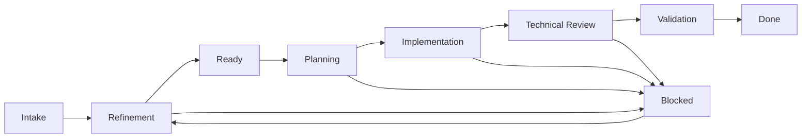

# Agent Team — workspace do Tech Lead

> Como organizar em disco o contexto, o planejamento, a execução e o aprendizado de vários projetos operados por múltiplos agentes ao mesmo tempo.

## Em 2 minutos

Quando vários agentes trabalham em paralelo sobre os mesmos projetos, o problema deixa de ser "onde guardo este arquivo" e passa a ser "qual dos três lugares onde este dado aparece é o verdadeiro". Sem uma resposta explícita, agentes começam a divergir silenciosamente e o trabalho se corrompe sem que ninguém perceba.

Este documento resolve isso com uma separação: **o projeto é a unidade de organização do trabalho; o repositório é a unidade de organização do código**. Um projeto pode envolver vários repositórios, e um repositório pode servir a mais de um projeto. A partir daí, cada tipo de informação tem exatamente um dono declarado na [tabela de fonte de verdade](#7-regras-de-fonte-de-verdade).

| Área | Guarda | Não guarda |
|---|---|---|
| `docs/` | conhecimento válido para vários projetos: padrões, playbooks, templates, portfólio | PRDs, specs e decisões de um projeto |
| `projects/<slug>/` | tudo que é específico do projeto, do contexto às evidências | código-fonte |
| `repos/` | clones locais e worktrees, espelhando a identidade do GitHub | artefatos de planejamento |
| `plans/` | estratégia de execução e material bruto de sessão | conclusões canônicas |
| `memory/` | contexto operacional temporário do agente | conhecimento validado |
| `coordination/` | comunicação transitória entre agentes | qualquer coisa persistente |

Duas regras derivam disso e valem para qualquer agente: uma informação nunca é autoritativa em dois lugares, e resumos apontam para a fonte original em vez de reproduzi-la.

---

## Mapa do documento

| Seção | Responde | Leia se você… |
|---|---|---|
| [1–2. Objetivo e estrutura](#1-objetivo) | Como a pasta é organizada | vai criar o workspace |
| [3. Responsabilidade de cada área](#3-responsabilidade-de-cada-área) | O que entra em cada diretório | está em dúvida sobre onde salvar algo |
| [4. BOARD e Work Items](#4-board-e-work-items) | Como o trabalho é rastreado | vai operar o board |
| [5. Workflow multiagente](#5-workflow-multiagente) | Como as etapas se conectam ao workspace | vai rodar um workflow aqui |
| [6. Arquivos fundamentais](#6-arquivos-fundamentais) | O conteúdo mínimo de cada arquivo-chave | vai escrever `WORKSPACE.md` ou `AGENTS.md` |
| [7–8. Fonte de verdade e convenções](#7-regras-de-fonte-de-verdade) | Onde está a verdade e como nomear as coisas | vai automatizar algo sobre o workspace |
| [9–10. Implantação](#9-implantação-incremental) | Em que ordem adotar | está começando |

**Vizinhos:** [sistema operacional do trio humano](../operating-model.md) · [catálogo de agentes](../agents/catalog.md) · [modelo operacional 90/10](../operating-model-90-10.md) · [workflows canônicos](../workflows/README.md) · [repo harness](../repo-harness.md).

Este documento organiza o trabalho **fora** do código. O que cada repositório carrega dentro de si — `AGENTS.md`, rules, hooks, `CODEOWNERS` e evidência — é o [repo harness](../repo-harness.md), que trata exclusivamente do repositório de código. A fronteira entre os dois nem sempre é óbvia à primeira vista, então vale ver alguns exemplos lado a lado:

| Pergunta | Mora no repo harness | Mora no workspace do Tech Lead |
|---|---|---|
| Como este serviço é arquitetado? | sim, em `docs/rules/` | não |
| Quais são os projetos ativos e suas prioridades? | não | sim, em `BOARD.md` e `projects/` |
| Qual o padrão de teste para uma mudança de contrato? | sim | não |
| Onde está o PRD desta feature? | não | sim, em `projects/<slug>/product/` |
| Que comando roda a suíte de integração? | sim, em `AGENTS.md` ou skill | não |
| Qual branch e worktree este Work Item usa? | não | sim, no Work Item |

O teste que resolve os casos não listados: **se a informação continua verdadeira quando outro time clona o repositório, ela pertence ao repo harness. Se depende de quem está trabalhando, em qual projeto, nesta semana, ela pertence ao workspace.**

Uma implementação navegável deste contrato está em [`workspaces/tech-lead/`](../../workspaces/tech-lead/WORKSPACE.md). Os workflows reutilizáveis ficam no catálogo global; o workspace mantém apenas seus bindings locais e os artefatos de execução por projeto.

---

## 1. Objetivo

Organizar o contexto, o planejamento, a execução e o aprendizado de todos os projetos sob responsabilidade do Tech Lead em um único workspace, compartilhado pelos seus agentes.

O modelo separa explicitamente seis coisas que costumam se misturar: conhecimento global válido para vários projetos, fonte de verdade de cada projeto, código-fonte e checkouts dos repositórios GitHub, coordenação do trabalho entre agentes, memória operacional, e a distinção entre aprendizado ainda candidato e conhecimento já validado.

O princípio central é: **o projeto é a unidade principal de organização do trabalho, enquanto o repositório é a unidade de organização do código**. Um projeto pode envolver vários repositórios e um repositório pode atender mais de um projeto.

## 2. Estrutura recomendada

```text
tech-lead/
├── AGENTS.md
├── WORKSPACE.md
├── BOARD.md
│
├── docs/
│   ├── portfolio/
│   │   └── PROJECTS.md
│   ├── standards/
│   │   ├── architecture.md
│   │   ├── coding.md
│   │   ├── testing.md
│   │   └── security.md
│   ├── playbooks/
│   │   ├── create-project.md
│   │   ├── incident-response.md
│   │   ├── release.md
│   │   └── technical-discovery.md
│   ├── workflows/
│   │   └── README.md          # bindings locais para workflows canônicos
│   └── templates/
│       ├── adr.md
│       ├── plan.md
│       ├── spec.md
│       ├── work-item.md
│       └── handoff.md
│
├── projects/
│   ├── README.md
│   └── <project-slug>/
│       ├── README.md
│       ├── CONTEXT.md
│       ├── STATUS.md
│       │
│       ├── product/
│       │   ├── prd/
│       │   ├── requirements/
│       │   └── glossary.md
│       │
│       ├── ux/
│       │   ├── research/
│       │   ├── flows/
│       │   └── handoffs/
│       │
│       ├── engineering/
│       │   ├── architecture/
│       │   ├── adr/
│       │   ├── specs/
│       │   ├── api/
│       │   ├── diagrams/
│       │   └── repositories.yaml
│       │
│       ├── plans/
│       │   ├── active/
│       │   ├── archive/
│       │   └── assets/
│       │       └── <workflow>/
│       │           └── <data>-<session-id>/
│       │
│       ├── work-items/
│       │   ├── WI-001.md
│       │   ├── WI-002.md
│       │   └── README.md
│       │
│       ├── execution/
│       │   ├── handoffs/
│       │   ├── reviews/
│       │   └── evidence/
│       │
│       ├── LEARNINGS.md
│       │   ├── candidates/
│       │   └── accepted/
│       │
│       └── memory/
│           ├── current-state.md
│           ├── decisions-summary.md
│           └── history/
│
├── repos/
│   ├── README.md
│   ├── registry.yaml
│   ├── github/
│   │   └── <organization>/
│   │       └── <repository>/
│   └── worktrees/
│       └── <organization>/
│           └── <repository>/
│               └── <work-item>/
│
├── .coordination/
│   ├── active/
│   ├── handoffs/
│   ├── blockers/
│   └── inbox/
│
├── memory/
│   ├── workspace.md
│   ├── agents/
│   └── history/
│
└── archive/
```

## 3. Responsabilidade de cada área

### 3.1 `docs/` — conhecimento global

Armazena somente conteúdo aplicável a vários projetos:

- padrões de arquitetura, código, testes e segurança;
- playbooks operacionais;
- bindings locais para os [workflows canônicos](../workflows/README.md), com versão, permissões e integrações autorizadas;
- templates;
- visão do portfólio.

PRDs, specs e decisões específicas não devem ser duplicados aqui. Eles pertencem ao projeto correspondente.

O diretório `docs/workflows/` não armazena saídas de execução. `PLAN.md`, `SPEC.md`, `ADR.md`, Work Items, reviews, evidence packs e handoffs persistentes pertencem a `projects/<project>/`; `coordination/` serve apenas para a comunicação transitória entre agentes.

### 3.2 `projects/<project-slug>/` — fonte de verdade do projeto

Centraliza todo o material específico do projeto:

- contexto e status;
- PRDs e requisitos;
- pesquisa e especificações de UX;
- arquitetura, ADRs, APIs e specs técnicas;
- planos ativos e arquivados;
- itens de trabalho;
- handoffs, reviews e evidências;
- aprendizados e memória operacional do projeto.

Um agente deve conseguir entrar nessa pasta e encontrar o contexto necessário sem pesquisar o workspace inteiro.

### 3.3 `repos/` — código-fonte dos repositórios GitHub

Contém os clones locais dos repositórios usados pelos agentes. A organização recomendada preserva a identidade do GitHub:

```text
repos/github/<organization>/<repository>/
```

Exemplo:

```text
repos/github/acme/checkout-api/
repos/github/acme/checkout-web/
repos/github/acme/design-system/
```

O diretório `repos/` não substitui `projects/`:

| Conceito | Responsabilidade |
|---|---|
| `projects/` | Por que, o que e quando será construído |
| `repos/` | Onde o código é implementado e versionado |
| GitHub | Remote oficial, colaboração, PRs, checks e releases |

Não devem existir clones duplicados dentro de cada projeto. A ligação é declarada em `projects/<project>/engineering/repositories.yaml`.

Exemplo:

```yaml
project: checkout
repositories:
  - id: checkout-api
    github: acme/checkout-api
    local_path: repos/github/acme/checkout-api
    role: backend
    required: true
  - id: checkout-web
    github: acme/checkout-web
    local_path: repos/github/acme/checkout-web
    role: frontend
    required: true
  - id: design-system
    github: acme/design-system
    local_path: repos/github/acme/design-system
    role: shared-library
    required: false
```

#### Registro global de repositórios

`repos/registry.yaml` é o inventário operacional dos clones disponíveis:

```yaml
repositories:
  - id: checkout-api
    github: acme/checkout-api
    local_path: repos/github/acme/checkout-api
    default_branch: main
    kind: service
    projects:
      - checkout
    owner: payments-team
    status: active
```

Esse registro deve armazenar metadados e relações, não informações voláteis como o SHA atual ou se o checkout está limpo. Estado Git deve ser consultado diretamente no repositório.

#### Worktrees para agentes concorrentes

O clone em `repos/github/` é a cópia canônica local. Quando mais de um agente precisar atuar no mesmo repositório, cada missão deve usar um worktree isolado:

```text
repos/worktrees/<organization>/<repository>/<work-item>/
```

Exemplo:

```text
repos/worktrees/acme/checkout-api/WI-031/
repos/worktrees/acme/checkout-api/WI-044/
```

O Work Item deve registrar `repository`, `worktree`, `branch` e `base_branch`. Worktrees encerrados devem ser removidos somente depois de confirmar que commits e evidências foram preservados.

#### Cuidados de armazenamento e indexação

`repos/` deve permanecer em disco local confiável — pastas sincronizadas por serviços de nuvem podem corromper ou degradar `.git`, e a falha costuma aparecer tarde. Da indexação documental devem ficar de fora `.git/`, `node_modules/`, artefatos de build, caches e dependências.

Segredos, arquivos `.env` e credenciais nunca são copiados para documentação, memória ou handoffs. Cada repositório mantém seu próprio `AGENTS.md`, README, regras de build e instruções locais, e `repos/README.md` explica como clonar, atualizar, criar worktrees e validar os repositórios deste workspace.

### 3.4 `plans/` — planejamento dentro do projeto

Planos globais perdem rapidamente a ligação com contexto, execução e evidências. Por isso, cada projeto possui:

- `active/`: planos em elaboração ou execução;
- `archive/`: planos concluídos, cancelados ou substituídos;
- `assets/`: material bruto que sustenta análises e discussões do workflow — transcrições, printscreens, e-mails, PDFs, documentos Word e afins.

Todo plano deve declarar projeto, status, responsável e Work Items relacionados.

#### `plans/assets/` — material bruto isolado por sessão

Cada execução de um workflow (intake, discovery, especificação técnica etc.) grava seu material bruto em uma pasta própria, para que uma nova tentativa nunca colida com a anterior:

```text
plans/assets/<workflow>/<YYYY-MM-DD>-<session-id>/
```

- `<workflow>` identifica o workflow ou a skill que gerou o material, por exemplo `01-discovery-and-research` ou `technical-discovery`.
- `<session-id>` é um identificador curto e único da execução (`mission_id` ou run id). Reexecutar um workflow por resultado insatisfatório cria uma nova pasta; a anterior permanece no histórico, mas deixa de ser referenciada.
- Dentro da pasta da sessão, use subpastas por tipo somente quando houver mais de um arquivo do mesmo tipo: `transcripts/`, `screenshots/`, `emails/`, `documents/`.
- `plans/assets/` nunca é fonte canônica. A conclusão, decisão ou requisito extraído do material vai para o artefato do domínio correto (`product/`, `ux/`, `engineering/` ou o plano); o asset fica como rastro auditável, referenciado por caminho.
- O `STATUS.md` ou o Work Item correspondente deve indicar qual sessão de `plans/assets/` sustenta a versão vigente de um artefato quando isso não for óbvio.

```yaml
---
id: PLAN-014
project: checkout
status: active
owner: tech-lead
work_items:
  - WI-031
  - WI-032
updated_at: 2026-08-08
---
```

### 3.5 `memory/` — memória operacional

A memória ajuda os agentes a continuar uma execução. Pode conter:

- estado observado;
- resumos de sessões;
- contexto temporário;
- comandos úteis;
- ponteiros para documentos oficiais.

Memória não é fonte de verdade. Quando uma informação se torna durável, deve ser promovida:

| Informação | Destino oficial |
|---|---|
| Decisão técnica | ADR |
| Requisito | PRD ou spec |
| Trabalho necessário | Work Item |
| Evidência de execução | `execution/evidence/` |
| Aprendizado validado | `LEARNINGS.md (aceitos)` ou `docs/` |

A memória da raiz contém apenas informações do workspace. Memória específica permanece dentro do projeto.

### 3.6 `LEARNINGS.md` — aprendizado curado

Possui dois estágios:

- `candidates/`: observações ainda não confirmadas;
- `accepted/`: aprendizados validados e reutilizáveis no projeto.

Quando um aprendizado passa a valer para vários projetos, ele deve ser promovido para `docs/standards/` ou `docs/playbooks/`.

### 3.7 `coordination/` — comunicação entre agentes

Guarda somente coordenação transversal e temporária:

- `active/`: missões em andamento e seus responsáveis;
- `handoffs/`: passagem explícita de contexto entre agentes;
- `blockers/`: impedimentos que precisam de resolução externa;
- `inbox/`: entradas ainda não triadas.

Depois da conclusão, o conteúdo durável deve ser incorporado ao projeto e o material transitório pode ser arquivado.

## 4. BOARD e Work Items

O `BOARD.md` não deve ser o banco de dados principal. Vários agentes editando o mesmo arquivo aumentam o risco de conflito e sobrescrita.

A fonte de verdade é um arquivo por Work Item:

```text
projects/checkout/work-items/WI-031.md
```

### 4.1 Modelo de Work Item

```markdown
---
id: WI-031
title: Implementar idempotência no processamento do pagamento
project: checkout
status: implementation
priority: high
owner: agent-backend
reviewer: tech-lead
repositories:
  - id: checkout-api
    branch: feat/WI-031-payment-idempotency
    base_branch: main
    worktree: repos/worktrees/acme/checkout-api/WI-031
depends_on:
  - WI-027
blocked_by: []
updated_at: 2026-08-08T14:30:00-03:00
---

## Objetivo

Impedir processamento duplicado de eventos de pagamento.

## Critérios de aceite

- [ ] Eventos repetidos não geram nova cobrança
- [ ] Estado permanece consistente após retry
- [ ] Testes cobrem concorrência e redelivery

## Plano relacionado

`PLAN-014`

## Evidências

Preencher durante a implementação.

## Histórico

- 2026-08-08: item refinado pelo agente de arquitetura.
```

### 4.2 Papel do `BOARD.md`

O board da raiz oferece uma visão consolidada do portfólio:

```markdown
# Board

## Backlog

- `WI-045` — checkout

## Refinement

- `WI-018` — identity

## Ready

- `WI-031` — checkout

## Implementation

- `WI-009` — catalog

## Blocked

- `WI-014` — identity — aguardando decisão de segurança

## Review

- `WI-028` — checkout

## Done

- `WI-007` — catalog
```

Idealmente, esse arquivo deve ser regenerável a partir do campo `status` dos Work Items. Para reduzir contenção, agentes atualizam seus próprios Work Items; um agente coordenador atualiza ou regenera o board.

## 5. Workflow multiagente



### 5.1 Contrato de saída por etapa

| Etapa | Condição de saída |
|---|---|
| Intake | Work Item criado e associado a um projeto |
| Refinement | Escopo, critérios de aceite, risco e dependências definidos |
| Ready | Sem dúvida ou bloqueio relevante para iniciar |
| Planning | Plano técnico e divisão do trabalho registrados |
| Implementation | Artefatos produzidos e evidências coletadas |
| Technical Review | Revisão técnica registrada e pendências resolvidas |
| Validation | Critérios de aceite comprovados |
| Done | Resultado entregue e documentação atualizada |

`Blocked` não é uma etapa normal: é um estado de exceção. Todo bloqueio deve informar causa, impacto, responsável pela resolução e próxima ação.

## 6. Arquivos fundamentais

### 6.1 `WORKSPACE.md`

É a porta de entrada. Deve explicar:

- como navegar pelo workspace;
- quais são os projetos ativos;
- onde cada tipo de informação pertence;
- como iniciar e concluir uma missão;
- quais documentos são fontes de verdade.

### 6.2 `AGENTS.md`

Define regras obrigatórias para todos os agentes:

1. Ler `WORKSPACE.md` e o `AGENTS.md` aplicável.
2. Ler `CONTEXT.md` e `STATUS.md` antes de atuar em um projeto.
3. Consultar `engineering/repositories.yaml` para localizar os repositórios envolvidos.
4. Ler o `AGENTS.md` e as instruções locais de cada repositório antes de alterar código.
5. Criar ou assumir um Work Item antes de modificar artefatos.
6. Declarar repositório, branch, worktree e escopo da mudança.
7. Verificar o estado Git e preservar alterações preexistentes.
8. Não sobrescrever trabalho de outro agente.
9. Registrar decisões, validações e evidências.
10. Produzir handoff explícito ao trocar de agente.
11. Não transformar memória temporária em fonte de verdade.
12. Não marcar um item como concluído sem comprovar os critérios de aceite.

### 6.3 `projects/<project>/CONTEXT.md`

Explica o projeto de forma relativamente estável:

- problema e objetivo;
- usuários e stakeholders;
- limites de escopo;
- arquitetura atual;
- sistemas e repositórios relacionados;
- glossário e restrições relevantes.

### 6.4 `projects/<project>/STATUS.md`

É um resumo executivo curto e atual:

```markdown
# Status

- Fase: implementação
- Objetivo atual: tornar pagamentos idempotentes
- Plano ativo: `PLAN-014`
- Itens em execução: `WI-031`, `WI-032`
- Bloqueios: definição do prazo de retenção
- Última atualização: 2026-08-08
```

## 7. Regras de fonte de verdade

| Assunto | Fonte de verdade |
|---|---|
| Prioridade entre projetos | `BOARD.md` e `docs/portfolio/PROJECTS.md` |
| Contexto de um projeto | `projects/<project>/CONTEXT.md` |
| Estado atual do projeto | `projects/<project>/STATUS.md` |
| Requisito de produto | `product/prd/` ou `product/requirements/` |
| Experiência do usuário | `ux/` |
| Decisão arquitetural | `engineering/adr/` |
| Especificação técnica | `engineering/specs/` |
| Relação entre projeto e repositórios | `projects/<project>/engineering/repositories.yaml` |
| Inventário dos clones locais | `repos/registry.yaml` |
| Código-fonte e estado do checkout | repositório em `repos/github/` ou worktree ativo |
| Remote, PRs, checks e releases | GitHub |
| Estratégia de execução | `plans/active/` |
| Material bruto de uma sessão de workflow | `plans/assets/<workflow>/<data>-<session-id>/` (não autoritativo) |
| Estado de uma unidade de trabalho | arquivo em `work-items/` |
| Prova de conclusão | `execution/evidence/` |
| Contexto temporário do agente | `memory/` |

Uma informação não deve existir como conteúdo autoritativo em dois locais. Arquivos de resumo devem apontar para a fonte original.

## 8. Convenções operacionais

### 8.1 Identificadores

Identificadores estáveis são o que permite automatizar qualquer coisa sobre o workspace.

| Entidade | Formato |
|---|---|
| Projeto | slug estável, por exemplo `checkout` |
| Plano | `PLAN-NNN` |
| Work Item | `WI-NNN` |
| ADR | `ADR-NNN` |
| Handoff | `HANDOFF-<work-item>-<origem>-<destino>.md` |

Quando identificadores puderem colidir entre projetos, use o prefixo do projeto — `CHK-WI-031`.

### 8.2 Estados permitidos

```text
backlog
refinement
ready
planning
implementation
review
validation
blocked
done
cancelled
```

Os valores devem ser estáveis e escritos sempre da mesma forma para permitir automação.

### 8.3 Handoff mínimo

Um handoff que não permite ao receptor retomar sozinho o trabalho não é um handoff — é um pedido de reunião. O conteúdo mínimo:

| Bloco | Registra |
|---|---|
| Identificação | missão e Work Item; agente ou papel de destino |
| Código | repositórios, branches, worktrees e commits envolvidos; arquivos alterados |
| Resultado | o que foi feito; decisões tomadas; evidências disponíveis |
| Continuidade | pendências e riscos; próxima ação esperada |

### 8.4 Concorrência entre agentes

O risco em um workspace multiagente é a sobrescrita silenciosa. As regras abaixo existem para tornar cada conflito visível antes que ele destrua trabalho.

**Sobre responsabilidade.** Cada missão ativa tem um único agente responsável, com responsabilidade e horário de início registrados no Work Item. Dois agentes não editam simultaneamente o mesmo artefato sem divisão explícita.

**Sobre o código.** Agentes concorrentes no mesmo repositório usam branches e worktrees separados por Work Item, e alterações locais preexistentes nunca são descartadas ou incorporadas sem autorização.

**Sobre o registro.** O board é consolidado por um coordenador, não editado livremente por todos, e achados transitórios ficam em arquivos separados — um grande arquivo compartilhado de anotações vira ponto de conflito garantido.

## 9. Implantação incremental

### Fase 1 — contrato mínimo

Criar somente:

```text
AGENTS.md
WORKSPACE.md
BOARD.md
repos/
├── README.md
├── registry.yaml
└── github/<organization>/<repository>/
projects/<piloto>/
├── README.md
├── CONTEXT.md
├── STATUS.md
├── engineering/repositories.yaml
├── plans/active/
├── work-items/
└── execution/evidence/
```

### Fase 2 — templates e coordenação

Torna o contrato repetível. Adicione templates de plano, ADR, Work Item e handoff; introduza `.coordination/`; padronize metadados, estados, branches e worktrees por Work Item. Valide o resultado com um projeto real antes de seguir.

### Fase 3 — memória e aprendizado

Introduz o que sobrevive entre missões: memória por projeto, o fluxo `candidate → accepted → promoted` para aprendizados, e a política de retenção e arquivamento de contexto temporário.

### Fase 4 — automação

Só faz sentido depois que as três fases anteriores produzirem dados consistentes. As verificações automáticas se dividem em três frentes:

| Frente | Verifica |
|---|---|
| **Consolidação** | regenerar `BOARD.md` a partir dos Work Items; gerar relatórios de status e bloqueios |
| **Integridade** | itens sem owner, critérios ou evidências; links e identificadores; divergências entre `registry.yaml`, projetos e clones |
| **Higiene** | worktrees órfãos e branches sem Work Item relacionado; memória com decisão ainda não promovida |

## 10. Decisão recomendada

Adotar `projects/<project>/` como unidade central do trabalho, mover `plans/` para dentro de cada projeto e usar `repos/` como localização canônica dos checkouts de código.

Manter na raiz apenas elementos transversais:

- `docs/`: conhecimento global curado;
- `repos/`: repositórios GitHub e worktrees locais;
- `.coordination/`: comunicação temporária entre agentes;
- `memory/`: memória do workspace;
- `BOARD.md`: visão consolidada do portfólio;
- `archive/`: material global desativado.

Essa divisão separa claramente documentação, planejamento e código; reduz duplicidade; melhora a navegação; limita conflitos entre agentes; e torna explícita a fonte de verdade de cada informação.
