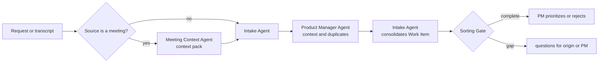

# 🚦 Triage Loop

> Intake and screening — converts noise into traceable Work Item, without letting screening become a priority decision.

The Triage Loop is the gateway to the journey. Everything that comes from outside — request, incident, feedback, opportunity, meeting transcript — passes through here before existing as work. The distinction that sustains the entire loop: **normalizing a demand is not approving it**. The agent organizes; the PM decides.

---

## Operating contract

| Contract | |
|---|---|
| **Step** | 0 — input |
| **Consolidates** | [📥 Intake Agent](../agentes/intake-agent.md) |
| **Collaborate** | [📝 Meeting Context Agent](../agentes/meeting-context-agent.md) when the origin is a meeting; [📋 Product Manager Agent](../agentes/product-manager-agent.md) to enrich product context |
| **Human owner** | Product Manager |
| **Input** | request, incident, feedback, opportunity or meeting context pack |
| **Exit** | Work Item with problem, origin, product, owner, duplicates, dependencies, preliminary risk and gaps |
| **Exit gate** | explicit problem, traceability, responsible and minimum context |
| **Dominant lap** | external — the gap becomes a question returned to the origin, not an assumption |

---

## Sequence

1. The Meeting Context Agent, when activated, separates facts, provisional decisions and items that require confirmation. Your output is input context only — never a Work Item.
2. The Intake Agent normalizes demand, links sources and looks for duplications and dependencies.
3. The Product Manager Agent complements value, stakeholder, affected product and business questions, **without defining the final priority**.
4. The Intake Agent consolidates a single Work Item and records the origin of each relevant assertion.
5. PM decides to prioritize, return for clarification or close.

---

##Handoffs

| Direction | Load |
|---|---|
| **Input** | raw source material, with identifiable author and date |
| **Exit** | Work Item with each statement linked to its source; gaps listed as open questions, not filled in by inference |

---

## What this loop doesn't do

**Does not:** prioritize, estimate or propose a solution.

A Work Item that arrives with a built-in solution contaminates the entire [🔦 Scout Loop](01-discovery-and-research.md) that comes later — discovery starts validating the solution instead of investigating the problem. The Intake Agent records what was requested and what problem is behind it; the conversion into a proposal belongs to another stage.

---

## Typical faults

| Failure | Symptom | Correction |
|---|---|---|
| Solution disguised as a problem | the Work Item describes a feature, not a pain | return to the source the question "what problem does this solve?" |
| Duplicity terminated without link | item disappears from backlog without trace | closure requires explicit link to the item that absorbed it |
| Silent Inference | the Work Item states what no one said | each statement carries origin; without origin, becomes a question |

---

## Artifacts and where they live

| Artifact | Destination | Mandatory |
|---|---|---|
| Work Consolidated Item | `<pm-workspace>/projects/<project>/work-items/<WI-id>.md` | yes |
| Meeting context pack | `<pm-workspace>/projects/<project>/work-items/assets/` | if there was a meeting |
| Raw material received | `<pm-workspace>/.coordination/inbox/` | traffic |
| Questions returned to origin | `<pm-workspace>/.coordination/handoffs/` | traffic |

---

## Escalation

Escalate to PM when issue cannot be identified, requests conflict, or priority requires judgment. **Duplicity does not authorize closing an item without an explicit link to the item that absorbed it.**
