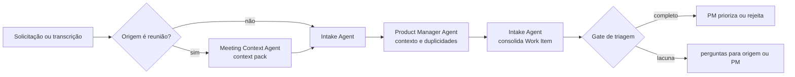

# 🚦 Triage Loop

> Intake e triagem — converte ruído em Work Item rastreável, sem deixar a triagem virar decisão de prioridade.

O Triage Loop é a porta de entrada da jornada. Tudo o que chega de fora — solicitação, incidente, feedback, oportunidade, transcrição de reunião — passa por aqui antes de existir como trabalho. A distinção que sustenta o loop inteiro: **normalizar uma demanda não é aprová-la**. O agente organiza; o PM decide.

---

## Contrato operacional

| Contrato | |
|---|---|
| **Etapa** | 0 — entrada |
| **Consolida** | [📥 Intake Agent](../agentes/intake-agent.md) |
| **Colaboram** | [📝 Meeting Context Agent](../agentes/meeting-context-agent.md) quando a origem for reunião; [📋 Product Manager Agent](../agentes/product-manager-agent.md) para enriquecer contexto de produto |
| **Owner humano** | Product Manager |
| **Entrada** | solicitação, incidente, feedback, oportunidade ou context pack de reunião |
| **Saída** | Work Item com problema, origem, produto, owner, duplicidades, dependências, risco preliminar e lacunas |
| **Gate de saída** | problema, rastreabilidade, responsável e contexto mínimo explícitos |
| **Volta dominante** | externa — a lacuna vira pergunta devolvida à origem, não suposição |

---

## Sequência

1. O Meeting Context Agent, quando acionado, separa fatos, decisões provisórias e itens que exigem confirmação. Seu output é somente contexto de entrada — nunca um Work Item.
2. O Intake Agent normaliza a demanda, vincula fontes e procura duplicidades e dependências.
3. O Product Manager Agent complementa valor, stakeholder, produto afetado e perguntas de negócio, **sem definir a prioridade final**.
4. O Intake Agent consolida um único Work Item e registra a origem de cada afirmação relevante.
5. O PM decide priorizar, devolver para esclarecimento ou encerrar.

---

## Handoffs

| Direção | Carrega |
|---|---|
| **Entrada** | material bruto da origem, com autor e data identificáveis |
| **Saída** | Work Item com cada afirmação vinculada à sua fonte; lacunas listadas como perguntas abertas, não preenchidas por inferência |

---

## O que este loop não faz

**Não faz:** priorizar, estimar ou propor solução.

Um Work Item que já chega com solução embutida contamina todo o [🔦 Scout Loop](01-discovery-and-research.md) que vem depois — o discovery passa a validar a solução em vez de investigar o problema. O Intake Agent registra o que foi pedido e qual problema está por trás; a conversão em proposta pertence a outra etapa.

---

## Falhas típicas

| Falha | Sintoma | Correção |
|---|---|---|
| Solução disfarçada de problema | o Work Item descreve uma feature, não uma dor | devolver à origem a pergunta "que problema isso resolve?" |
| Duplicidade encerrada sem vínculo | item some do backlog sem rastro | encerramento exige link explícito ao item que o absorveu |
| Inferência silenciosa | o Work Item afirma o que ninguém disse | cada afirmação carrega origem; sem origem, vira pergunta |

---

## Artefatos e onde vivem

| Artefato | Destino | Obrigatório |
|---|---|---|
| Work Item consolidado | `<pm-workspace>/projects/<project>/work-items/<WI-id>.md` | sim |
| Context pack de reunião | `<pm-workspace>/projects/<project>/work-items/assets/` | se houve reunião |
| Material bruto recebido | `<pm-workspace>/.coordination/inbox/` | trânsito |
| Perguntas devolvidas à origem | `<pm-workspace>/.coordination/handoffs/` | trânsito |

---

## Escalonamento

Escalar ao PM quando o problema não puder ser identificado, houver conflito entre solicitações ou a prioridade exigir julgamento. **Duplicidade não autoriza encerrar um item sem vínculo explícito ao item que o absorveu.**
