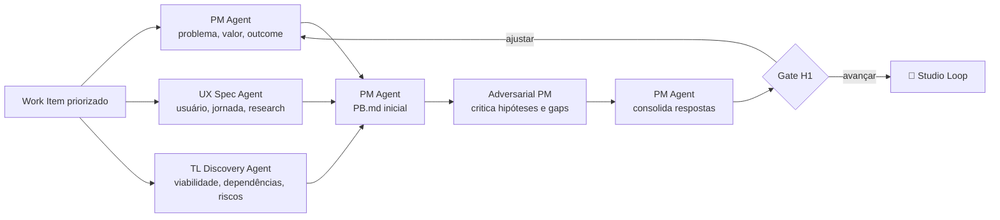

# 🔦 Scout Loop

> Discovery e research — investiga problema, usuário e viabilidade em paralelo, e entrega um `PB.md` que preserva as incertezas em vez de escondê-las.

O Scout Loop é o único da jornada em que **não saber ainda é o resultado correto**. Três investigações independentes partem da mesma pergunta e convergem em um documento que separa evidência de hipótese. Um discovery que termina com todas as perguntas respondidas geralmente respondeu por inferência.

---

## Contrato operacional

| Contrato | |
|---|---|
| **Etapa** | 1 — produto e discovery |
| **Consolida** | [📋 Product Manager Agent](../agentes/product-manager-agent.md) |
| **Colaboram** | [🧭 UX Specification Agent](../agentes/ux-specification-agent.md); [🔭 Tech Lead Discovery Agent](../agentes/tech-lead-discovery-agent.md); [🥊 Adversarial PM](../agentes/adversarial-product-manager-agent.md) quando houver hipótese ou proposta candidata |
| **Owner humano** | PM; UX e Tech Lead respondem pelos respectivos domínios |
| **Entrada** | Work Item priorizado, dados disponíveis, pesquisas, restrições e perguntas |
| **Saída** | `PB.md`, evidências, jornada inicial, restrições, risco preliminar e perguntas abertas |
| **Gate de saída** | H1 — problema, usuário, experiência desejada e viabilidade inicial cobertos |
| **Volta dominante** | média — a crítica adversarial tenta invalidar a hipótese antes da consolidação |

---

## Sequência

1. PM, UX e Tech Lead Discovery recebem a **mesma pergunta de discovery**, fontes autorizadas e limite de tempo.
2. As três investigações acontecem em paralelo; cada uma separa evidência, inferência, hipótese e pergunta.
3. O PM Agent consolida o `PB.md` e preserva riscos, desacordos e lacunas apontados por UX e Tech Lead.
4. Havendo proposta candidata ou hipótese de alto impacto, o Adversarial PM tenta invalidá-la antes da consolidação final.
5. O PM apresenta em H1 apenas a síntese decisória: problema, valor, evidências, restrições, riscos e recomendação.

**Regras de colaboração.** A consulta ao Tech Lead Discovery é de viabilidade e risco inicial — arquitetura final pertence ao [🗺️ Drafting Loop](03-technical-specification.md). O UX pode devolver a hipótese de problema quando a evidência de usuário a contradisser, e essa devolução não é uma objeção a ser negociada. A crítica adversarial produz findings rastreáveis; ela não reescreve o `PB.md` silenciosamente.

---

## Handoffs

| Direção | Carrega |
|---|---|
| **Entrada** | Work Item priorizado, com a pergunta de discovery formulada pelo PM |
| **Saída** | `PB.md` com quatro camadas separadas: evidência verificável, inferência declarada, hipótese em aberto e pergunta não respondida |

---

## O que este loop não faz

**Não faz:** transformar hipótese em requisito nem antecipar a solução técnica.

Uma hipótese promovida a requisito sem evidência atravessa a jornada inteira sem que ninguém a reveja — e reaparece como retrabalho na homologação, quando corrigir custa mais caro. O `PB.md` mantém a hipótese identificada como tal, com o que precisaria ser verdade para confirmá-la.

---

## Falhas típicas

| Falha | Sintoma | Correção |
|---|---|---|
| Discovery que valida a solução | as três investigações partem de uma feature já decidida | reescrever a pergunta de discovery em termos de problema |
| Incerteza apagada na consolidação | o `PB.md` soa conclusivo, sem perguntas abertas | preservar desacordo entre UX e Tech Lead no artefato final |
| Arquitetura antecipada | o Tech Lead Discovery entrega desenho de solução | restringir a consulta a viabilidade e risco |

---

## Artefatos e onde vivem

| Artefato | Destino | Obrigatório |
|---|---|---|
| `PB.md` consolidado | `<pm-workspace>/projects/<project>/discovery/PB.md` | sim |
| Research e evidências de usuário | `<ux-workspace>/projects/<project>/research/` | quando houver |
| Jornada inicial | `<ux-workspace>/projects/<project>/journeys/` | quando houver |
| Notas de viabilidade técnica | `<tech-lead-workspace>/projects/<project>/engineering/architecture/` | quando houver |
| Findings do Adversarial PM | `<pm-workspace>/projects/<project>/discovery/reviews/` | quando acionado |
| Handoffs entre workspaces | `.coordination/handoffs/` de cada workspace | trânsito |

---

## Escalonamento

Escalar se a evidência crítica estiver ausente, se valor e viabilidade entrarem em conflito sem alternativa clara, ou se um risco ultrapassar a autonomia autorizada. H1 decide investir, ajustar, adiar ou encerrar — não resolve detalhes de execução.
