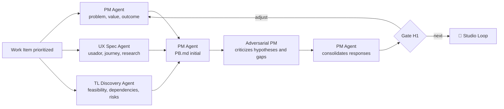

# 🔦 Scout Loop

> Discovery and research — investigates problem, user and feasibility in parallel, and delivers a `PB.md` that preserves uncertainties instead of hiding them.

The Scout Loop is the only one in the journey where **not knowing is still the correct outcome**. Three independent investigations start from the same question and converge in a document that separates evidence from hypothesis. A discovery that ends with all questions answered has generally answered by inference.

---

## Operating contract

| Contract | |
|---|---|
| **Step** | 1 — product and discovery |
| **Consolidates** | [📋 Product Manager Agent](../agentes/product-manager-agent.md) |
| **Collaborate** | [🧭 UX Specification Agent](../agentes/ux-specification-agent.md); [🔭 Tech Lead Discovery Agent](../agentes/tech-lead-discovery-agent.md); [🥊 Adversarial PM](../agentes/adversarial-product-manager-agent.md) when there is a candidate hypothesis or proposal |
| **Human owner** | PM; UX and Tech Lead respond for their respective domains |
| **Input** | Work Prioritized Item, Available Data, Searches, Constraints, and Questions |
| **Exit** | `PB.md`, evidence, initial journey, restrictions, preliminary risk and open questions |
| **Exit gate** | H1 — problem, user, desired experience and initial feasibility covered |
| **Dominant lap** | average — adversarial criticism attempts to invalidate the hypothesis before consolidation |

---

## Sequence

1. PM, UX and Tech Lead Discovery receive the **same discovery question**, authoritative sources and time limit.
2. The three investigations take place in parallel; each separates evidence, inference, hypothesis and question.
3. PM Agent consolidates `PB.md` and preserves risks, disagreements and gaps pointed out by UX and Tech Lead.
4. If there is a candidate proposal or high-impact hypothesis, the Adversarial PM tries to invalidate it before final consolidation.
5. The PM presents in H1 only the decision synthesis: problem, value, evidence, restrictions, risks and recommendation.

**Collaboration rules.** Consultation with Tech Lead Discovery is for feasibility and initial risk — final architecture belongs to [🗺️ Drafting Loop](03-technical-specification.md). UX can return the problem hypothesis when user evidence contradicts it, and this return is not an objection to be negotiated. Adversarial criticism produces traceable findings; it does not silently rewrite `PB.md`.

---

##Handoffs

| Direction | Load |
|---|---|
| **Input** | Work Item prioritized, with the discovery question formulated by the PM |
| **Exit** | `PB.md` with four separate layers: verifiable evidence, stated inference, open hypothesis and unanswered question |

---

## What this loop doesn't do

**Does not:** transform a hypothesis into a requirement or anticipate a technical solution.

A hypothesis promoted to a requirement without evidence goes through the entire journey without anyone reviewing it — and reappears as rework during approval, when correcting it costs more. `PB.md` keeps the hypothesis identified as such, with what would need to be true to confirm it.

---

## Typical faults

| Failure | Symptom | Correction |
|---|---|---|
| Discovery that validates the solution | the three investigations start from a feature already decided | rewrite discovery question in terms of problem |
| Uncertainty erased in consolidation | the `PB.md` sounds conclusive, without open questions | preserve disagreement between UX and Tech Lead in the final artifact |
| Early Architecture | Tech Lead Discovery delivers solution design | restrict consultation to feasibility and risk |

---

## Artifacts and where they live

| Artifact | Destination | Mandatory |
|---|---|---|
| `PB.md` consolidated | `<pm-workspace>/projects/<project>/discovery/PB.md` | yes |
| User research and evidence | `<ux-workspace>/projects/<project>/research/` | when there is |
| Initial journey | `<ux-workspace>/projects/<project>/journeys/` | when there is |
| Technical feasibility notes | `<tech-lead-workspace>/projects/<project>/engineering/architecture/` | when there is |
| Adversarial PM Findings | `<pm-workspace>/projects/<project>/discovery/reviews/` | when triggered |
| Handoffs between workspaces | `.coordination/handoffs/` from each workspace | traffic |

---

## Escalation

Escalate if critical evidence is absent, if value and feasibility conflict with no clear alternative, or if a risk exceeds authorized autonomy. H1 decides to invest, adjust, postpone or terminate — does not resolve execution details.
