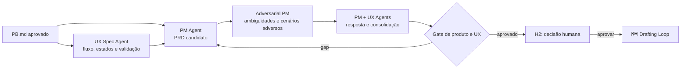

# 🎨 Studio Loop

> Planejamento de produto e UX — converte o problema aprovado em escopo, experiência e critérios de aceite coerentes entre si.

O Studio Loop é o único em que dois agentes consolidam artefatos distintos ao mesmo tempo: o PM é dono do `PRD.md`, o UX é dono da UX spec, e nenhum dos dois é subordinado ao outro. A coerência entre os dois documentos é o produto real desta etapa — um PRD que contradiz a UX spec passa despercebido até a implementação, quando o engenheiro precisa escolher qual dos dois obedecer.

---

## Contrato operacional

| Contrato | |
|---|---|
| **Etapa** | 2 — produto e discovery |
| **Consolida** | [📋 Product Manager Agent](../agentes/product-manager-agent.md) para o `PRD.md`; [🧭 UX Specification Agent](../agentes/ux-specification-agent.md) para a UX spec |
| **Colaboram** | [🥊 Adversarial PM](../agentes/adversarial-product-manager-agent.md); agentes de research, conteúdo e prototipação quando necessários |
| **Owners humanos** | PM para produto; UX para experiência |
| **Entrada** | `PB.md`, decisão H1, evidências de usuário e restrições conhecidas |
| **Saída** | `PRD.md`, jornada e fluxo desejados, UX spec, protótipo proporcional, critérios de UX e de aceite |
| **Gate de saída** | H2 — rastreabilidade `PB → PRD`, gaps críticos tratados, sucesso mensurável |
| **Volta dominante** | média — crítica adversarial sobre ambiguidade e casos-limite |

---

## Sequência

1. O PM Agent propõe objetivo, escopo, fora de escopo, métricas e critérios de produto no `PRD.md`.
2. O UX Specification Agent define jornada, fluxos, estados, conteúdo, acessibilidade, hipóteses e plano de validação. **Restrição descoberta no fluxo retorna ao PRD** — não é resolvida apenas na UX spec.
3. Pesquisadores, UX writers e agentes de prototipação só entram por necessidade explícita e entregam insumos ao UX Agent, nunca versões concorrentes da fonte canônica.
4. O Adversarial PM avalia problema, métricas, escopo implícito, casos-limite e coerência entre PRD e UX spec.
5. PM e UX registram a resposta a cada finding; o PM consolida o `PRD.md` e H2 fixa o compromisso.

---

## Handoffs

| Direção | Carrega |
|---|---|
| **Entrada** | `PB.md` aprovado em H1, com hipóteses ainda identificadas como hipóteses |
| **Saída** | `PRD.md` + UX spec mutuamente consistentes, com cada critério de aceite verificável e rastreável até um item do `PB.md` |

---

## O que este loop não faz

**Não faz:** aprovar o próprio artefato.

Nenhum agente deste loop tem autoridade para fechar o que produziu. H2 aprova a decisão de compromisso — não edita o documento linha a linha. Quando um gate humano começa a revisar redação em vez de decidir escopo, o loop está entregando material que ainda não passou pela crítica adversarial.

---

## Falhas típicas

| Falha | Sintoma | Correção |
|---|---|---|
| PRD e UX spec divergentes | o engenheiro pergunta qual documento vale | coerência entre os dois é finding bloqueante do Adversarial PM |
| Critério de aceite não mensurável | "a experiência deve ser fluida" | todo critério precisa de um método de verificação declarado |
| Escopo implícito | funcionalidade aparece na UX spec sem estar no PRD | o fora de escopo é tão obrigatório quanto o escopo |

---

## Artefatos e onde vivem

| Artefato | Destino | Obrigatório |
|---|---|---|
| `PRD.md` | `<pm-workspace>/projects/<project>/requirements/prd/` | sim |
| Decisões de produto | `<pm-workspace>/projects/<project>/decisions/` | quando houver trade-off |
| Fluxos e estados | `<ux-workspace>/projects/<project>/flows/` | sim |
| UX spec | `<ux-workspace>/projects/<project>/specifications/` | sim |
| Protótipo | `<ux-workspace>/projects/<project>/prototypes/` | quando proporcional ao risco |
| Plano de validação de UX | `<ux-workspace>/projects/<project>/validation/` | sim |
| Findings do Adversarial PM | `<pm-workspace>/projects/<project>/requirements/reviews/` | sim |
| Handoffs entre PM e UX | `projects/<project>/handoffs/` de cada workspace | trânsito |

---

## Escalonamento

Escalar aos owners quando produto e experiência exigirem trade-off de escopo, faltar evidência para hipótese crítica ou houver objetivo incompatível. Se a evidência de usuário contradisser o problema, o loop devolve ao [🔦 Scout Loop](01-discovery-and-research.md).
