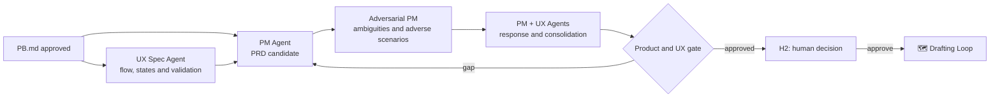

# 🎨 Studio Loop

> Product and UX planning — converts the approved problem into scope, experience and acceptance criteria that are coherent with each other.

Studio Loop is unique in that two agents consolidate distinct artifacts at the same time: the PM owns `PRD.md`, the UX owns the UX spec, and neither is subordinate to the other. Coherence between the two documents is the real product of this step — a PRD that contradicts the UX spec goes unnoticed until implementation, when the engineer needs to choose which of the two to obey.

---

## Operating contract

| Contract | |
|---|---|
| **Step** | 2 — product and discovery |
| **Consolidates** | [📋 Product Manager Agent](../agentes/product-manager-agent.md) for `PRD.md`; [🧭 UX Specification Agent](../agentes/ux-specification-agent.md) for UX spec |
| **Collaborate** | [🥊 Adversarial PM](../agentes/adversarial-product-manager-agent.md); research, content and prototyping agents when necessary |
| **Human Owners** | PM for product; UX for experience |
| **Input** | `PB.md`, H1 decision, user evidence and known constraints |
| **Exit** | `PRD.md`, desired journey and flow, UX spec, proportional prototype, UX and acceptance criteria |
| **Exit gate** | H2 — `PB → PRD` traceability, critical gaps addressed, measurable success |
| **Dominant lap** | average — adversarial criticism on ambiguity and borderline cases |

---

## Sequence

1. PM Agent proposes objective, scope, out-of-scope, metrics and product criteria in `PRD.md`.
2. The UX Specification Agent defines journey, flows, states, content, accessibility, hypotheses and validation plan. **Restriction discovered in the flow returns to the PRD** — is not resolved only in the UX spec.
3. Researchers, UX writers and prototyping agents only enter out of explicit need and deliver input to the UX Agent, never competing versions of the canonical source.
4. The Adversarial PM evaluates problem, metrics, implicit scope, limit cases and coherence between PRD and UX spec.
5. PM and UX record the response to each finding; the PM consolidates the `PRD.md` and H2 fixes the commitment.

---

##Handoffs

| Direction | Load |
|---|---|
| **Input** | `PB.md` approved in H1, with hypotheses still identified as hypotheses |
| **Exit** | `PRD.md` + UX spec mutually consistent, with each acceptance criteria verifiable and traceable back to a `PB.md` item |

---

## What this loop doesn't do

**Does not:** approve the artifact itself.

No agent in this loop has the authority to close what they have produced. H2 approves the compromise decision — does not edit the document line by line. When a human gate starts reviewing writing instead of deciding scope, the loop is delivering material that has not yet gone through adversarial critique.

---

## Typical faults

| Failure | Symptom | Correction |
|---|---|---|
| PRD and UX spec divergent | the engineer asks which document is valid | coherence between the two is a blocking finding for the Adversarial PM |
| Non-measurable acceptance criteria | "the experience must be fluid" | every criterion needs a declared verification method |
| Implicit scope | functionality appears in the UX spec without being in the PRD | out of scope is as mandatory as in scope |

---

## Artifacts and where they live

| Artifact | Destination | Mandatory |
|---|---|---|
| `PRD.md` | `<pm-workspace>/projects/<project>/requirements/prd/` | yes |
| Product decisions | `<pm-workspace>/projects/<project>/decisions/` | when there is a trade-off |
| Flows and states | `<ux-workspace>/projects/<project>/flows/` | yes |
| UX spec | `<ux-workspace>/projects/<project>/specifications/` | yes |
| Prototype | `<ux-workspace>/projects/<project>/prototypes/` | when proportional to the risk |
| UX Validation Plan | `<ux-workspace>/projects/<project>/validation/` | yes |
| Adversarial PM Findings | `<pm-workspace>/projects/<project>/requirements/reviews/` | yes |
| Handoffs between PM and UX | `projects/<project>/handoffs/` from each workspace | traffic |

---

## Escalation

Escalate to owners when product and experience require scope trade-off, lack of evidence for critical hypothesis or there is an incompatible objective. If user evidence contradicts the issue, the loop returns to [🔦 Scout Loop](01-discovery-and-research.md).
