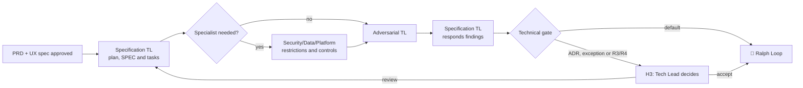

# 🗺️ Drafting Loop

> Technical specification — transforms approved product and UX into an executable strategy, criticized by an independent body before becoming a task.

The Drafting Loop is the last step where a wrong decision is still cheap. After this point, correcting architecture costs code written, reviewed and sometimes already in production. This is why adversarial criticism here is obligatory even when the solution seems obvious—especially when it seems obvious.

---

## Operating contract

| Contract | |
|---|---|
| **Step** | 3 — specification |
| **Consolidates** | [📐 Specification Tech Lead Agent](../agentes/specification-tech-lead-agent.md) |
| **Collaborate** | [♟️ Adversarial Tech Lead](../agentes/adversarial-tech-lead-agent.md); [🧩 Security, Data & Platform Specialist](../agentes/specialist-security-data-platform-agent.md) when the risk demands |
| **Human owner** | Tech Lead |
| **Input** | `PB.md`, `PRD.md`, UX spec, current architecture, contracts, SLOs and risk class |
| **Exit** | `PLAN.md`, `SPEC.md`, `TASKS.md`, `CHECKLIST.md`, ADR and test plans, rollout and rollback when applicable |
| **Exit gate** | H3 — traceability, verifiable tasks, trade-offs and critical gaps addressed |
| **Dominant lap** | average — Adversarial TL challenges before any tasks are created |

---

## Sequence

1. The Specification Tech Lead evaluates alternatives and records architecture, contracts, data, testing, telemetry and delivery strategy.
2. Experts are consulted **before** criticism, when there is a security, data, platform or domain requirement that cannot be addressed by inference.
3. Adversarial Tech Lead challenges the proposal with failure scenarios, couplings, migrations, rollback, testability and operational costs.
4. Specification Tech Lead responds to findings in the canonical source and maintains visible residual scratches. **The review does not change the specification directly.**
5. H3 is only triggered by new ADR, exception or risk R3/R4. Without this, the gate directs to implementation.

---

##Handoffs

| Direction | Load |
|---|---|
| **Input** | `PRD.md` and UX spec approved in H2, with acceptance criteria already verifiable |
| **Exit** | `TASKS.md` with isolatable tasks, each with its own completion criteria; `CHECKLIST.md` that [⚔️ Red Team Loop](05-adversarial-validation.md) will use as a base coat |

The quality of `TASKS.md` determines the behavior of the entire Ralph Loop. Poorly isolated task generates missions that collide in the same file; a task without completion criteria generates an agent that does not know when to stop.

---

## What this loop doesn't do

**Does not:** reduce the risk class for convenience of delivery.

Reclassifying a risk is the quietest way to bypass a gate — no gates are changed, only the input that triggers them. That is why the risk class is decided by declared criteria and its change belongs to the human Tech Lead, not the agent who wants to advance.

---

## Typical faults

| Failure | Symptom | Correction |
|---|---|---|
| Task without completion criteria | the Engineer Agent rotates without converging in the Ralph Loop | every task in `TASKS.md` declares how it is proven to be finished |
| Unique alternative | SPEC presents a solution, without trade-off | record what was discarded and why, even if briefly |
| ADR missing for structural decision | six months later no one knows why it is like this | decision that restricts the future requires ADR, not comment on SPEC |
| Expert consulted after criticism | Expert's Finding Invalidates Entire Criticism | specialist enters before Adversarial TL |

---

## Artifacts and where they live

| Artifact | Destination | Mandatory |
|---|---|---|
| Active plan | `<tech-lead-workspace>/projects/<project>/plans/active/<PLAN-id>.md` | yes |
| SPEC finalized | `<tech-lead-workspace>/projects/<project>/engineering/specs/<SPEC-id>.md` | yes |
| ADR | `<tech-lead-workspace>/projects/<project>/engineering/adr/<ADR-id>.md` | when the decision is structural |
| Adversarial TL Review | `<tech-lead-workspace>/projects/<project>/execution/reviews/spec-<SPEC-id>.md` | yes |
| Work Items created | `<tech-lead-workspace>/projects/<project>/work-items/<WI-id>.md` | yes |
| Pre-critique draft | `plans/assets/03-technical-specification/<date-id>/drafts/` | if there was iteration |
| External session transcript | `plans/assets/03-technical-specification/<date-id>/transcripts/` | if there was external material |
| `STATUS.md` | current phase, active plan, next gate | yes |
| `MEMORY.md` | decisions and trade-offs from this round | yes |

---

## Escalation

Scale when the trade-off is structural, depends on access or supplier, changes to a public contract or does not have sufficient mitigation. Ambiguous requirement returns to [🎨 Studio Loop](02-product-and-ux-planning.md) — not resolved by technical interpretation.
