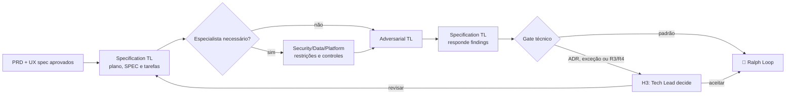

# 🗺️ Drafting Loop

> Especificação técnica — transforma produto e UX aprovados em estratégia executável, criticada por instância independente antes de virar tarefa.

O Drafting Loop é a última etapa em que uma decisão errada ainda é barata. Depois daqui, corrigir arquitetura custa código escrito, revisado e às vezes já em produção. É por isso que a crítica adversarial aqui é obrigatória mesmo quando a solução parece óbvia — especialmente quando parece óbvia.

---

## Contrato operacional

| Contrato | |
|---|---|
| **Etapa** | 3 — especificação |
| **Consolida** | [📐 Specification Tech Lead Agent](../agentes/specification-tech-lead-agent.md) |
| **Colaboram** | [♟️ Adversarial Tech Lead](../agentes/adversarial-tech-lead-agent.md); [🧩 Security, Data & Platform Specialist](../agentes/specialist-security-data-platform-agent.md) quando o risco exigir |
| **Owner humano** | Tech Lead |
| **Entrada** | `PB.md`, `PRD.md`, UX spec, arquitetura vigente, contratos, SLOs e classe de risco |
| **Saída** | `PLAN.md`, `SPEC.md`, `TASKS.md`, `CHECKLIST.md`, ADR e planos de teste, rollout e rollback quando aplicáveis |
| **Gate de saída** | H3 — rastreabilidade, tarefas verificáveis, trade-offs e gaps críticos tratados |
| **Volta dominante** | média — o Adversarial TL desafia antes de qualquer tarefa ser criada |

---

## Sequência

1. O Specification Tech Lead avalia alternativas e registra arquitetura, contratos, dados, testes, telemetria e estratégia de entrega.
2. Especialistas são consultados **antes** da crítica, quando há requisito de segurança, dados, plataforma ou domínio que não possa ser tratado por inferência.
3. O Adversarial Tech Lead desafia a proposta com cenários de falha, acoplamentos, migrações, rollback, testabilidade e custo operacional.
4. O Specification Tech Lead responde findings na fonte canônica e mantém riscos residuais visíveis. **A crítica não altera a especificação diretamente.**
5. H3 só é acionado por nova ADR, exceção ou risco R3/R4. Sem isso, o gate direciona para implementação.

---

## Handoffs

| Direção | Carrega |
|---|---|
| **Entrada** | `PRD.md` e UX spec aprovados em H2, com critérios de aceite já verificáveis |
| **Saída** | `TASKS.md` com tarefas isoláveis, cada uma com critério de conclusão próprio; `CHECKLIST.md` que o [⚔️ Red Team Loop](05-adversarial-validation.md) usará como base de cobertura |

A qualidade do `TASKS.md` determina o comportamento do Ralph Loop inteiro. Tarefa mal isolada gera missões que colidem no mesmo arquivo; tarefa sem critério de conclusão gera agente que não sabe quando parar.

---

## O que este loop não faz

**Não faz:** reduzir a classe de risco por conveniência de entrega.

Reclassificar um risco é a forma mais silenciosa de burlar um gate — nenhum gate é alterado, apenas a entrada que os aciona. Por isso a classe de risco é decidida por critério declarado e sua alteração pertence ao Tech Lead humano, não ao agente que quer avançar.

---

## Falhas típicas

| Falha | Sintoma | Correção |
|---|---|---|
| Tarefa sem critério de conclusão | o Engineer Agent gira sem convergir no Ralph Loop | toda tarefa em `TASKS.md` declara como se prova que terminou |
| Alternativa única | o SPEC apresenta uma solução, sem trade-off | registrar o que foi descartado e por quê, mesmo que brevemente |
| ADR ausente para decisão estrutural | seis meses depois ninguém sabe por que é assim | decisão que restringe o futuro exige ADR, não comentário no SPEC |
| Especialista consultado depois da crítica | o finding do especialista invalida a crítica inteira | especialista entra antes do Adversarial TL |

---

## Artefatos e onde vivem

| Artefato | Destino | Obrigatório |
|---|---|---|
| Plano ativo | `<tech-lead-workspace>/projects/<project>/plans/active/<PLAN-id>.md` | sim |
| SPEC finalizado | `<tech-lead-workspace>/projects/<project>/engineering/specs/<SPEC-id>.md` | sim |
| ADR | `<tech-lead-workspace>/projects/<project>/engineering/adr/<ADR-id>.md` | quando a decisão for estrutural |
| Review do Adversarial TL | `<tech-lead-workspace>/projects/<project>/execution/reviews/spec-<SPEC-id>.md` | sim |
| Work Items criados | `<tech-lead-workspace>/projects/<project>/work-items/<WI-id>.md` | sim |
| Rascunho pré-crítica | `plans/assets/03-technical-specification/<date-id>/drafts/` | se houve iteração |
| Transcrição de sessão externa | `plans/assets/03-technical-specification/<date-id>/transcripts/` | se houve material externo |
| `STATUS.md` | fase atual, plano ativo, próximo gate | sim |
| `MEMORY.md` | decisões e trade-offs desta rodada | sim |

---

## Escalonamento

Escalar quando o trade-off for estrutural, depender de acesso ou fornecedor, alterar contrato público ou não tiver mitigação suficiente. Requisito ambíguo devolve ao [🎨 Studio Loop](02-product-and-ux-planning.md) — não é resolvido por interpretação técnica.
