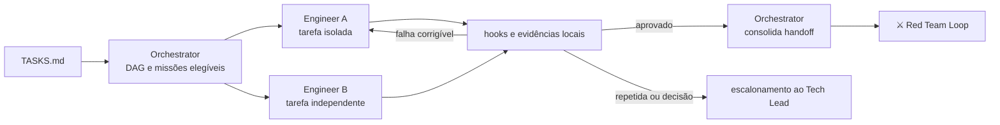

# 🔁 Ralph Loop

> Implementação autônoma — várias missões pequenas girando em paralelo contra sensors locais, sob um orquestrador que coordena dependências e nunca escreve código.

O nome vem da *Ralph Wiggum technique*: manter um agente girando sobre o mesmo prompt até que a tarefa passe nas verificações. É a volta interna em estado puro — barata, repetível, sem julgamento humano no circuito. O Ralph Loop leva essa ideia ao limite, com várias instâncias girando ao mesmo tempo sobre tarefas isoladas.

O codinome carrega junto o aviso: **um agente que gira sem gate não converge, apenas insiste.** Tudo neste loop existe para garantir que cada volta termine contra um critério objetivo e que a insistência tenha limite declarado.

---

## Contrato operacional

| Contrato | |
|---|---|
| **Etapa** | 4 — construção e validação |
| **Consolida** | [🎛️ Orchestrator Agent](../agentes/orchestrator-agent.md) |
| **Colaboram** | um ou mais [🛠️ Software Engineer Agents](../agentes/software-engineer-agent.md) |
| **Owner humano** | Tech Lead, por política e exceção |
| **Entrada** | tarefa elegível, `SPEC.md`, critérios de aceite, permissões, classe de risco e gates |
| **Saída** | diff rastreável, testes, documentação afetada, resultados locais e handoff para validação |
| **Gate de saída** | sensors locais e critérios da tarefa aprovados, com resultado registrado |
| **Volta dominante** | interna — retry do próprio agente contra `.hooks/`, com limite de tentativas e budget |

---

## Sequência

1. O Orchestrator monta o DAG a partir de `TASKS.md`, seleciona apenas missões com dependências satisfeitas e distribui o **contexto mínimo** de cada uma.
2. Cada Engineer Agent declara escopo, arquivos, branch/worktree e validações. Trabalho concorrente no mesmo repositório usa isolamento por Work Item.
3. O Engineer implementa a menor mudança possível, atualiza testes e documentação e executa os gates locais.
4. Falha corrigível retorna ao mesmo agente, dentro dos limites de tentativa e tempo. O Orchestrator bloqueia dependentes até a evidência existir.
5. O Orchestrator consolida **o estado, não o código**: lista de mudanças, evidências, dependências resolvidas e pendências para validação.

**Regras de colaboração.** Esta é a etapa mais paralela da jornada, e as regras existem para impedir que dois agentes destruam o trabalho um do outro. Agentes não editam simultaneamente o mesmo artefato sem divisão explícita, e nenhuma tarefa usa branch, worktree ou alteração preexistente de outra missão sem autorização.

---

## Handoffs

| Direção | Carrega |
|---|---|
| **Entrada** | uma tarefa por missão, com critério de conclusão próprio e contexto mínimo — não o `SPEC.md` inteiro |
| **Saída** | diff + resultado dos sensors + o que ficou fora de escopo, consolidado pelo Orchestrator em um único handoff |

---

## O que este loop não faz

**Não faz:** declarar a mudança aprovada.

Gate local verde significa que a mudança está **pronta para ser atacada** — não que está correta. A conclusão local nunca substitui a validação adversarial, e um agente que trata o próprio hook verde como aprovação transferiu para si uma autoridade que o loop não lhe deu.

O corolário mais importante: **alterar código e alterar verificação são coisas estruturalmente separadas.** Quando um agente está bloqueado por um gate, o caminho de menor resistência é afrouxar o gate. Essa separação não pode depender de instrução de prompt.

---

## Falhas típicas

| Falha | Sintoma | Correção |
|---|---|---|
| Giro sem convergência | o agente repete a mesma tentativa com variações cosméticas | limite de tentativas declarado; ao estourar, escala com opções |
| Tarefas agrupadas | um commit resolve três tarefas | uma tarefa por vez; diff pequeno é revisável, diff grande esconde defeito |
| Colisão de worktree | dois agentes editam o mesmo arquivo | isolamento por Work Item, declarado antes de começar |
| Escopo expandido silenciosamente | o diff toca arquivos fora da tarefa | escopo declarado na abertura da missão é o limite auditável |

---

## Artefatos e onde vivem

| Artefato | Destino | Obrigatório |
|---|---|---|
| Código implementado | `repos/worktrees/<org>/<repo>/<WI-id>/` — fora do workspace | sim |
| Work Item atualizado | `work-items/<WI-id>.md` — status, branch, worktree | sim |
| Evidências locais | `execution/evidence/<WI-id>/` | sim |
| `STATUS.md` | fase `implementation`, próximo gate `technical review` | sim |
| `MEMORY.md` | progresso e bloqueios relevantes | se houve mudança |
| Missões ativas e dependências | `.coordination/active/` | trânsito |

**Nenhum arquivo de implementação vai para `plans/assets/`.** O rastro auditável da implementação é o diff no repositório e as evidências em `execution/evidence/`.

---

## Escalonamento

Escalar por falha repetida, requisito contraditório, dependência circular, necessidade de permissão ou risco acima da missão. O escalonamento contém **decisão solicitada, opções, impacto e evidências** — não apenas logs.
