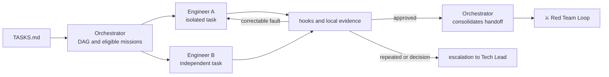

# 🔁Ralph Loop

> Autonomous deployment — several small missions running in parallel against local sensors, under an orchestrator that coordinates dependencies and never writes code.

The name comes from the *Ralph Wiggum technique*: keeping an agent rotating on the same prompt until the task passes the checks. It's pure internal looping—cheap, repeatable, with no human judgment in the loop. Ralph Loop takes this idea to the limit, with multiple instances spinning at the same time over isolated tasks.

The codename carries with it the warning: **an agent that turns without a gate does not converge, it just insists.** Everything in this loop exists to guarantee that each turn ends against an objective criterion and that the insistence has a declared limit.

---

## Operating contract

| Contract | |
|---|---|
| **Step** | 4 — construction and validation |
| **Consolidates** | [🎛️ Orchestrator Agent](../agentes/orchestrator-agent.md) |
| **Collaborate** | one or more [🛠️ Software Engineer Agents](../agentes/software-engineer-agent.md) |
| **Human owner** | Tech Lead, by policy and exception |
| **Input** | eligible task, `SPEC.md`, acceptance criteria, permissions, risk class and gates |
| **Exit** | traceable diff, tests, affected documentation, local results and handoff to validation |
| **Exit gate** | local sensors and task criteria approved, with result recorded |
| **Dominant lap** | internal — retry of the agent itself against `.hooks/`, with limit of attempts and budget |

---

## Sequence

1. Orchestrator assembles the DAG from `TASKS.md`, selects only missions with satisfied dependencies and distributes the **minimum context** of each one.
2. Each Engineer Agent declares scope, files, branch/worktree and validations. Concurrent work in the same repository uses isolation per Work Item.
3. The Engineer implements the smallest change possible, updates tests and documentation, and runs local gates.
4. Correctable failure returns to the same agent, within the attempt and time limits. Orchestrator blocks dependents until evidence exists.
5. Orchestrator consolidates **the state, not the code**: list of changes, evidence, resolved dependencies, and pending validation.

**Collaboration rules.** This is the most parallel stage of the journey, and the rules are there to prevent two agents from destroying each other's work. Agents do not simultaneously edit the same artifact without explicit splitting, and no task uses a branch, worktree, or pre-existing change from another mission without authorization.

---

##Handoffs

| Direction | Load |
|---|---|
| **Input** | one task per mission, with its own completion criteria and minimal context — not the entire `SPEC.md` |
| **Exit** | diff + sensor results + what was out of scope, consolidated by Orchestrator in a single handoff |

---

## What this loop doesn't do

**Does not:** declare the change approved.

Green local gate means the change is **ready to be attacked** — not that it is correct. Local completion never replaces adversarial validation, and an agent that treats the green hook itself as approval has transferred to itself an authority that the loop did not give it.

The most important corollary: **changing code and changing verification are structurally separate things.** When an agent is blocked by a gate, the path of least resistance is to loosen the gate. This separation cannot depend on prompt instruction.

---

## Typical faults

| Failure | Symptom | Correction |
|---|---|---|
| Spin without convergence | the agent repeats the same attempt with cosmetic variations | declared attempt limit; when popping, scale with options |
| Grouped tasks | one commit solves three tasks | one task at a time; small diff is reviewable, large diff hides defect |
| Worktree collision | two agents edit the same file | isolation by Work Item, declared before starting |
| Scope Expanded Quietly | diff touches files outside of task | scope declared at the opening of the mission is the auditable limit |

---

## Artifacts and where they live

| Artifact | Destination | Mandatory |
|---|---|---|
| Code implemented | `repos/worktrees/<org>/<repo>/<WI-id>/` — outside workspace | yes |
| Work Item updated | `work-items/<WI-id>.md` — status, branch, worktree | yes |
| Local evidence | `execution/evidence/<WI-id>/` | yes |
| `STATUS.md` | phase `implementation`, next gate `technical review` | yes |
| `MEMORY.md` | progress and relevant blockages | if there was a change |
| Active missions and dependencies | `.coordination/active/` | traffic |

**No implementation files go to `plans/assets/`.** The auditable trace of the implementation is the diff in the repository and the evidence in `execution/evidence/`.

---

## Escalation

Escalate due to repeated failure, contradictory requirement, circular dependency, need for permission, or risk beyond the mission. Escalation contains **requested decision, options, impact, and evidence** — not just logs.
