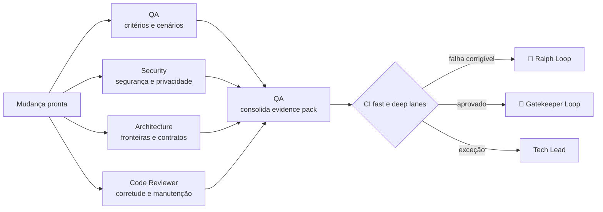

# ⚔️ Red Team Loop

> Validação adversarial — quatro perspectivas independentes atacam a mudança em paralelo e convertem achados em um único evidence pack.

O Red Team Loop existe porque a pergunta "isso funciona?" e a pergunta "isso quebra?" não são a mesma pergunta, e quem implementou só consegue fazer a primeira com convicção. Os reviewers não assumem que o resultado dos testes do autor é suficiente — eles derivam a própria cobertura da `CHECKLIST.md` e reproduzem o que afirmam.

---

## Contrato operacional

| Contrato | |
|---|---|
| **Etapa** | 5 — construção e validação |
| **Consolida** | [🧪 QA / Validation Agent](../agentes/qa-validation-agent.md) |
| **Colaboram** | [🛡️ Security Review](../agentes/security-review-agent.md); [🏛️ Architecture Review](../agentes/architecture-review-agent.md); [🔎 Adversarial Code Reviewer](../agentes/adversarial-code-reviewer-agent.md) |
| **Owner humano** | Tech Lead; PM e UX para os próprios critérios |
| **Entrada** | diff, `PRD.md`, UX spec, `SPEC.md`, `CHECKLIST.md`, resultados locais e classe de risco |
| **Saída** | checklist comprovado, findings classificados, evidências reproduzíveis e recomendação de gate |
| **Gate de saída** | todos os checks obrigatórios aprovados e nenhum bloqueador aberto |
| **Volta dominante** | média e externa — findings corrigíveis voltam ao [🔁 Ralph Loop](04-autonomous-implementation.md); CI decide o restante |

---

## Sequência

1. O QA Agent deriva a cobertura da `CHECKLIST.md` e executa cenários nominal, erro, recuperação, regressão e casos-limite.
2. Security, Architecture e Code Reviewer investigam em paralelo seus domínios e apresentam findings com **evidência, severidade, impacto e ação sugerida**.
3. O QA Agent consolida sem silenciar divergências, mapeando cada critério para uma evidência ou para um gap declarado.
4. O CI decide os checks requeridos pela classe de risco e pelos paths alterados. Findings corrigíveis voltam à implementação; **toda correção material recebe nova validação proporcional**.

---

## Handoffs

| Direção | Carrega |
|---|---|
| **Entrada** | diff consolidado pelo Orchestrator + evidências locais + o que ficou fora de escopo |
| **Saída** | evidence pack único: cada critério da `CHECKLIST.md` mapeado para evidência reproduzível ou gap explícito, com findings classificados por severidade |

O teste prático do evidence pack: **outra pessoa consegue refazer a verificação sem perguntar nada a quem a produziu?** Se precisa de contexto adicional, o que existe é um resumo, não evidência.

---

## O que este loop não faz

**Não faz:** fechar o achado de outro reviewer.

O QA Agent consolida, mas não tem autoridade para declarar resolvido um finding de Security, Architecture ou Code Review sem evidência de revalidação do domínio correspondente. Consolidação é montagem, não veredito — a alternativa é um único agente com poder de silenciar três perspectivas independentes.

---

## Falhas típicas

| Falha | Sintoma | Correção |
|---|---|---|
| Finding sem reprodução | "possível problema de concorrência aqui" | todo finding carrega o caminho para reproduzi-lo |
| Divergência resolvida por omissão | dois reviewers discordam e o consolidado escolhe um | divergência sem regra de desempate escala ao Tech Lead |
| Correção sem revalidação | o fix entra e o gate segue verde do ciclo anterior | mudança material invalida a evidência que ela afeta |
| Cobertura herdada do autor | o QA roda os mesmos testes que o Engineer rodou | a cobertura deriva da `CHECKLIST.md`, não do diff |

---

## Artefatos e onde vivem

| Artefato | Destino | Obrigatório |
|---|---|---|
| Evidence pack consolidado | `execution/evidence/<WI-id>.md` | sim |
| Review do Code Reviewer | `execution/reviews/code-<WI-id>.md` | sim |
| Review do Security Agent | `execution/reviews/security-<WI-id>.md` | quando aplicável |
| Review do Architecture Agent | `execution/reviews/architecture-<WI-id>.md` | quando aplicável |
| Work Item atualizado | `work-items/<WI-id>.md` — status e link para evidence | sim |
| `STATUS.md` | fase `review`, próximo gate `PR` ou devolução | sim |
| Exceções ativas | `.coordination/blockers/` | trânsito |

Achado aberto em qualquer review bloqueia o gate. Cada resolução exige evidência referenciada no arquivo de review correspondente — não apenas texto.

---

## Escalonamento

Escalar falso positivo, exceção, requisito ausente ou divergência sem regra de desempate. Requisito ausente devolve ao [🎨 Studio Loop](02-product-and-ux-planning.md) ou ao [🗺️ Drafting Loop](03-technical-specification.md), conforme a natureza da lacuna.
