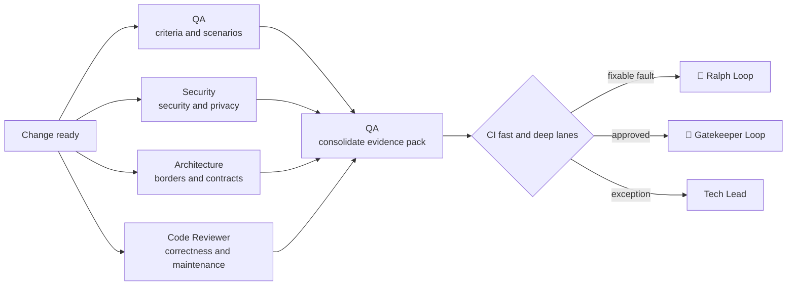

# ⚔️ Red Team Loop

> Adversarial validation — four independent perspectives attack change in parallel and convert findings into a single evidence pack.

Red Team Loop exists because the question “does it work?” and the question "does it break?" they are not the same question, and those who implemented it can only ask the first one with conviction. Reviewers do not assume that the author's test results are sufficient — they derive their own coverage from `CHECKLIST.md` and reproduce what they claim.

---

## Operating contract

| Contract | |
|---|---|
| **Step** | 5 — construction and validation |
| **Consolidates** | [🧪 QA / Validation Agent](../agentes/qa-validation-agent.md) |
| **Collaborate** | [🛡️ Security Review](../agentes/security-review-agent.md); [🏛️ Architecture Review](../agentes/architecture-review-agent.md); [🔎 Adversarial Code Reviewer](../agentes/adversarial-code-reviewer-agent.md) |
| **Human owner** | Tech Lead; PM and UX for own criteria |
| **Input** | diff, `PRD.md`, UX spec, `SPEC.md`, `CHECKLIST.md`, local results and risk class |
| **Exit** | proven checklist, classified findings, reproducible evidence and gate recommendation |
| **Exit gate** | all mandatory checks passed and no blockers open |
| **Dominant lap** | middle and outer — correctable findings return to [🔁 Ralph Loop](04-autonomous-implementation.md); CI decides the rest |

---

## Sequence

1. The QA Agent derives coverage from `CHECKLIST.md` and runs nominal, error, recovery, regression, and edge-case scenarios.
2. Security, Architecture and Code Reviewer investigate their domains in parallel and present findings with **evidence, severity, impact and suggested action**.
3. The QA Agent consolidates disagreements without silencing them, mapping each criterion to evidence or a declared gap.
4. The IC decides the checks required by the risk class and the changed paths. Correctable findings return to implementation; **all material correction receives new proportional validation**.

---

##Handoffs

| Direction | Load |
|---|---|
| **Input** | diff consolidated by Orchestrator + local evidence + what was out of scope |
| **Exit** | unique evidence pack: each `CHECKLIST.md` criteria mapped to reproducible evidence or explicit gap, with findings classified by severity |

The evidence pack practical test: **can someone else redo the check without asking anyone who produced it?** If additional context is needed, what exists is a summary, not evidence.

---

## What this loop doesn't do

**Do not:** close another reviewer's finding.

The QA Agent consolidates, but does not have the authority to declare a Security, Architecture or Code Review finding resolved without evidence of revalidation of the corresponding domain. Consolidation is an assembly, not a verdict — the alternative is a single agent with the power to silence three independent perspectives.

---

## Typical faults

| Failure | Symptom | Correction |
|---|---|---|
| Finding without reproduction | "possible competition problem here" | todo finding carries the path to reproduce it |
| Disagreement resolved by omission | two reviewers disagree and the consolidated chooses one | divergence without tiebreaker rule escalates to Tech Lead |
| Correction without revalidation | the fix enters and the gate remains green from the previous cycle | material change invalidates the evidence it affects |
| Coverage inherited from the author | the QA runs the same tests that the Engineer ran | coverage derives from `CHECKLIST.md`, not diff |

---

## Artifacts and where they live

| Artifact | Destination | Mandatory |
|---|---|---|
| Consolidated evidence pack | `execution/evidence/<WI-id>.md` | yes |
| Code Reviewer Review | `execution/reviews/code-<WI-id>.md` | yes |
| Security Agent Review | `execution/reviews/security-<WI-id>.md` | when applicable |
| Architecture Agent Review | `execution/reviews/architecture-<WI-id>.md` | when applicable |
| Work Item updated | `work-items/<WI-id>.md` — status and link to evidence | yes |
| `STATUS.md` | phase `review`, next gate `PR` or return | yes |
| Active exceptions | `.coordination/blockers/` | traffic |

Open finding in any review blocks the gate. Each resolution requires evidence referenced in the corresponding review file — not just text.

---

## Escalation

Escalate false positive, exception, missing requirement, or divergence without tiebreaker rule. Missing requirement returns to [🎨 Studio Loop](02-product-and-ux-planning.md) or [🗺️ Drafting Loop](03-technical-specification.md), depending on the nature of the gap.
