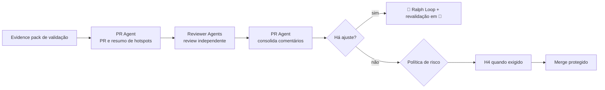

# 🚪 Gatekeeper Loop

> PR e merge — empacota a mudança validada para uma decisão de integração proporcional ao risco.

A PR não é uma segunda implementação nem uma segunda validação: é a **síntese auditável** das evidências e dos hotspots, montada para que a decisão de merge seja tomada em minutos por quem tem autoridade para tomá-la. Um PR que obriga o revisor a refazer o trabalho do [⚔️ Red Team Loop](05-adversarial-validation.md) falhou no seu único propósito.

---

## Contrato operacional

| Contrato | |
|---|---|
| **Etapa** | 6 — construção e validação |
| **Consolida** | [🔀 PR Agent](../agentes/pr-agent.md) |
| **Colaboram** | Reviewer Agents e Code Owners exigidos pela política |
| **Owner humano** | Tech Lead ou Code Owner, conforme risco |
| **Entrada** | diff validado, commits, resultado do CI, checklist e evidence pack de validação |
| **Saída** | PR rastreável, descrição de risco, aprovações válidas e decisão de merge |
| **Gate de saída** | H4 — CI verde, branch atualizada, aprovações exigidas e nenhuma exceção pendente |
| **Volta dominante** | externa — ajuste devolve ao Ralph Loop e exige revalidação |

---

## Sequência

1. O PR Agent gera descrição, comportamento alterado, risco, arquivos sensíveis, evidências, plano de rollback e itens fora de escopo.
2. Reviewer Agents revisam corretude, segurança, arquitetura, testes, documentação e observabilidade dentro do próprio contrato — **sem reproduzir o pacote inteiro de validação**.
3. O PR Agent registra cada comentário e roteia correções para implementação. **Mudança material invalida aprovações e evidências afetadas.**
4. H4 e o merge protegido obedecem à política R0–R4. O agente apenas prepara a recomendação.

---

## Handoffs

| Direção | Carrega |
|---|---|
| **Entrada** | evidence pack consolidado pelo QA Agent, com findings resolvidos e evidência de revalidação |
| **Saída** | PR com hotspots destacados: os pontos do diff que concentram risco, com o link para a evidência que os cobre |

---

## O que este loop não faz

**Não faz:** tratar ausência de resposta como aprovação.

Um revisor que não respondeu não aprovou. Silêncio como consentimento é o mecanismo pelo qual uma política de aprovação vira formalidade — e é especialmente perigoso quando o autor da mudança é um agente que pode abrir dezenas de PRs por dia.

---

## Falhas típicas

| Falha | Sintoma | Correção |
|---|---|---|
| PR que repete a validação | descrição de 400 linhas que ninguém lê | a PR sintetiza e referencia; a evidência vive no evidence pack |
| Aprovação sobrevivendo a mudança | novo commit entra depois do approve | mudança material invalida aprovações afetadas |
| Hotspot não sinalizado | o revisor aprova sem ver o trecho crítico | arquivos sensíveis e trechos de risco são destacados explicitamente |
| CI não reproduzível | verde local, vermelho no CI, sem explicação | não é falha corrigível por retry: escala |

---

## Artefatos e onde vivem

| Artefato | Destino | Obrigatório |
|---|---|---|
| PR aberta | plataforma de código, vinculada ao Work Item | sim |
| Work Item atualizado | `work-items/<WI-id>.md` — link da PR e status | sim |
| Comentários e resoluções | `execution/reviews/pr-<WI-id>.md` | sim |
| `STATUS.md` | fase `pr`, próximo gate `merge` ou devolução | sim |
| Exceções de política pendentes | `.coordination/blockers/` | trânsito |

---

## Escalonamento

Escalar quando uma aprovação exigida estiver indisponível, houver exceção de política, conflito entre reviews ou CI não reproduzível. **A ausência de resposta nunca conta como aprovação.**
