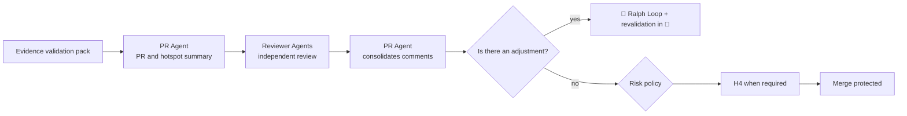

# 🚪 Gatekeeper Loop

> PR and merge — packages the validated change for a risk-proportional integration decision.

The PR is not a second implementation or a second validation: it is the **auditable synthesis** of evidence and hotspots, assembled so that the merge decision can be made in minutes by whoever has the authority to make it. A PR that forces the reviewer to redo the work of [⚔️ Red Team Loop](05-adversarial-validation.md) has failed in its sole purpose.

---

## Operating contract

| Contract | |
|---|---|
| **Step** | 6 — construction and validation |
| **Consolidates** | [🔀 PR Agent](../agentes/pr-agent.md) |
| **Collaborate** | Reviewer Agents and Code Owners required by policy |
| **Human owner** | Tech Lead or Code Owner, depending on risk |
| **Input** | validated diff, commits, CI result, validation checklist and evidence pack |
| **Exit** | Traceable PR, risk description, valid approvals and merger decision |
| **Exit gate** | H4 — Green CI, branch updated, approvals required and no exceptions pending |
| **Dominant lap** | external — adjustment returns to Ralph Loop and requires revalidation |

---

## Sequence

1. PR Agent generates description, changed behavior, risk, sensitive files, evidence, rollback plan and out-of-scope items.
2. Reviewer Agents review correctness, security, architecture, testing, documentation and observability within the contract itself — **without reproducing the entire validation package**.
3. The PR Agent records each comment and routes corrections for implementation. **Material change invalidates affected approvals and evidence.**
4. H4 and protected merge obey policy R0–R4. The agent only prepares the recommendation.

---

##Handoffs

| Direction | Load |
|---|---|
| **Input** | evidence pack consolidated by QA Agent, with resolved findings and evidence of revalidation |
| **Exit** | PR with highlighted hotspots: the points in the diff that concentrate risk, with the link to the evidence that covers them |

---

## What this loop doesn't do

**Does not:** treat lack of response as approval.

One reviewer who did not respond did not approve. Silence as consent is the mechanism by which an approval policy becomes a formality — and it is especially dangerous when the author of the change is an agent who can open dozens of PRs a day.

---

## Typical faults

| Failure | Symptom | Correction |
|---|---|---|
| PR that repeats validation | 400-line description that no one reads | PR synthesizes and references; the evidence lives in the evidence pack |
| Approval surviving change | new commit enters after approve | material change invalidates affected approvals |
| Unflagged hotspot | the reviewer approves without seeing the critical section | sensitive files and risky snippets are highlighted explicitly |
| IC not reproducible | local green, red on CI, no explanation | not fault fixable by retry: scale |

---

## Artifacts and where they live

| Artifact | Destination | Mandatory |
|---|---|---|
| PR open | code platform, linked to Work Item | yes |
| Work Item updated | `work-items/<WI-id>.md` — PR link and status | yes |
| Comments and resolutions | `execution/reviews/pr-<WI-id>.md` | yes |
| `STATUS.md` | phase `pr`, next gate `merge` or return | yes |
| Pending Policy Exceptions | `.coordination/blockers/` | traffic |

---

## Escalation

Escalate when a required approval is unavailable, there is a policy exception, conflict between reviews, or non-reproducible CI. **No response never counts as approval.**
