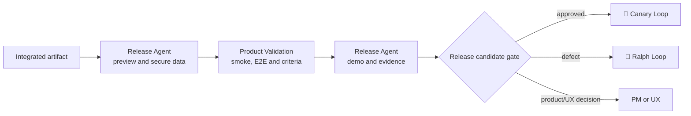

# 🎭 Rehearsal Loop

> Homologation — confirms, in a representative environment, that the integrated change delivers the product and experience criteria.

The Rehearsal Loop is the dress rehearsal: same artifact, same behavior, environment that looks enough like production that a surprise here is still cheap. The question it answers is not "is the code correct?" — this [⚔️ Red Team Loop](05-adversarial-validation.md) has already responded — but "**is this what was requested?**".

---

## Operating contract

| Contract | |
|---|---|
| **Step** | 7 — release and operation |
| **Consolidates** | [✅ Product Validation Agent](../agentes/product-validation-agent.md) |
| **Collaborate** | [🚀 Release Agent](../agentes/release-agent.md) |
| **Human Owners** | PM for value; UX for experience; stakeholder when necessary |
| **Input** | integrated immutable artifact, acceptance criteria, preview/staging environment and secure test data |
| **Exit** | release candidate approved or returned, demo and evidence, pending issues registered |
| **Exit gate** | validated acceptance criteria or explicit correction plan |
| **Dominant lap** | external — defect returns to Ralph Loop; scope divergence returns to Studio Loop |

---

## Sequence

1. Release Agent creates the environment from the **immutable artifact** and provides secure test data.
2. The Product Validation Agent confirms product and UX criteria by smoke, E2E, visual comparison and demonstration when applicable.
3. The Release Agent attaches environment and execution evidence; the Product Validation Agent consolidates acceptance or gaps.
4. Implementation failure returns to [🔁 Ralph Loop](04-autonomous-implementation.md). Scope or experience decisions return to the owners and the product and UX stages when necessary.

---

##Handoffs

| Direction | Load |
|---|---|
| **Input** | immutable artifact identified by version — the same binary that will go into production, not a rebuild |
| **Exit** | criterion-evidence matrix: each acceptance criterion of `PRD.md` and UX spec marked as validated, with the execution record that proves it |

---

## What this loop doesn't do

**Does not:** compensate for an undefined requirement with informal approval.

When an acceptance criterion does not exist, approval cannot invent it — and a stakeholder's "it looks good" does not become a criterion retroactively. Absence is a gap from [🎨 Studio Loop](02-product-and-ux-planning.md) and back there. This is the last step in which this gap can still be corrected at no production cost.

---

## Typical faults

| Failure | Symptom | Correction |
|---|---|---|
| Reconstructed artifact | the approval build differs from the production version | always validate the immutable artifact, identified by version |
| Inadequate test data | the real scenario is not reproducible in staging | secure test data is a prerequisite, not agent improvisation |
| Approval without criteria | "feels right" closes the gate | every acceptance references a criterion declared in the PRD or in the UX spec |
| Defect confused with scope | correction enters without product decision | defect returns to Ralph; scope returns to owner |

---

## Artifacts and where they live

| Artifact | Destination | Mandatory |
|---|---|---|
| Criterion-evidence matrix | `<pm-workspace>/projects/<project>/validation/` | yes |
| Experience validation | `<ux-workspace>/projects/<project>/validation/` | when there is UX criteria |
| Environment and execution evidence | `<tech-lead-workspace>/projects/<project>/execution/evidence/<WI-id>/` | yes |
| Demo or recording | `<pm-workspace>/projects/<project>/validation/assets/` | when applicable |
| Handoff for release | `.coordination/handoffs/` | traffic |

---

## Escalation

Escalate if environment, test data, acceptance criteria, or expected behavior is missing. Consciously accepted to-do is recorded with owner and deadline — never silently inherited by [🐤 Canary Loop](08-production-release-and-observation.md).
