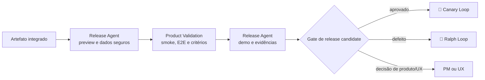

# 🎭 Rehearsal Loop

> Homologação — confirma, em ambiente representativo, que a mudança integrada entrega os critérios de produto e experiência.

O Rehearsal Loop é o ensaio geral: mesmo artefato, mesmo comportamento, ambiente que se parece com produção o suficiente para que uma surpresa aqui ainda seja barata. A pergunta que ele responde não é "o código está correto?" — isso o [⚔️ Red Team Loop](05-adversarial-validation.md) já respondeu — mas "**isso é o que foi pedido?**".

---

## Contrato operacional

| Contrato | |
|---|---|
| **Etapa** | 7 — release e operação |
| **Consolida** | [✅ Product Validation Agent](../agentes/product-validation-agent.md) |
| **Colabora** | [🚀 Release Agent](../agentes/release-agent.md) |
| **Owners humanos** | PM para valor; UX para experiência; stakeholder quando necessário |
| **Entrada** | artefato imutável integrado, critérios de aceite, ambiente de preview/staging e dados de teste seguros |
| **Saída** | release candidate aprovado ou devolvido, demo e evidências, pendências registradas |
| **Gate de saída** | critérios de aceite validados ou plano de correção explícito |
| **Volta dominante** | externa — defeito volta ao Ralph Loop; divergência de escopo volta ao Studio Loop |

---

## Sequência

1. O Release Agent cria o ambiente a partir do **artefato imutável** e fornece dados de teste seguros.
2. O Product Validation Agent confirma critérios de produto e UX por smoke, E2E, comparação visual e demonstração quando aplicável.
3. O Release Agent anexa a evidência de ambiente e execução; o Product Validation Agent consolida aceite ou gaps.
4. Falha de implementação retorna ao [🔁 Ralph Loop](04-autonomous-implementation.md). Decisão de escopo ou experiência retorna aos owners e às etapas de produto e UX quando necessário.

---

## Handoffs

| Direção | Carrega |
|---|---|
| **Entrada** | artefato imutável identificado por versão — o mesmo binário que irá a produção, não uma reconstrução |
| **Saída** | matriz critério-evidência: cada critério de aceite do `PRD.md` e da UX spec marcado como validado, com o registro da execução que o comprova |

---

## O que este loop não faz

**Não faz:** compensar requisito indefinido com aprovação informal.

Quando um critério de aceite não existe, a homologação não pode inventá-lo — e um "ficou bom" de stakeholder não vira critério retroativamente. A ausência é uma lacuna do [🎨 Studio Loop](02-product-and-ux-planning.md) e volta para lá. Esta é a última etapa em que essa lacuna ainda pode ser corrigida sem custo de produção.

---

## Falhas típicas

| Falha | Sintoma | Correção |
|---|---|---|
| Artefato reconstruído | o build da homologação difere do que vai a produção | validar sempre o artefato imutável, identificado por versão |
| Dado de teste inadequado | o cenário real não é reproduzível em staging | dado de teste seguro é pré-requisito, não improviso do agente |
| Aprovação sem critério | "parece certo" fecha o gate | todo aceite referencia um critério declarado no PRD ou na UX spec |
| Defeito confundido com escopo | correção entra sem decisão de produto | defeito volta ao Ralph; escopo volta ao owner |

---

## Artefatos e onde vivem

| Artefato | Destino | Obrigatório |
|---|---|---|
| Matriz critério-evidência | `<pm-workspace>/projects/<project>/validation/` | sim |
| Validação de experiência | `<ux-workspace>/projects/<project>/validation/` | quando houver critério de UX |
| Evidências de ambiente e execução | `<tech-lead-workspace>/projects/<project>/execution/evidence/<WI-id>/` | sim |
| Demo ou gravação | `<pm-workspace>/projects/<project>/validation/assets/` | quando aplicável |
| Handoff para release | `.coordination/handoffs/` | trânsito |

---

## Escalonamento

Escalar se ambiente, dado de teste, critério de aceite ou comportamento esperado estiver ausente. Pendência aceita conscientemente é registrada com owner e prazo — nunca herdada em silêncio pelo [🐤 Canary Loop](08-production-release-and-observation.md).
