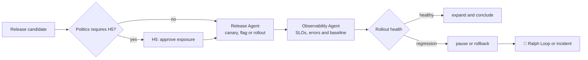

# 🐤 Canary Loop

> Production and observation — releases with controlled exposure and uses operational signals to zoom, pause or reverse.

The name comes from the canary in the mine: a small fraction of the exhibit serves as a sensor for the rest. The Canary Loop is the only one in the journey whose gate runs **after** the change has already taken effect — the post-deploy window is a return like any other, and the rollback is its return.

The Release Agent executes the policy; the Observability Agent interprets and highlights health. The separation exists because whoever is executing a rollout has a structural incentive to interpret ambiguous signal as noise.

---

## Operating contract

| Contract | |
|---|---|
| **Step** | 8 — release and operation |
| **Consolidates** | [🚀 Release Agent](../agentes/release-agent.md) |
| **Collaborate** | [📡 Observability Agent](../agentes/observability-agent.md) |
| **Human owner** | Tech Lead; PM co-approves R3/R4 |
| **Input** | approved release candidate, rollout and rollback plans, SLOs, alerts and authorizations |
| **Exit** | released version, health report, changelog and rollback or pause when applicable |
| **Exit gate** | H5 — authorized environment, compatible migration and post-deployment window without relevant regression |
| **Dominant lap** | external — the post-deploy window closes the loop; regression triggers rollback |

---

## Sequence

1. The Release Agent checks artifact, environment, authorized secrets, migration, backup and **rollback capability** before any exposure.
2. H5 is applied depending on the risk. R3/R4 require explicit approval before production.
3. The Release Agent executes the authorized strategy — canary, feature flag, or progressive rollout. The Observability Agent compares errors, latency, SLOs and product metrics with the baseline.
4. Regression signal triggers pause or rollback according to policy, with evidence pack for the Tech Lead. Stability completes the post-deploy window.

---

##Handoffs

| Direction | Load |
|---|---|
| **Input** | release candidate approved + pending issues consciously accepted upon approval, with owner and deadline |
| **Exit** | health report with baseline, observed deviation and decision taken; apprenticeship candidates for the [🗄️ Archivist Loop](09-knowledge-curation.md) |

---

## What this loop doesn't do

**Does not:** expand exposure in the face of an unexplained critical alert.

"Probably unrelated" is the phrase that precedes most preventable incidents. As long as a critical signal is unexplained, exposure does not grow — the decision to follow anyway belongs to the Tech Lead, with the deviation recorded.

---

## Typical faults

| Failure | Symptom | Correction |
|---|---|---|
| Rollback not tested | it is discovered immediately that the migration is irreversible | rollback capacity is checked before exposure, not during |
| Missing baseline | there is nothing to compare the metric to | the baseline is captured before the rollout begins |
| Contradictory signal resolved by the executor | whoever does the rollout also judges health | interpretation belongs to Observability Agent |
| Post-deploy window closed early | "rose and didn't break" after ten minutes | the window has a duration declared by the risk class |

---

## Artifacts and where they live

| Artifact | Destination | Mandatory |
|---|---|---|
| Post-deploy window health report | `<tech-lead-workspace>/projects/<project>/execution/evidence/<release-id>/` | yes |
| Version changelog | authorized release registration | yes |
| Apprenticeship Candidates | `<tech-lead-workspace>/projects/<project>/LEARNINGS.md` | when there is |
| Rollback evidence pack | `execution/evidence/<release-id>/rollback/` | if there was rollback |
| Incident, alert and pause in progress | `.coordination/` until they are promoted | traffic |

---

## Escalation

Escalate when automatic rollback is unsafe, signals are contradictory, or the impact exceeds the mitigation plan. Open incident interrupts the loop and transfers control to the human owner.
