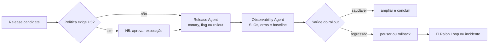

# 🐤 Canary Loop

> Produção e observação — libera com exposição controlada e usa sinais operacionais para ampliar, pausar ou reverter.

O nome vem do canário na mina: uma fração pequena da exposição serve de sensor para o resto. O Canary Loop é o único da jornada cujo gate roda **depois** da mudança já estar valendo — a janela pós-deploy é uma volta como qualquer outra, e o rollback é o retorno dela.

O Release Agent executa a política; o Observability Agent interpreta e evidencia a saúde. A separação existe porque quem está executando um rollout tem incentivo estrutural para interpretar sinal ambíguo como ruído.

---

## Contrato operacional

| Contrato | |
|---|---|
| **Etapa** | 8 — release e operação |
| **Consolida** | [🚀 Release Agent](../agentes/release-agent.md) |
| **Colabora** | [📡 Observability Agent](../agentes/observability-agent.md) |
| **Owner humano** | Tech Lead; PM coaprova R3/R4 |
| **Entrada** | release candidate aprovado, planos de rollout e rollback, SLOs, alertas e autorizações |
| **Saída** | versão liberada, health report, changelog e rollback ou pausa quando aplicável |
| **Gate de saída** | H5 — ambiente autorizado, migração compatível e janela pós-deploy sem regressão relevante |
| **Volta dominante** | externa — a janela pós-deploy fecha a volta; regressão dispara rollback |

---

## Sequência

1. O Release Agent verifica artefato, ambiente, secrets autorizados, migração, backup e **capacidade de rollback** antes de qualquer exposição.
2. H5 é aplicado conforme o risco. R3/R4 exigem aprovação explícita antes de produção.
3. O Release Agent executa a estratégia autorizada — canary, feature flag ou rollout progressivo. O Observability Agent compara erros, latência, SLOs e métricas de produto com o baseline.
4. Sinal de regressão dispara pausa ou rollback conforme política, com evidence pack para o Tech Lead. Estabilidade completa a janela pós-deploy.

---

## Handoffs

| Direção | Carrega |
|---|---|
| **Entrada** | release candidate aprovado + pendências aceitas conscientemente na homologação, com owner e prazo |
| **Saída** | health report com baseline, desvio observado e decisão tomada; candidatos a aprendizado para o [🗄️ Archivist Loop](09-knowledge-curation.md) |

---

## O que este loop não faz

**Não faz:** ampliar exposição diante de alerta crítico não explicado.

"Provavelmente não é relacionado" é a frase que precede a maior parte dos incidentes evitáveis. Enquanto um sinal crítico não tiver explicação, a exposição não cresce — a decisão de seguir mesmo assim pertence ao Tech Lead, com o desvio registrado.

---

## Falhas típicas

| Falha | Sintoma | Correção |
|---|---|---|
| Rollback não testado | descobre-se na hora que a migração é irreversível | capacidade de rollback é verificada antes da exposição, não durante |
| Baseline ausente | não há com o que comparar a métrica | o baseline é capturado antes do rollout começar |
| Sinal contraditório resolvido pelo executor | quem faz o rollout também julga a saúde | interpretação pertence ao Observability Agent |
| Janela pós-deploy encerrada cedo | "subiu e não quebrou" após dez minutos | a janela tem duração declarada pela classe de risco |

---

## Artefatos e onde vivem

| Artefato | Destino | Obrigatório |
|---|---|---|
| Health report da janela pós-deploy | `<tech-lead-workspace>/projects/<project>/execution/evidence/<release-id>/` | sim |
| Changelog da versão | registro autorizado de release | sim |
| Candidatos a aprendizado | `<tech-lead-workspace>/projects/<project>/LEARNINGS.md` | quando houver |
| Evidence pack de rollback | `execution/evidence/<release-id>/rollback/` | se houve rollback |
| Incidente, alerta e pausa em curso | `.coordination/` até serem promovidos | trânsito |

---

## Escalonamento

Escalar quando o rollback automático não for seguro, os sinais forem contraditórios ou o impacto exceder o plano de mitigação. Incidente aberto interrompe o loop e transfere a condução ao owner humano.
