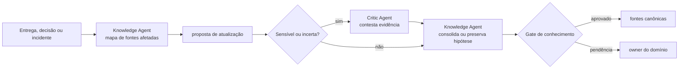

# 🗄️ Archivist Loop

> Curadoria de conhecimento — mantém as fontes canônicas alinhadas à entrega, sem deixar memória temporária virar verdade permanente.

O Archivist Loop trata a documentação como consequência da entrega, não como tarefa paralela a ela. E resolve o problema que assombra qualquer sistema com memória: **uma observação registrada uma vez tende a ser lida para sempre como fato**. Por isso toda atualização carrega origem, data, contexto de aplicação e limite de validade — e a crítica independente é obrigatória para alteração sensível ou conclusão de baixa confiança.

---

## Contrato operacional

| Contrato | |
|---|---|
| **Etapa** | 9 — conhecimento e melhoria |
| **Consolida** | [📚 Knowledge Agent](../agentes/knowledge-agent.md) |
| **Colabora** | [⚖️ Critic Agent](../agentes/critic-agent.md) quando a mudança for sensível, contraditória ou de baixa confiança |
| **Owner humano** | owner do domínio alterado |
| **Entrada** | decisões, PR, release, evidências de homologação, incidentes e fontes canônicas afetadas |
| **Saída** | documentação e conhecimento reutilizável atualizados, ou proposta explícita para revisão |
| **Gate de saída** | rastreabilidade, atualidade e ausência de contradições não resolvidas |
| **Volta dominante** | média — o Critic contesta a conclusão antes de ela virar fonte canônica |

---

## Sequência

1. O Knowledge Agent relaciona mudança e evidência às fontes canônicas afetadas e identifica conteúdo obsoleto ou contraditório.
2. Propõe a atualização com **origem, data, contexto de aplicação e limites de validade**.
3. Para memória sensível, baixa confiança ou contradição, o Critic Agent verifica se a conclusão é sustentada pela evidência. Hipótese inconclusiva permanece identificada como tal.
4. O Knowledge Agent consolida somente o que passou pelo gate e entrega ao owner do domínio os links para auditoria.

---

## Handoffs

| Direção | Carrega |
|---|---|
| **Entrada** | decisões, evidências e incidentes das etapas anteriores, com data e origem preservadas |
| **Saída** | atualização em fonte canônica, ou hipótese explicitamente marcada como não confirmada — nunca a terceira opção, que é afirmação sem lastro |

---

## O que este loop não faz

**Não faz:** promover memória de trânsito a fonte canônica.

`memory.md` e `.coordination/` guardam contexto retomável de uma execução. Eles registram o que um agente achou naquele momento, com o contexto daquele momento. Promover esse conteúdo a fonte canônica sem passar pelo gate é como transformar a anotação de uma reunião em política da empresa — e o custo aparece meses depois, quando um agente age sobre uma "regra" que ninguém decidiu.

---

## Falhas típicas

| Falha | Sintoma | Correção |
|---|---|---|
| Fato sem data | a documentação afirma algo que era verdade há um ano | toda atualização carrega data e limite de validade |
| Contradição silenciosa | duas fontes canônicas discordam e ambas seguem válidas | contradição não resolvida bloqueia o gate |
| Documentação como resumo | a página descreve o que foi feito, não o que vale hoje | a fonte canônica registra o estado vigente, não o histórico da entrega |
| Confiança inflada | hipótese aparece redigida como conclusão | baixa confiança preserva a marcação de hipótese |

---

## Artefatos e onde vivem

| Artefato | Destino | Obrigatório |
|---|---|---|
| Atualização de fonte canônica | fonte canônica do domínio alterado | sim |
| Aprendizados da rodada | `<tech-lead-workspace>/projects/<project>/LEARNINGS.md` | quando houver |
| Review do Critic Agent | `execution/reviews/knowledge-<id>.md` | quando acionado |
| ADR revisada ou superseded | `engineering/adr/` | quando a decisão mudou |
| Propostas ainda não decididas | `.coordination/` | trânsito |

---

## Escalonamento

Escalar ao owner se não houver fonte canônica definida, se a evidência conflitar, ou se a alteração puder afetar política, segurança ou decisão vigente.
