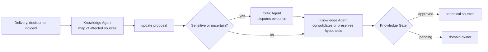

# 🗄️ Archivist Loop

> Knowledge curation — keeps canonical sources aligned with delivery, without letting temporary memory become permanent truth.

Archivist Loop treats documentation as a consequence of delivery, not as a parallel task to it. And it solves the problem that haunts any system with memory: **an observation recorded once tends to be read forever as fact**. That's why every update carries origin, date, application context and validity limit — and independent criticism is mandatory for sensitive changes or low confidence conclusions.

---

## Operating contract

| Contract | |
|---|---|
| **Step** | 9 — knowledge and improvement |
| **Consolidates** | [📚 Knowledge Agent](../agentes/knowledge-agent.md) |
| **Collaborate** | [⚖️ Critic Agent](../agentes/critic-agent.md) when the change is sensitive, contradictory or low confidence |
| **Human owner** | domain owner changed |
| **Input** | decisions, PR, release, approval evidence, incidents and affected canonical sources |
| **Exit** | updated documentation and reusable knowledge, or explicit proposal for revision |
| **Exit gate** | traceability, timeliness and absence of unresolved contradictions |
| **Dominant lap** | average — the Critic disputes the conclusion before it became a canonical source |

---

## Sequence

1. The Knowledge Agent matches change and evidence to the affected canonical sources and identifies obsolete or contradictory content.
2. Proposes updating with **origin, date, application context and validity limits**.
3. For sensitive memory, low confidence, or contradiction, the Critic Agent checks whether the conclusion is supported by the evidence. Inconclusive hypothesis remains identified as such.
4. The Knowledge Agent consolidates only what passed through the gate and delivers the links for auditing to the domain owner.

---

##Handoffs

| Direction | Load |
|---|---|
| **Input** | decisions, evidence and incidents from previous stages, with date and origin preserved |
| **Exit** | update in canonical source, or hypothesis explicitly marked as unconfirmed — never the third option, which is an unsupported statement |

---

## What this loop doesn't do

**Does not:** promote transit memory to canonical source.

`memory.md` and `.coordination/` store the resumable context of an execution. They record what an agent thought at that moment, with the context of that moment. Promoting this content to the canonical source without going through the gate is like turning a meeting note into company policy — and the cost appears months later, when an agent acts on a "rule" that no one decided on.

---

## Typical faults

| Failure | Symptom | Correction |
|---|---|---|
| Undated fact | documentation states something that was true a year ago | every update carries an expiration date and limit |
| Silent contradiction | two canonical sources disagree and both remain valid | unresolved contradiction blocks the gate |
| Documentation as a summary | the page describes what was done, not what it is worth today | the canonical source records the current state, not the delivery history |
| Inflated confidence | hypothesis appears written as conclusion | low confidence preserves hypothesis marking |

---

## Artifacts and where they live

| Artifact | Destination | Mandatory |
|---|---|---|
| Canonical Source Update | canonical source of changed domain | yes |
| Learnings from the round | `<tech-lead-workspace>/projects/<project>/LEARNINGS.md` | when there is |
| Critic Agent Review | `execution/reviews/knowledge-<id>.md` | when triggered |
| Revised or superseded ADR | `engineering/adr/` | when the decision changed |
| Proposals not yet decided | `.coordination/` | traffic |

---

## Escalation

Escalate to owner if there is no canonical source defined, if the evidence conflicts, or if the change could affect current policy, security, or decision.
