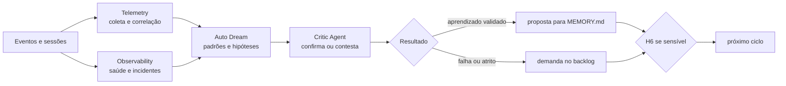

# 🌙 Dream Loop

> Telemetria e melhoria contínua — converte o histórico do sistema de trabalho em aprendizado validado ou demanda priorizável.

O Dream Loop é a quarta volta, a de período mais longo: o único circuito em que **o sistema de trabalho é o objeto do trabalho**. Ele observa como os outros dez loops se comportaram — quantas voltas deram, onde escalaram, o que custaram — e transforma padrão em aprendizado ou em demanda.

Telemetry fornece dados íntegros; Auto Dream formula conclusões; Critic impede que um padrão aparente vire regra sem evidência. A separação é o que distingue melhoria contínua de superstição operacional.

---

## Contrato operacional

| Contrato | |
|---|---|
| **Etapa** | 10 — conhecimento e melhoria |
| **Consolida** | [💭 Auto Dream Agent](../agentes/auto-dream-agent.md) |
| **Colaboram** | [📊 Telemetry Agent](../agentes/telemetry-agent.md); [📡 Observability Agent](../agentes/observability-agent.md); [⚖️ Critic Agent](../agentes/critic-agent.md) independente |
| **Owner humano** | trio; PM ordena o backlog; owner do domínio decide a execução |
| **Entrada** | sessões, gates, retries, feedbacks, incidentes, métricas de custo, qualidade e autonomia, e demandas anteriores |
| **Saída** | proposta de atualização de memória, demanda de melhoria, relatório periódico e hipóteses em observação |
| **Gate de saída** | H6 — evidência, contexto, confiança, privacidade e contradições tratados |
| **Volta dominante** | do sistema — realimenta o desenho dos outros dez loops |

---

## Sequência

1. Telemetry coleta eventos correlacionáveis e **remove secrets e dados pessoais antes da análise**. Observability acrescenta sinais de saúde, incidentes e rollbacks.
2. Auto Dream agrupa os dados por etapa, causa e impacto, compara com o baseline e separa padrão, hipótese e ocorrência isolada.
3. O Critic Agent avalia conclusão, evidências, contradições e generalização indevida. É independente do Auto Dream.
4. Auto Dream consolida em dois destinos: **aprendizado** com contexto e validade para `MEMORY.md`, ou **demanda de melhoria** com sintoma, evidência, impacto, causa provável, critério de aceite e owner recomendado.
5. H6 revisa mudança sensível de memória, item P0/P1 e alteração de gate. Itens de baixo risco podem seguir por amostragem.

---

## Handoffs

| Direção | Carrega |
|---|---|
| **Entrada** | telemetria anonimizada de todos os loops, com o número de voltas por circuito e a causa de cada escalonamento |
| **Saída** | ou um aprendizado com contexto e validade declarados, ou um item de backlog acionável — e nunca uma observação genérica sem destino |

---

## O que este loop não faz

**Não faz:** aprovar alterações nos próprios gates.

Um sistema que analisa a si mesmo e tem autoridade para relaxar as próprias verificações converge para a ausência de verificação. A proposta de alterar um gate é sempre uma demanda com owner humano — e alteração de gate está entre os itens que exigem H6 por definição.

Vale a leitura complementar em [Loops — How Loops Work](../LOOPS.md#versionamento-e-avaliação): as métricas produzidas aqui medem o **desenho dos loops**, não o desempenho dos agentes. Volta externa frequente indica gate mal posicionado ou entrada mal definida — quase nunca indica um agente ruim. Usá-las como avaliação individual corrompe o sinal.

---

## Falhas típicas

| Falha | Sintoma | Correção |
|---|---|---|
| Padrão de três ocorrências vira regra | uma conclusão geral tirada de amostra mínima | o Critic avalia generalização; amostra insuficiente mantém hipótese |
| Falha de coleta virando conclusão | métrica cai e isso é lido como melhoria | falha de coleta abre alerta, nunca conclusão silenciosa |
| Dado pessoal na análise | telemetria carrega conteúdo de sessão | anonimização acontece antes da análise, não depois |
| Melhoria sem owner | relatório com dez recomendações e nenhum responsável | toda demanda nasce com owner recomendado e critério de aceite |

---

## Artefatos e onde vivem

| Artefato | Destino | Obrigatório |
|---|---|---|
| Relatório periódico | `<tech-lead-workspace>/projects/<project>/execution/telemetry/<periodo>.md` | sim |
| Proposta de atualização de memória | `MEMORY.md` do workspace correspondente | quando validada |
| Demanda de melhoria | `<pm-workspace>/projects/<project>/work-items/<WI-id>.md` | quando houver |
| Review do Critic Agent | `execution/reviews/dream-<periodo>.md` | quando a conclusão for contestada |
| Hipóteses em observação | `.coordination/` até nova evidência | trânsito |

---

## Escalonamento

Falha de coleta abre alerta, não conclusão silenciosa. Baixa confiança mantém a hipótese em observação. Contradição bloqueia atualização automática. Toda demanda que altere gate, política ou autonomia vai a H6 antes de entrar no [🚦 Triage Loop](00-intake-and-triage.md) do próximo ciclo.
