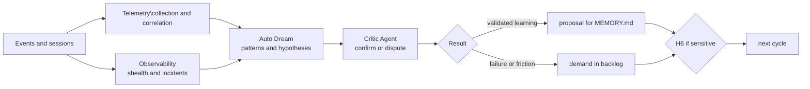

# 🌙 Dream Loop

> Telemetry and continuous improvement — converts system work history into validated learning or prioritizable demand.

The Dream Loop is the fourth lap, the one with the longest period: the only circuit in which **the work system is the object of the work**. He observes how the other ten loops behaved — how many laps they took, where they climbed, what they cost — and turns the pattern into learning or demand.

Telemetry provides complete data; Auto Dream formulates conclusions; Critic prevents an apparent pattern from becoming a rule without evidence. Separation is what distinguishes continuous improvement from operational superstition.

---

## Operating contract

| Contract | |
|---|---|
| **Step** | 10 — knowledge and improvement |
| **Consolidates** | [💭 Auto Dream Agent](../agentes/auto-dream-agent.md) |
| **Collaborate** | [📊 Telemetry Agent](../agentes/telemetry-agent.md); [📡 Observability Agent](../agentes/observability-agent.md); [⚖️ Critic Agent](../agentes/critic-agent.md) independent |
| **Human owner** | trio; PM orders the backlog; domain owner decides execution |
| **Input** | sessions, gates, retries, feedbacks, incidents, cost, quality and autonomy metrics, and previous demands |
| **Exit** | memory update proposal, demand for improvement, periodic report and hypotheses under observation |
| **Exit gate** | H6 — evidence, context, trust, privacy and contradictions addressed |
| **Dominant lap** | of the system — feeds back to the design of the other ten loops |

---

## Sequence

1. Telemetry collects correlatable events and **removes secrets and personal data before analysis**. Observability adds health signals, incidents and rollbacks.
2. Auto Dream groups data by stage, cause and impact, compares with the baseline and separates pattern, hypothesis and isolated occurrence.
3. The Critic Agent evaluates conclusion, evidence, contradictions and undue generalization. It is independent of Auto Dream.
4. Auto Dream consolidates into two destinations: **learning** with context and validity for `MEMORY.md`, or **demand for improvement** with symptom, evidence, impact, probable cause, acceptance criteria and recommended owner.
5. H6 reviews sensitive memory change, item P0/P1 and gate change. Low-risk items can be sampled.

---

##Handoffs

| Direction | Load |
|---|---|
| **Input** | anonymized telemetry of all loops, with the number of turns per circuit and the cause of each escalation |
| **Exit** | or a learning with declared context and validity, or an actionable backlog item — and never a generic observation with no destination |

---

## What this loop doesn't do

**Does not:** approve changes to the gates themselves.

A system that analyzes itself and has the authority to relax its own checks converges to no checking. The proposal to change a gate is always a demand with a human owner — and changing a gate is among the items that require H6 by definition.

It's worth further reading in [Loops — How Loops Work](../LOOPS.md#versioning-and-evaluation): the metrics produced here measure the **design of the loops**, not the performance of the agents. Frequent external loops indicate a poorly positioned gate or poorly defined input — almost never indicating a bad agent. Using them as an individual assessment corrupts the signal.

---

## Typical faults

| Failure | Symptom | Correction |
|---|---|---|
| Pattern of three occurrences becomes the rule | a general conclusion drawn from a minimum sample | Critic evaluates generalization; insufficient sample maintains hypothesis |
| Collection failure turning into conclusion | metric drops and this is read as improvement | collection failure opens alert, never silent completion |
| Personal data in analysis | telemetry loads session content | anonymization happens before analysis, not after |
| Improvement without owner | report with ten recommendations and no one responsible | every demand comes with a recommended owner and acceptance criteria |

---

## Artifacts and where they live

| Artifact | Destination | Mandatory |
|---|---|---|
| Periodic report | `<tech-lead-workspace>/projects/<project>/execution/telemetry/<periodo>.md` | yes |
| Memory upgrade proposal | `MEMORY.md` from the corresponding workspace | when validated |
| Demand for improvement | `<pm-workspace>/projects/<project>/work-items/<WI-id>.md` | when there is |
| Critic Agent Review | `execution/reviews/dream-<periodo>.md` | when the conclusion is challenged |
| Hypotheses under observation | `.coordination/` until further evidence | traffic |

---

## Escalation

Collection failure opens alert, not silent completion. Low confidence keeps the hypothesis under observation. Contradiction blocks automatic update. Any demand that changes gate, policy or autonomy goes to H6 before entering the [🚦 Triage Loop](00-intake-and-triage.md) of the next cycle.
