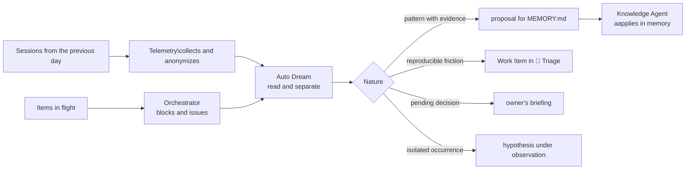

# ☀️ Daily Loop

> Daily operation — converts the previous day's sessions into memory, improvement and signaling to the owner, without letting the day's record become a report.

The Daily Loop is the only circuit that rotates by calendar and not by Work Item. All other loops are triggered by something arriving — a request, a push, a gate fail. This rotates every day, whether or not there was a delivery, because what it observes is not the item: it is **what happened while the system was working**.

The distinction that underpins the entire loop: **recording the day is not prioritizing the day**. The agent reads, separates and signals; the owner decides what to do with what was signaled. A daily loop that also sets priority closes the loop on itself and ceases to be observation.

---

## Operating contract

| Contract | |
|---|---|
| **Step** | 11 — knowledge and improvement |
| **Consolidates** | [💭 Auto Dream Agent](../agentes/auto-dream-agent.md) |
| **Collaborate** | [📊 Telemetry Agent](../agentes/telemetry-agent.md) for collection and cost; [📚 Knowledge Agent](../agentes/knowledge-agent.md) for memory; [🎛️ Orchestrator Agent](../agentes/orchestrator-agent.md) for in-flight items and blocks; [📥 Intake Agent](../agentes/intake-agent.md) as a destination for improvements |
| **Human owner** | workspace owner |
| **Input** | sessions closed since last run, with output envelopes, failed gates, retries, open escalations and items in flight |
| **Exit** | owner's briefing, proposals for updating `MEMORY.md`, Work Items for improving intake and to-do list and points of attention |
| **Exit gate** | every statement linked to an identifiable session; every improvement with explicit destination — Work Item created or discard recorded |
| **Dominant lap** | of the system, with a 24-hour window |

---

## Sequence

1. **Collection.** The Telemetry Agent gathers the period's sessions with output envelopes, gates, retries, schedules and cost. **Secrets and personal data are removed before analysis**, not after. Orchestrator adds the items in flight, their blocks, and the time in each state.
2. **Reading.** Auto Dream goes through the material and separates four natures that cannot be treated together: what was completed, what was pending, what failed and for what reason, and what only one person can decide.
3. **Learning.** Recurrent pattern with session evidence becomes a proposal for memory updating. Isolated occurrence remains marked as hypothesis — low confidence learning **does not** go into `MEMORY.md`.
4. **Improvement.** Reproducible friction becomes Work Item in [🚦 Triage Loop](00-intake-and-triage.md), with symptom, evidence, impact, probable cause and recommended owner. Friction without evidence does not become an item; becomes a hypothesis.
5. **Memory.** The Knowledge Agent applies the proposals accepted in `MEMORY.md`, preserving the origin, context and declared validity of each entry.
6. **Signaling.** The briefing reaches the owner in three categories, in this order: **blocked** — needs a decision today; **at risk** — will block if no one takes action; **in progress** — informative. The order is part of the contract: a briefing that opens with the newsletter stops being read at the end.

---

##Handoffs

| Direction | Load |
|---|---|
| **Input** | anonymized sessions with intact output envelope, and the status of items in flight with time at each stage |
| **Exit** | briefing with required decisions and deadline; memory proposals with evidence and validity; Work Items with recommended owner — and never a generic note with no destination |

---

## What this loop doesn't do

**It does not:** prioritize the improvements that it raises, nor approve changes to gates, policies or autonomy.

A circuit that observes the system, creates demand and defines its own priority converges into a backlog that serves the observer. Daily Loop delivers to intake; the order belongs to the PM. Any proposal that changes gate, policy or level of autonomy crosses H6 in [🌙 Dream Loop](10-continuous-improvement.md), never here.

**It also does not:** replace the curation of [🗄️ Archivist Loop](09-knowledge-curation.md). The specific knowledge of a delivery is recorded there, with the delivery. What this loop records is what goes through deliveries.

---

## Daily and weekly — why are there two loops

The natural question is why there are two learning loops. They differ in window, input, and rigor of critique—and it is this difference that makes them complementary rather than redundant.

| | ☀️ Daily | 🌙Dream |
|---|---|---|
| **Window** | 24h | week or cycle |
| **Scope** | a workspace | all loops and workspaces |
| **Input** | sessions and raw envelopes | aggregated telemetry and baseline |
| **Criticism** | light — session evidence is enough | [⚖️ Critic Agent](../agentes/critic-agent.md) independent, mandatory |
| **Exit** | briefing, memory, item in intake | validated learning, P0/P1 demand, gate change proposal |
| **Human gate** | none; the owner reads the briefing | H6 |
| **Typical fault** | become a report that no one reads | become a rule after three occurrences |

The diary feeds the weekly: what this loop records as a hypothesis is exactly the material that the Dream Loop confirms or discards with baseline and independent criticism.

---

## Typical faults

| Failure | Symptom | Correction |
|---|---|---|
| Briefing becomes narrative | the owner reads what happened, not what needs to be decided | the briefing opens by blocked users and is limited in size |
| Improvement without destination | the same friction is recorded day after day without becoming an item | every improvement comes out as a Work Item or as a recorded disposal |
| Inflated memory | `MEMORY.md` grows without criteria and stops being read | entry requires declared validity; expired entry is reviewed, not maintained |
| Missed session | a day without execution disappears from the history | collection failure opens alert, never silent empty result |
| Signage without deadline | everything appears as "attention" and nothing is decided | each blocked item carries the requested decision and the deadline |

---

## Artifacts and where they live

| Artifact | Destination | Mandatory |
|---|---|---|
| Daily briefing | `<workspace-do-owner>/.coordination/daily/<data>.md` | yes |
| Memory upgrade proposal | `MEMORY.md` from the corresponding workspace | when validated |
| Work Improvement Item | `<pm-workspace>/projects/<project>/work-items/<WI-id>.md` | when there is reproducible friction |
| Hypotheses under observation | `.coordination/` until further evidence | traffic |
| Sessions collected and anonymized | input from [🌙 Dream Loop](10-continuous-improvement.md) | traffic |

The briefing is the only artifact in this loop whose canonical source is `.coordination/` — it is, by nature, a document valid for one day. Everything that needs to survive it has already left as memory or as a Work Item.

---

## Escalation

Escalate to owner when an item remains locked for more than one daily cycle, when an open escalation has no response, or when collection fails. **Collection failure opens alert, not empty briefing** — a day without data is a signal, not the absence of one.
