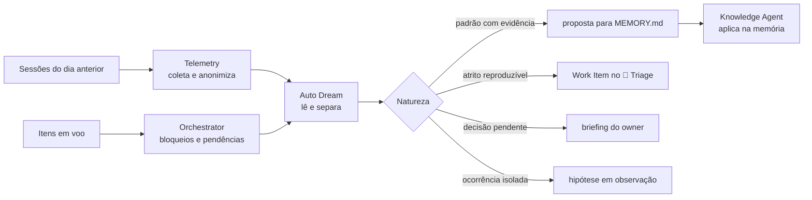

# ☀️ Daily Loop

> Operação diária — converte as sessões do dia anterior em memória, melhoria e sinalização ao owner, sem deixar o registro do dia virar relatório.

O Daily Loop é o único circuito que gira por calendário e não por Work Item. Todos os demais loops são disparados por algo que chegou — uma solicitação, um push, um gate reprovado. Este gira todo dia, tenha ou não havido entrega, porque o que ele observa não é o item: é **o que aconteceu enquanto o sistema trabalhava**.

A distinção que sustenta o loop inteiro: **registrar o dia não é priorizar o dia**. O agente lê, separa e sinaliza; o owner decide o que fazer com o que foi sinalizado. Um loop diário que também define prioridade fecha o ciclo sobre si mesmo e deixa de ser observação.

---

## Contrato operacional

| Contrato | |
|---|---|
| **Etapa** | 11 — conhecimento e melhoria |
| **Consolida** | [💭 Auto Dream Agent](../agentes/auto-dream-agent.md) |
| **Colaboram** | [📊 Telemetry Agent](../agentes/telemetry-agent.md) para coleta e custo; [📚 Knowledge Agent](../agentes/knowledge-agent.md) para memória; [🎛️ Orchestrator Agent](../agentes/orchestrator-agent.md) para itens em voo e bloqueios; [📥 Intake Agent](../agentes/intake-agent.md) como destino das melhorias |
| **Owner humano** | owner do workspace |
| **Entrada** | sessões encerradas desde a última execução, com envelopes de saída, gates reprovados, retries, escalonamentos abertos e itens em voo |
| **Saída** | briefing do owner, propostas de atualização de `MEMORY.md`, Work Items de melhoria no intake e lista de pendências e pontos de atenção |
| **Gate de saída** | toda afirmação vinculada a uma sessão identificável; toda melhoria com destino explícito — Work Item criado ou descarte registrado |
| **Volta dominante** | do sistema, com janela de 24 h |

---

## Sequência

1. **Coleta.** O Telemetry Agent reúne as sessões do período com envelopes de saída, gates, retries, escalonamentos e custo. **Secrets e dados pessoais são removidos antes da análise**, não depois. O Orchestrator acrescenta os itens em voo, seus bloqueios e o tempo em cada estado.
2. **Leitura.** O Auto Dream percorre o material e separa quatro naturezas que não podem ser tratadas juntas: o que foi concluído, o que ficou pendente, o que falhou e por qual causa, e o que só uma pessoa pode decidir.
3. **Aprendizado.** Padrão recorrente com evidência de sessão vira proposta de atualização de memória. Ocorrência isolada permanece marcada como hipótese — um aprendizado de baixa confiança **não** entra em `MEMORY.md`.
4. **Melhoria.** Atrito reproduzível vira Work Item no [🚦 Triage Loop](00-intake-and-triage.md), com sintoma, evidência, impacto, causa provável e owner recomendado. Atrito sem evidência não vira item; vira hipótese.
5. **Memória.** O Knowledge Agent aplica as propostas aceitas em `MEMORY.md`, preservando origem, contexto e validade declarada de cada entrada.
6. **Sinalização.** O briefing chega ao owner em três categorias, nesta ordem: **bloqueado** — precisa de decisão hoje; **em risco** — vai bloquear se ninguém agir; **em andamento** — informativo. A ordem é parte do contrato: um briefing que abre pelo informativo deixa de ser lido pelo fim.

---

## Handoffs

| Direção | Carrega |
|---|---|
| **Entrada** | sessões anonimizadas com envelope de saída íntegro, e o estado dos itens em voo com tempo em cada etapa |
| **Saída** | briefing com decisões requeridas e prazo; propostas de memória com evidência e validade; Work Items com owner recomendado — e nunca uma observação genérica sem destino |

---

## O que este loop não faz

**Não faz:** priorizar as melhorias que ele mesmo levanta, nem aprovar alteração de gate, de política ou de autonomia.

Um circuito que observa o sistema, cria demanda e define a própria prioridade converge para um backlog que serve ao observador. O Daily Loop entrega ao intake; a ordenação pertence ao PM. Toda proposta que altere gate, política ou nível de autonomia atravessa H6 no [🌙 Dream Loop](10-continuous-improvement.md), nunca aqui.

**Também não faz:** substituir a curadoria do [🗄️ Archivist Loop](09-knowledge-curation.md). O conhecimento específico de uma entrega é registrado lá, com a entrega. O que este loop registra é o que atravessa entregas.

---

## Diário e semanal — por que são dois loops

A pergunta natural é por que existem dois circuitos de aprendizado. Eles diferem em janela, insumo e rigor de crítica — e é essa diferença que os torna complementares em vez de redundantes.

| | ☀️ Daily | 🌙 Dream |
|---|---|---|
| **Janela** | 24 h | semana ou ciclo |
| **Escopo** | um workspace | todos os loops e workspaces |
| **Insumo** | sessões e envelopes brutos | telemetria agregada e baseline |
| **Crítica** | leve — evidência de sessão basta | [⚖️ Critic Agent](../agentes/critic-agent.md) independente, obrigatório |
| **Saída** | briefing, memória, item no intake | aprendizado validado, demanda P0/P1, proposta de alteração de gate |
| **Gate humano** | nenhum; o owner lê o briefing | H6 |
| **Falha típica** | virar relatório que ninguém lê | virar regra a partir de três ocorrências |

O diário alimenta o semanal: o que este loop registra como hipótese é exatamente o material que o Dream Loop confirma ou descarta com baseline e crítica independente.

---

## Falhas típicas

| Falha | Sintoma | Correção |
|---|---|---|
| Briefing vira narrativa | o owner lê o que aconteceu, não o que precisa decidir | o briefing abre pelos bloqueados e tem tamanho limitado |
| Melhoria sem destino | o mesmo atrito é registrado dia após dia sem virar item | toda melhoria sai como Work Item ou como descarte registrado |
| Memória inflacionada | `MEMORY.md` cresce sem critério e deixa de ser lido | entrada exige validade declarada; entrada expirada é revisada, não mantida |
| Sessão perdida | um dia sem execução some do histórico | falha de coleta abre alerta, nunca resultado vazio silencioso |
| Sinalização sem prazo | tudo aparece como "atenção" e nada é decidido | cada item bloqueado carrega a decisão pedida e a data-limite |

---

## Artefatos e onde vivem

| Artefato | Destino | Obrigatório |
|---|---|---|
| Briefing diário | `<workspace-do-owner>/.coordination/daily/<data>.md` | sim |
| Proposta de atualização de memória | `MEMORY.md` do workspace correspondente | quando validada |
| Work Item de melhoria | `<pm-workspace>/projects/<project>/work-items/<WI-id>.md` | quando houver atrito reproduzível |
| Hipóteses em observação | `.coordination/` até nova evidência | trânsito |
| Sessões coletadas e anonimizadas | insumo do [🌙 Dream Loop](10-continuous-improvement.md) | trânsito |

O briefing é o único artefato deste loop cuja fonte canônica é `.coordination/` — ele é, por natureza, um documento com validade de um dia. Tudo o que precisa sobreviver a ele já saiu como memória ou como Work Item.

---

## Escalonamento

Escalar ao owner quando um item permanecer bloqueado por mais de um ciclo diário, quando um escalonamento aberto não tiver resposta, ou quando a coleta falhar. **Falha de coleta abre alerta, não briefing vazio** — um dia sem dados é um sinal, não a ausência de um.
