# 06 — Jornada comentada

> O ciclo inteiro visto pelos pontos humanos: onde uma pessoa entra, o que a fez entrar e o que acontece se ela disser não.

Esta página costura. Ela não descreve a mecânica de nenhuma etapa — isso está em [`loops/`](../loops/README.md), um arquivo por contrato — e não redefine autoridade de agente. O que ela mostra é o **conjunto**: as doze etapas agrupadas em cinco blocos, com os checkpoints humanos posicionados e os caminhos de retorno visíveis.

O ponto a observar na primeira leitura é a **quantidade de amarelo** no diagrama. São seis pontos de decisão humana em todo o ciclo, e dois deles são condicionais. Todo o resto é executado por agentes ou verificado por automação. É essa proporção que o modelo tenta sustentar — e é ela que degrada primeiro quando gates ficam frouxos ou artefatos ficam ambíguos.

---

## O ciclo, pelos pontos humanos

```mermaid
flowchart TD
    START([Necessidade, problema ou oportunidade])

    subgraph B1["Bloco 1 · Produto e discovery"]
        L0["🚦 Triage<br/>etapa 0"]
        L1["🔦 Scout<br/>etapa 1"]
        H1{"H1 · Vale investir?"}
        L2["🎨 Studio<br/>etapa 2"]
        H2{"H2 · É isto que construiremos?"}
    end

    subgraph B2["Bloco 2 · Especificação técnica"]
        L3["🗺️ Drafting<br/>etapa 3"]
        D3{"ADR nova, exceção<br/>ou risco R3/R4?"}
        H3{"H3 · Aceitamos<br/>o trade-off?"}
    end

    subgraph B3["Bloco 3 · Construção e validação"]
        L4["🔁 Ralph<br/>etapa 4"]
        L5["⚔️ Red Team<br/>etapa 5"]
        G5{{"Sensors e CI<br/>fast e deep lane"}}
    end

    subgraph B4["Bloco 4 · Integração e entrega"]
        L6["🚪 Gatekeeper<br/>etapa 6"]
        H4{"H4 · Podemos integrar?"}
        L7["🎭 Rehearsal<br/>etapa 7"]
        D8{"Risco R3/R4 ou<br/>exposição crítica?"}
        H5{"H5 · Podemos<br/>expor o risco?"}
        L8["🐤 Canary<br/>etapa 8"]
    end

    subgraph B5["Bloco 5 · Conhecimento e melhoria"]
        L9["🗄️ Archivist<br/>etapa 9"]
        L11["☀️ Daily<br/>etapa 11"]
        L10["🌙 Dream<br/>etapa 10"]
        H6{"H6 · O sistema<br/>aprendeu corretamente?"}
    end

    START --> L0 --> L1 --> H1
    H1 -- "avançar" --> L2
    H1 -- "ajustar" --> L1
    H1 -- "adiar ou encerrar" --> L0
    L2 --> H2
    H2 -- "aprovar" --> L3
    H2 -- "revisar produto" --> L2
    L3 --> D3
    D3 -- "sim" --> H3
    D3 -- "não" --> L4
    H3 -- "aceitar" --> L4
    H3 -- "revisar decisão" --> L3
    L4 --> G5 --> L5
    G5 -- "reprovou" --> L4
    L5 --> L6 --> H4
    H4 -- "aprovar" --> L7
    H4 -- "ajuste de código" --> L4
    H4 -- "ajuste de escopo" --> L2
    L7 --> D8
    D8 -- "não · R0/R1" --> L8
    D8 -- "sim" --> H5
    H5 -- "aprovar" --> L8
    H5 -- "revisar release" --> L7
    L8 --> L9

    L4 -. "sessões" .-> L11
    L5 -. "sessões" .-> L11
    L9 -. "telemetria" .-> L10
    L11 -. "hipóteses" .-> L10
    L11 -. "melhorias" .-> L0
    L10 --> H6
    H6 -. "demandas priorizáveis" .-> L0

    classDef loop fill:#dbeafe,stroke:#2563eb,color:#172554,stroke-width:1.5px;
    classDef automation fill:#dcfce7,stroke:#16a34a,color:#052e16,stroke-width:1.5px;
    classDef human fill:#fef3c7,stroke:#d97706,color:#451a03,stroke-width:2px;
    classDef knowledge fill:#f3e8ff,stroke:#9333ea,color:#3b0764,stroke-width:1.5px;
    classDef terminal fill:#f1f5f9,stroke:#475569,color:#0f172a,stroke-width:1.5px;

    class L0,L1,L2,L3,L4,L5,L6,L7,L8 loop;
    class G5,D3,D8 automation;
    class H1,H2,H3,H4,H5,H6 human;
    class L9,L10,L11 knowledge;
    class START terminal;
```

| Cor | Natureza |
|---|---|
| 🔵 Azul | loop executado por agentes |
| 🟢 Verde | verificação ou decisão por política |
| 🟡 Amarelo | decisão humana |
| 🟣 Roxo | conhecimento, memória e melhoria |

Linha contínua indica fluxo de entrega; linha pontilhada, coleta ou reutilização de conhecimento. **As setas de retorno importam tanto quanto as de avanço** — elas mostram para onde uma falha devolve o trabalho, e é por isso que um gate frouxo em uma etapa inicial custa caro várias etapas depois.

---

## Os cinco blocos

Cada bloco agrupa loops que respondem à mesma pergunta. A tabela é o mapa de conjunto; o contrato de execução de cada linha está no arquivo linkado.

| # | Bloco | Loops | Checkpoints | Artefatos centrais |
|---:|---|---|---|---|
| 1 | Produto e discovery | [🚦 0](../loops/00-intake-and-triage.md) · [🔦 1](../loops/01-discovery-and-research.md) · [🎨 2](../loops/02-product-and-ux-planning.md) | H1, H2 | `PB.md`, `PRD.md` |
| 2 | Especificação técnica | [🗺️ 3](../loops/03-technical-specification.md) | H3, condicional | `PLAN`, `SPEC`, `ADR`, `TASKS` |
| 3 | Construção e validação | [🔁 4](../loops/04-autonomous-implementation.md) · [⚔️ 5](../loops/05-adversarial-validation.md) | nenhum, salvo exceção | mudança pronta para PR |
| 4 | Integração e entrega | [🚪 6](../loops/06-pr-and-merge.md) · [🎭 7](../loops/07-release-candidate-validation.md) · [🐤 8](../loops/08-production-release-and-observation.md) | H4, H5 | PR, release candidate, release |
| 5 | Conhecimento e melhoria | [🗄️ 9](../loops/09-knowledge-curation.md) · [🌙 10](../loops/10-continuous-improvement.md) · [☀️ 11](../loops/11-daily-operations.md) | H6, condicional | `MEMORY.md`, demandas de melhoria |

### Bloco 1 — produto e discovery

Responde a **"vale resolver este problema, e é este o problema?"**. É onde mais evidência é produzida e onde um erro custa menos para corrigir. Concentra dois dos seis checkpoints, deliberadamente: decisão errada aqui se propaga por todo o resto do ciclo.

O owner é o PM, com o UX como coautor em H2. O critério de avanço é que problema, usuário, valor e experiência estejam explícitos e rastreáveis à sua origem.

### Bloco 2 — especificação técnica

Responde a **"como construir, e o que aceitamos ao escolher assim?"**. Único bloco com um só loop, e único cujo checkpoint é condicional por natureza: sem ADR nova, exceção ou risco alto, não há trade-off a aceitar, e a etapa segue direto para a construção.

O owner é o Tech Lead. O critério de avanço é rastreabilidade `PRD → SPEC → TASKS` e gaps críticos tratados.

### Bloco 3 — construção e validação

Responde a **"está construído, e alguém independente atacou?"**. É o bloco sem checkpoint humano no fluxo saudável — e é isso que sustenta o modelo. As voltas aqui são internas e médias: o agente corrige, o sensor reprova, a crítica contesta, tudo em minutos.

O humano só aparece por exceção: limite de tentativas atingido, falso positivo de gate ou gap de requisito descoberto na validação. **Um bloco 3 que chama humano com frequência é sintoma de bloco 1 ou 2 mal executado** — o requisito chegou ambíguo.

### Bloco 4 — integração e entrega

Responde a **"podemos integrar, e podemos expor o risco?"**. Concentra os dois checkpoints em que o custo de errar é mais alto e mais visível. O peso de cada um varia por classe de risco, conforme a tabela em [Checkpoints humanos](02-checkpoints-humanos.md).

O critério de avanço tem duas partes que não se substituem: gates verdes **e** decisão registrada de quem tem a titularidade.

### Bloco 5 — conhecimento e melhoria

Responde a **"o sistema aprendeu, e aprendeu corretamente?"**. Fecha as voltas mais longas — as que têm o próprio sistema de trabalho como objeto — e é o único bloco que gira por calendário, não por Work Item.

Contém três loops com janelas diferentes: o [🗄️ Archivist](../loops/09-knowledge-curation.md) registra o conhecimento de uma entrega; o [☀️ Daily](../loops/11-daily-operations.md) lê o dia; o [🌙 Dream](../loops/10-continuous-improvement.md) lê a semana com crítica independente e leva a H6. A saída dos três reinicia o ciclo pelo bloco 1 — com contexto e controles melhores do que na volta anterior.

---

## Se não passar

Um gate reprovado não interrompe a jornada: devolve o trabalho a um ponto específico. Em nível de bloco, os retornos são estes.

| Bloco | Falha corrigível volta para | Decisão volta para |
|---|---|---|
| 1 | o próprio bloco, com pergunta nova | PM, em H1 e H2 |
| 2 | bloco 1, se o requisito for ambíguo | Tech Lead, em H3 |
| 3 | o próprio bloco, dentro do limite de tentativas | Tech Lead, por exceção |
| 4 | bloco 3, se for defeito; bloco 1, se for escopo | Code Owner em H4; Tech Lead e PM em H5 |
| 5 | a hipótese permanece identificada como tal | trio, em H6 |

O mapa por loop — mais granular e usado durante a execução — está em [`loops/README.md`](../loops/README.md#caminhos-de-falha).

A leitura que interessa: **quanto mais tarde a falha é detectada, mais para trás ela devolve o trabalho.** Um escopo mal definido descoberto em H4 volta ao bloco 1 e descarta o trabalho de três blocos. É o argumento econômico para concentrar rigor no começo.

---

*Anterior: [Manual do operador](05-manual-do-operador.md) · Próximo: [Workflows de documentação](07-workflows-de-documentacao.md).*
