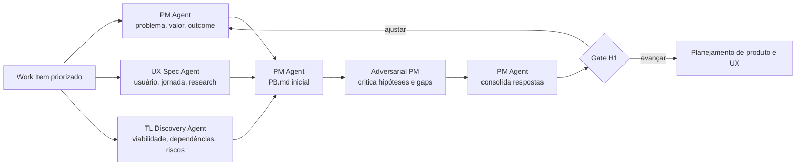

# Workflow — discovery e research

Investiga problema, usuário e viabilidade em paralelo para produzir um `PB.md` que preserve incertezas; não antecipa a solução técnica nem transforma hipótese em requisito.

| Aspecto | Contrato |
|---|---|
| Entrada | Work Item priorizado, dados disponíveis, pesquisas, restrições e perguntas |
| Consolida | Product Manager Agent |
| Colaboram | UX Specification Agent; Tech Lead Discovery Agent; Adversarial Product Manager Agent quando houver hipótese/proposta candidata |
| Saída | `PB.md`, evidências, jornada inicial, restrições, risco preliminar e perguntas abertas |
| Owner humano | PM; UX e Tech Lead respondem pelos respectivos domínios |
| Gate | problema, usuário, experiência desejada e viabilidade inicial cobertos |

## Sequência

1. PM, UX e Tech Lead Discovery recebem a mesma pergunta de discovery, fontes autorizadas e limites de tempo.
2. As três investigações acontecem em paralelo; cada uma separa evidência, inferência, hipótese e pergunta.
3. O PM Agent consolida o `PB.md` e preserva riscos, desacordos e lacunas apontados por UX e Tech Lead.
4. Havendo uma proposta candidata ou uma hipótese de alto impacto, o Adversarial PM tenta invalidá-la antes da consolidação final.
5. O PM apresenta em H1 apenas a síntese decisória: problema, valor, evidências, restrições, riscos e recomendação.

## Regras de colaboração

Três limites mantêm o discovery no seu escopo. A consulta ao Tech Lead Discovery é de viabilidade e risco inicial — arquitetura final pertence à especificação técnica. O UX pode devolver a hipótese de problema quando a evidência de usuário a contradisser, e essa devolução não é uma objeção a ser negociada. A crítica adversarial produz findings rastreáveis; ela não reescreve o `PB.md` silenciosamente.

## Escalonamento

Escalar se a evidência crítica estiver ausente, se valor e viabilidade entrarem em conflito sem alternativa clara, ou se um risco ultrapassar a autonomia autorizada. H1 decide investir, ajustar, adiar ou encerrar; não resolve detalhes de execução.
