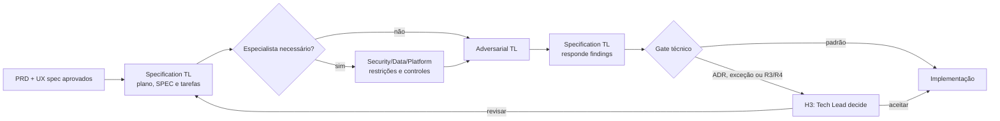

# Workflow — especificação técnica

Transforma produto e UX aprovados em uma estratégia técnica executável, criticada por uma instância independente antes de ser dividida em tarefas.

| Aspecto | Contrato |
|---|---|
| Entrada | `PB.md`, `PRD.md`, UX spec, arquitetura, contratos, SLOs e risco |
| Consolida | Specification Tech Lead Agent |
| Colaboram | Adversarial Tech Lead; especialista de Security, Data ou Platform quando o risco exigir |
| Saída | `PLAN.md`, `SPEC.md`, `TASKS.md`, `CHECKLIST.md`, ADR e planos de teste/rollout/rollback quando aplicáveis |
| Owner humano | Tech Lead |
| Gate | rastreabilidade, tarefas verificáveis, trade-offs e gaps críticos tratados |

## Sequência

1. O Specification Tech Lead avalia alternativas e registra arquitetura, contratos, dados, testes, telemetria e estratégia de entrega.
2. Especialistas são consultados antes da crítica quando há requisito de segurança, dados, plataforma ou domínio que não possa ser tratado por inferência.
3. O Adversarial Tech Lead desafia a proposta com cenários de falha, acoplamentos, migrações, rollback, testabilidade e custo operacional.
4. O Specification Tech Lead responde findings na fonte canônica e mantém riscos residuais visíveis; a crítica não altera a especificação diretamente.
5. H3 somente é acionado por nova ADR, exceção ou risco R3/R4. Sem isso, o gate direciona para implementação.

## Encerramento

Antes de fechar a rodada, registre:

| Artefato | Destino | Obrigatório |
|---|---|---|
| Rascunho intermediário do SPEC (pré-revisão adversarial) | `plans/assets/03-technical-specification/<date-id>/drafts/` | se houve iteração |
| Transcrição de reunião ou sessão | `plans/assets/03-technical-specification/<date-id>/transcripts/` | se houve material externo |
| Review adversarial do Adversarial TL Agent | `execution/reviews/spec-<SPEC-id>.md` | sim |
| SPEC finalizado | `engineering/specs/<SPEC-id>.md` | sim |
| ADR quando aplicável | `engineering/adr/<ADR-id>.md` | quando decisão estrutural |
| Plano ativo | `plans/active/<PLAN-id>.md` | sim |
| Work Items criados | `work-items/<WI-id>.md` | sim |
| STATUS.md | fase atual, plano ativo, próximo gate | sim |
| `MEMORY.md` | decisões e trade-offs desta rodada | sim |

## Escalonamento

Escalar quando o trade-off for estrutural, depender de acesso ou fornecedor, alterar contrato público ou não tiver mitigação suficiente. O agente não pode reduzir risco apenas por conveniência de entrega.
