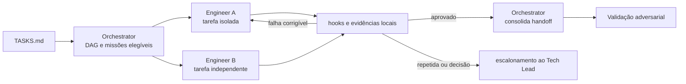

# Workflow — implementação autônoma

Executa tarefas elegíveis em unidades pequenas e isoladas. O Orchestrator coordena dependências e evidências; cada Software Engineer Agent é dono de uma missão, nunca do estado global.

| Aspecto | Contrato |
|---|---|
| Entrada | tarefa elegível, `SPEC.md`, critérios, permissões, risco e gates |
| Consolida | Orchestrator Agent |
| Colaboram | um ou mais Software Engineer Agents |
| Saída | diff rastreável, testes, documentação afetada, resultados locais e handoff para validação |
| Owner humano | Tech Lead por política e exceção |
| Gate | hooks locais e critérios da tarefa aprovados |

## Sequência

1. O Orchestrator cria o DAG a partir de `TASKS.md`, seleciona apenas missões com dependências satisfeitas e distribui o contexto mínimo.
2. Cada Engineer Agent declara escopo, arquivos, branch/worktree e validações; trabalho concorrente no mesmo repositório usa isolamento por Work Item.
3. O Engineer implementa a menor mudança, atualiza testes e documentação e executa os gates locais.
4. Falhas corrigíveis retornam ao mesmo agente dentro dos limites de tentativa e tempo. O Orchestrator bloqueia dependentes até a evidência existir.
5. O Orchestrator consolida o estado, não o código: produz a lista de mudanças, evidências, dependências resolvidas e pendências para validação.

## Regras de colaboração

Como esta é a etapa mais paralela do fluxo, as regras existem para evitar que dois agentes destruam o trabalho um do outro. Agentes não editam simultaneamente o mesmo artefato sem divisão explícita, e nenhuma tarefa usa branch, worktree ou alterações preexistentes de outra missão sem autorização. Por fim, a conclusão local não substitui a validação adversarial — gates verdes indicam que a mudança está pronta para ser atacada, não que está aprovada.

## Encerramento

Antes de fechar a rodada, registre:

| Artefato | Destino | Obrigatório |
|---|---|---|
| Código implementado | worktree em `repos/worktrees/` (fora do workspace) | sim |
| Work Item atualizado | `work-items/<WI-id>.md` — status, branch, worktree | sim |
| STATUS.md | fase `implementation`, próximo gate `technical review` | sim |
| `MEMORY.md` | progresso e bloqueios relevantes | se houve mudança |

Nenhum arquivo de implementação vai para `plans/assets/`. O rastro auditável da implementação é o diff no repositório e as evidências em `execution/evidence/`.

## Escalonamento

Escalar por falha repetida, requisito contraditório, dependência circular, necessidade de permissão ou risco acima da missão. O escalonamento contém decisão solicitada, opções, impacto e evidências, não apenas logs.
