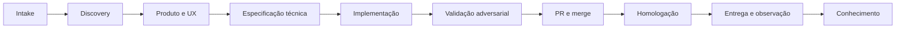

# Quick start — seu primeiro ciclo

> Um roteiro prático para montar um piloto de três pessoas e rodar um ciclo completo, do backlog à observação em produção. Pensado para quem aprende fazendo.

## Antes de começar: o que você precisa

O Agent Team não exige nenhuma ferramenta específica para o primeiro ciclo — exige clareza de papéis e um caso pequeno o suficiente para caber em uma iteração. A recomendação é começar com um repositório real e uma mudança de **baixo risco** (classe R1): uma refatoração localizada ou uma feature pequena, coberta por testes existentes, sem migração de dados nem integração crítica. O objetivo do piloto não é entregar valor grande; é provar o contrato de ponta a ponta.

Três pessoas assumem os papéis do trio. Não precisam ser dedicadas em tempo integral, mas cada uma precisa saber que é dona do seu domínio: o PM responde por valor e prioridade, o UX pela experiência, o Tech Lead pela viabilidade e pelo risco. Se o assunto de decisão não estiver claro, a página [Trio humano](../2-modelo-operacional/trio-humano.md) resolve.

## Os dez passos do piloto

O roteiro abaixo é sequencial. Cada passo prepara o terreno do próximo, e o valor do piloto está em completar o ciclo inteiro pelo menos uma vez — não em fazer cada passo perfeito.

1. **Escolha o repositório e um caso R1 real.** Pequeno, reversível, com testes já existentes.
2. **Nomeie PM, UX e Tech Lead** e registre, por escrito, os direitos de decisão de cada um.
3. **Mapeie o fluxo atual** e os principais gargalos, para ter uma linha de base contra a qual comparar.
4. **Defina o conjunto mínimo de agentes** e as permissões de cada um — o [catálogo de agentes](../4-agentes/TLDR.md) ajuda a escolher.
5. **Crie os templates mínimos** de `PB`, `PRD`, especificação de UX, `SPEC` e evidence pack.
6. **Implemente os gates essenciais** no repositório — comece pelo básico do [repo harness](../7-repo-harness/TLDR.md).
7. **Instrumente IDs, eventos, custo, duração e resultados dos gates**, para que o ciclo produza dados.
8. **Execute um ciclo completo de ponta a ponta**, do intake à observação.
9. **Faça a cerimônia H6** com os dados do ciclo e crie no máximo três melhorias prioritárias.
10. **Repita por três ciclos** antes de elevar autonomia ou adicionar cerimônias.

## Como o trabalho flui no ciclo

Para acompanhar o que acontece em cada passo, vale ter em mente a espinha dorsal da jornada. Um item entra pelo intake, passa por discovery, ganha um plano de produto e UX, recebe uma especificação técnica, é implementado, validado de forma adversarial, integrado por PR, homologado, liberado com observação e, por fim, vira aprendizado documentado. Cada uma dessas etapas tem um workflow próprio, detalhado em [Workflows](../5-workflows/TLDR.md).

## O erro mais comum no primeiro ciclo

Times novos costumam querer subir a autonomia cedo demais — deixar os agentes integrarem sozinhos porque "funcionou nas primeiras vezes". Resista. A autonomia é uma consequência de evidência acumulada, não uma aposta. No piloto, mantenha aprovação humana em todas as transições (nível A0). Só depois de três ciclos com gates confiáveis e baixa taxa de falha faz sentido conversar sobre elevar. A lógica completa está em [Risco e autonomia](../2-modelo-operacional/risco-e-autonomia.md).

## Depois do piloto

Com um ciclo rodado e medido, você terá evidência real para as decisões seguintes: quais gates automatizar, quais skills faltam, onde os agentes escalam mais para humanos. A partir daí, as seções [Skills](../3-skills/TLDR.md), [Workspace](../6-workspace/TLDR.md) e [Repo harness](../7-repo-harness/TLDR.md) deixam de ser teoria e passam a responder perguntas concretas que o seu piloto levantou.
