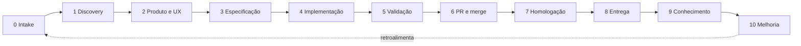

# Gates e cerimônias — como o trabalho anda

> A jornada de ponta a ponta como uma sequência de gates com owner, e as cerimônias humanas (H1 a H6) como pontos de decisão — não de relato.

## A ideia de gate: avançar exige prova

O conceito mais importante desta página cabe em uma frase: **um item só avança quando o gate anterior produziu evidência**. Um gate é um critério objetivo de passagem entre fases. Ele não pergunta "todos concordam?"; pergunta "a evidência que autoriza avançar existe?". Essa diferença é o que impede o fluxo de avançar por otimismo ou por cansaço.

Cada fase da jornada declara quatro coisas: o que recebe (entrada), o que produz (saída), quem responde por ela (owner humano) e qual o critério de passagem (gate). Se você entender esse formato, entende a jornada inteira.

## As dez etapas da jornada

A jornada tem dez etapas, cada uma com workflow próprio, owner humano, time de agentes e gate. A tabela abaixo é o mapa completo — você vai reencontrar cada linha, detalhada, na seção [Workflows](../5-workflows/TLDR.md).

| # | Etapa | Owner humano | Gate |
|---:|---|---|---|
| 0 | Intake e triagem | PM | problema, prioridade e responsável claros |
| 1 | Discovery | PM (UX e TL por domínio) | problema validado e viabilidade avaliada |
| 2 | Produto e experiência | PM / UX | gaps tratados e critérios aprovados |
| 3 | Especificação técnica | Tech Lead | trade-offs registrados e tarefas executáveis |
| 4 | Implementação | Tech Lead por exceção | verificações locais aprovadas |
| 5 | Validação adversarial | Tech Lead (PM/UX por critério) | checklist completo, sem bloqueadores |
| 6 | PR e merge | Tech Lead ou Code Owner | CI verde e aprovações válidas |
| 7 | Homologação | PM / UX | critérios validados ou plano de correção |
| 8 | Entrega e observação | Tech Lead (PM em R3/R4) | janela pós-deploy sem regressão |
| 9 | Curadoria de conhecimento | owner do domínio alterado | documentação atual e sem contradições |

Uma décima primeira etapa — telemetria e melhoria contínua — fecha o ciclo sobre o próprio sistema de trabalho, convertendo dados de operação em aprendizado e demanda priorizada.

## Dois portões que emolduram o ciclo

Além dos gates de fase, dois portões maiores protegem o começo e o fim da execução. O **Definition of Ready** decide se um item pode entrar em execução por agentes: problema e usuário explícitos, outcome e métrica definidos, owner humano conhecido, escopo claro, contratos e critérios de aceite verificáveis, classe de risco definida e dúvidas críticas resolvidas ou assumidas. O **Definition of Done** decide se o ciclo pode fechar: critérios cobertos, gates aprovados, riscos conhecidos, documentação atualizada, rastreabilidade entre backlog, commits, PR e release, e rollout observado sem regressão relevante.

## Cerimônias são pontos de decisão, não de relato

Aqui está a inversão que mais diferencia o Agent Team de um processo tradicional: as cerimônias existem para **decidir**, não para narrar status. Preparação, análise, atualização de status e geração de artefatos ficam com os agentes e automações. A pessoa entra para tomar a decisão que só ela pode tomar. Uma cerimônia que virou relato individual de progresso perdeu a razão de existir.

O ritmo contínuo tem duas cerimônias leves. O **pulso assíncrono diário** (até 10 minutos de leitura, para o trio) cobre apenas bloqueios, novas informações e pedidos de decisão — nunca vira reunião diária de relato. A **triagem semanal** (30 a 45 minutos, owner PM) decide o que entra, o que sai e o que precisa de discovery.

## Os marcos de decisão H1 a H6

Ao longo do ciclo, seis marcos concentram as decisões humanas de maior peso. Cada um tem um owner, uma cadência e um gate próprio.

| Marco | Cerimônia | Owner | Gate |
|---|---|---|---|
| **H1** | Kickoff de discovery | PM | missão, timebox e agentes definidos |
| **H2** | Refinamento de produto e experiência | PM (UX co-owner) | gaps críticos tratados e sucesso mensurável |
| **H3** | Revisão de solução e risco | Tech Lead | rastreabilidade e validação viável |
| **H4** | Review de entrega | PM/UX/Tech Lead por critério | revisão aprovada, CI verde, sem bloqueadores |
| **H5** | Decisão de release | Tech Lead (PM coaprova R3/R4) | ambiente, migração, observabilidade e rollback verificados |
| **H6** | Telemetria e melhoria | trio, facilitação rotativa | evidência rastreável e hipótese separada de aprendizado |

Vale entender o papel de cada um em uma frase. **H1** abre uma oportunidade com missão e timebox. **H2** responde "é isto que vamos construir, para quem e com qual resultado?". **H3** é obrigatório quando há ADR, exceção ou risco elevado. **H4** pergunta "entrega o outcome, funciona bem e pode ser integrada?". **H5** decide liberar, pausar, reduzir exposição ou voltar à implementação. **H6** pergunta "o sistema aprendeu corretamente e qual melhoria merece investimento?".

## O evidence pack: o que a pessoa recebe para decidir

Toda decisão humana chega embrulhada em um pacote curto, desenhado para permitir decidir **sem reler todas as sessões** — mas preservando os links para auditoria. Esse é o mecanismo que torna as cerimônias rápidas sem torná-las superficiais.

| Item | Conteúdo |
|---|---|
| Pergunta de decisão | uma frase |
| Recomendação | a posição dos agentes |
| Alternativas | opções consideradas e descartadas |
| Riscos e trade-offs | o que se ganha e o que se aceita |
| Delta | mudanças desde a última aprovação |
| Evidências | resultado dos gates executados |
| Pendências | exceções e nível de confiança |
| Links | artefatos completos, código e execução |

## Continue por aqui

Você viu como o trabalho avança e onde as pessoas decidem. O que ainda falta é entender **quanto** o sistema pode fazer sozinho em cada tipo de mudança — o assunto de [Risco e autonomia](risco-e-autonomia.md).
