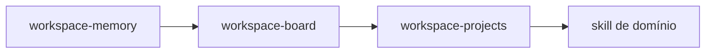

# Skills de base — o alicerce de toda missão

> As três skills que valem para qualquer missão, em qualquer papel, e por que são obrigatórias antes de qualquer skill de domínio.

## Por que existem skills que valem sempre

Vale começar por uma observação contraintuitiva: o erro mais caro de um agente **não** é escrever código ruim. É escrever o artefato certo no lugar errado, ou tratar memória operacional como se fosse fonte de verdade. Um review excelente gravado na pasta errada some; uma conclusão registrada como memória temporária, em vez de artefato canônico, é perdida no próximo ciclo.

As três skills de base existem para eliminar essa classe de erro. Elas não produzem o entregável da fase — produzem as **condições** para que o entregável seja gravado no lugar certo, no item certo, sem sobrescrever o trabalho de outra sessão. Por isso são obrigatórias em qualquer missão, antes de qualquer skill de domínio.

## As três skills e o que cada uma garante

| Skill | Garante | Falha que ela previne |
|---|---|---|
| **`workspace-memory`** | retomada de contexto e escrita segura de memória | tratar `memory.md` como fonte canônica |
| **`workspace-projects`** | fonte canônica correta e assets isolados por sessão | conclusão gravada no domínio errado; sessões se sobrescrevendo |
| **`workspace-board`** | seleção, transição e reconciliação de Work Items | trabalho sem item, ou item movido para `done` sem evidência |

Cada uma cobre uma pergunta que o agente precisa responder antes de agir. `workspace-memory` responde "o que eu já sabia sobre isto?" e, principalmente, "onde é seguro anotar o que aprendi?". `workspace-projects` responde "onde este artefato pertence de verdade?" — e mantém o material bruto de cada sessão isolado, para que reexecutar um workflow nunca sobrescreva a tentativa anterior. `workspace-board` responde "qual Work Item estou executando e como movo ele com segurança?".

## A ordem prática ao iniciar uma missão

Existe uma sequência recomendada, e segui-la evita quase todos os tropeços de início de missão. Primeiro `workspace-memory`, para recuperar o contexto do que já foi feito. Depois `workspace-board`, para assumir formalmente o item de trabalho. Em seguida `workspace-projects`, para localizar onde o artefato pertence. E **só então** a skill de domínio que produz o entregável da fase.

## Onde as skills de base se conectam ao workspace

Essas três skills são, na prática, o **harness do workspace** em ação — o conjunto de convenções que torna o espaço de trabalho do trio operável por agentes sem que cada execução reinvente a organização. Elas fazem mais sentido depois de você conhecer a estrutura do workspace, então, se algo aqui parecer abstrato, a página [Harness do workspace](../6-workspace/harness-do-workspace.md) fecha o círculo.

## Continue por aqui

Com o alicerce claro, veja [Skills por etapa](skills-por-etapa.md) para conhecer os procedimentos que produzem o artefato de cada fase da jornada.
