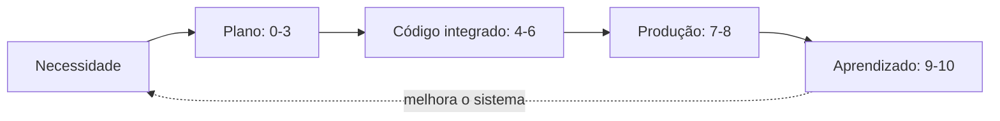

# A jornada completa, workflow a workflow

> As onze etapas da jornada em detalhe: quem consolida, quem colabora, o que cada etapa entrega e qual gate autoriza avançar.

## O mapa da jornada

A jornada completa vai de uma necessidade bruta até aprendizado documentado, passando por produção. Cada etapa é um workflow com um agente que consolida a saída e outros que colaboram ou desafiam. Este é o mapa que a página inteira detalha.

| Etapa | Workflow | Consolida | Colaboram ou desafiam |
|---:|---|---|---|
| 0 | Intake e triagem | Intake Agent | Product Manager; Meeting Context quando houver reunião |
| 1 | Discovery e research | Product Manager Agent | UX Specification; Tech Lead Discovery; Adversarial PM |
| 2 | Produto e UX | Product Manager + UX Specification | Adversarial PM; especialistas de pesquisa/conteúdo |
| 3 | Especificação técnica | Specification Tech Lead | Adversarial TL; Security/Data/Platform |
| 4 | Implementação autônoma | Orchestrator Agent | Software Engineer Agents |
| 5 | Validação adversarial | QA / Validation Agent | Security; Architecture; Adversarial Code Reviewer |
| 6 | PR e merge | PR Agent | Reviewer Agents |
| 7 | Homologação | Product Validation Agent | Release Agent |
| 8 | Produção e observação | Release Agent | Observability Agent |
| 9 | Curadoria de conhecimento | Knowledge Agent | Critic Agent quando sensível |
| 10 | Telemetria e melhoria | Auto Dream Agent | Telemetry; Observability; Critic |

## Da necessidade ao plano (etapas 0 a 3)

As primeiras etapas transformam uma necessidade vaga em um plano executável, e o padrão de produção-e-crítica aparece já aqui.

O **intake** registra, deduplica, contextualiza e prioriza. Ele é o filtro que impede ruído de entrar no backlog como se fosse demanda: entrega um Work Item priorizável com contexto inicial, owner e risco preliminar. O gate exige problema, origem, owner e contexto mínimo explícitos.

O **discovery** compreende problema, usuário, contexto, valor e viabilidade inicial. Três agentes investigam em paralelo — cada um no seu domínio — e o Product Manager Agent sintetiza enquanto os demais criticam a síntese. Entrega o `PB.md` com problema, usuários, jornada, valor, restrições e riscos. O gate exige problema validado e viabilidade avaliada.

O **planejamento de produto e UX** transforma o problema em uma proposta clara, testável e utilizável. A dinâmica é proposta → protótipo e UX spec → crítica adversarial → revisão → consolidação. Entrega o `PRD.md`, a jornada e o fluxo desejados, os estados e critérios de acessibilidade, e os critérios de sucesso. O gate exige gaps tratados e critérios aprovados.

A **especificação técnica** define como construir, validar, liberar e operar. Entrega um conjunto de artefatos que se sustentam mutuamente:

| Artefato | Conteúdo |
|---|---|
| `PLAN.md` | estratégia de implementação |
| `ADR.md` | decisões arquiteturais e consequências |
| `SPEC.md` | comportamento e contratos técnicos |
| `TASKS.md` | unidades pequenas de execução |
| `CHECKLIST.md` | critérios verificáveis de aceite |

O gate exige gaps críticos tratados, trade-offs registrados e tarefas executáveis — com rastreabilidade completa de `PRD → UX → SPEC → TASKS → CHECKLIST`.

## Do plano ao merge (etapas 4 a 6)

Aqui o plano vira código integrado, sob a disciplina de mudanças pequenas e crítica independente.

A **implementação** trabalha *uma tarefa pequena por vez*. O Orchestrator distribui e os Software Engineer Agents executam, apoiados pelo repo harness, pelas skills e pelas ferramentas de código. O resultado é código, testes, documentação e commits em um diff rastreável. A ação humana só ocorre diante de decisão, exceção ou escalonamento.

A **validação adversarial** prova aderência à especificação e procura falhas que o autor não encontrou. Agentes de QA, Security, Architecture e Code Review executam testes, verificação de segurança, análise arquitetural, acessibilidade e regressão. O gate exige checklist completo e ausência de bloqueadores.

O **PR e merge** avalia qualidade, risco, manutenibilidade e prontidão para integração. O gate exige revisão aprovada, CI verde, branch atualizada e aprovações válidas — e é aqui que o marco H4 acontece.

## Do merge ao aprendizado (etapas 7 a 10)

As etapas finais levam a mudança à produção com segurança e fecham o ciclo sobre o próprio sistema.

A **homologação** confirma valor e comportamento em cenário representativo, com o PM respondendo por valor e o UX por experiência. O gate exige critérios de aceite validados ou um plano de correção explícito.

A **entrega e observação** libera com exposição controlada e prova saúde no uso real — deploy progressivo, feature flag quando aplicável, monitoramento e comparação com baseline. O gate exige janela pós-deploy sem regressão relevante, e é onde ocorre o H5.

A **curadoria de conhecimento** mantém a documentação alinhada ao produto real, de forma contínua. O Knowledge Agent consolida decisões e aprendizados e procura contradições e obsolescência. O gate exige documentação atual, rastreável e sem contradições.

A **telemetria e melhoria contínua** fecha o ciclo sobre o sistema de trabalho: converte dados de operação em aprendizado validado ou em demanda priorizada. Ela é a etapa que faz o próximo ciclo ser mais seguro, rápido e autônomo que o anterior — e conecta-se diretamente ao marco H6.

## Continue por aqui

Você viu o *quê* de cada etapa. Falta o *onde*: em que pasta cada artefato é gravado e como um handoff se conclui. Esse é o assunto de [Onde a execução acontece](onde-a-execucao-acontece.md).
