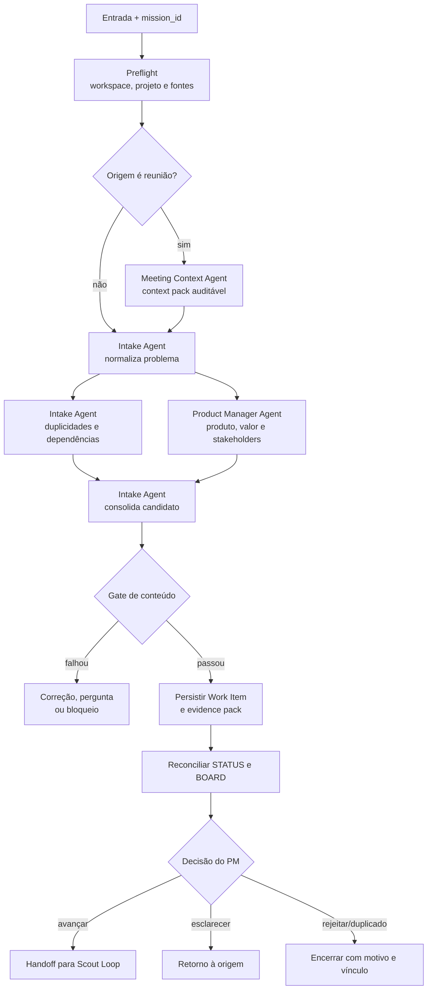

# Workflow 00 — intake e triagem

> Bloco executável do [🚦 Triage Loop](../docs/loops/00-intake-and-triage.md): converte uma entrada bruta em um Work Item rastreável e pronto para decisão do Product Manager, sem transformar normalização automática em prioridade ou aprovação.

Este workflow liga o contrato do loop aos contratos dos agentes e ao estado do workspace. Ele não termina porque os agentes responderam; termina quando a saída consolidada, as evidências, o estado autoritativo e o próximo owner estão coerentes entre si.

---

## Resultado do bloco

Uma execução bem-sucedida deixa um único Work Item no workspace de PM, com fontes localizáveis, incertezas preservadas e uma decisão explícita solicitada ao Product Manager. Nenhuma contribuição paralela é tratada como saída final antes da consolidação do Intake Agent.

O bloco é considerado fechado somente quando estas quatro camadas concordam:

| Camada | Condição de fechamento |
|---|---|
| **Loop** | o gate de triagem passou ou a falha foi registrada com destino definido |
| **Agentes** | cada missão entregou envelope; o Intake Agent consolidou fatos, divergências e lacunas |
| **Workspace** | Work Item foi atualizado antes de `BOARD.md` e `STATUS.md`; trânsito aponta para a fonte canônica |
| **Decisão** | o PM recebeu uma pergunta objetiva e sua decisão ficou registrada ou explicitamente pendente |

Se uma dessas condições faltar, a execução é `partial` ou `blocked`, nunca `completed`.

---

## Contrato operacional

| Contrato | Definição |
|---|---|
| **Etapa** | 0 — entrada |
| **Unidade de execução** | uma entrada identificada por `mission_id`; entradas distintas não compartilham pasta de sessão nem estado transitório |
| **Consolida** | [Intake Agent](../agents/intake-agent/AGENT.md) |
| **Colaboram** | [Meeting Context Agent](../agents/meeting-context-agent/AGENT.md), quando a origem for reunião; [Product Manager Agent](../agents/product-manager-agent/AGENT.md), para contexto de produto |
| **Owner humano** | Product Manager |
| **Workspace owner** | `<pm-workspace>`; por padrão, `workspaces/pm` |
| **Entrada** | solicitação, incidente, feedback, oportunidade ou context pack de reunião |
| **Saída canônica** | `<pm-workspace>/projects/<project>/work-items/<WI-id>.md` |
| **Gate de conteúdo** | problema, origem, projeto, owner e contexto mínimo explícitos; duplicidades conhecidas vinculadas |
| **Gate do bloco** | gate de conteúdo + envelopes + evidência persistida + Work Item/board/status reconciliados + decisão ou handoff registrado |
| **Volta dominante** | externa — lacuna material vira pergunta para a origem ou para o PM, nunca suposição do agente |
| **Próximo loop** | [🔦 Discovery e research](01-discovery-and-research.md), somente quando o PM autorizar avanço |

---

## Pré-condições e resolução do workspace

Antes de distribuir missões, o executor do workflow faz o preflight na ordem abaixo. O preflight é leitura e resolução de autoridade; ainda não altera prioridade, estado ou artefato canônico.

1. Fixar `mission_id`, sponsor, objetivo, escopo, fontes recebidas, risco conhecido, permissões e condição de parada.
2. Resolver `<pm-workspace>` e ler `README.md`, `AGENTS.md` e `WORKSPACE.md`.
3. Consultar memória permitida com `workspace-memory`, tratando-a apenas como contexto; confirmar estado atual em fontes canônicas.
4. Localizar `<project>` pelo portfólio, `BOARD.md` ou referência explícita. O slug não é inferido apenas do nome de um repositório ou de uma feature.
5. Se o projeto existir, ler `projects/<project>/README.md`, `CONTEXT.md` e `STATUS.md`; procurar Work Items relacionados antes de criar outro.
6. Criar uma pasta de sessão exclusiva em `projects/<project>/plans/assets/00-intake-and-triage/<YYYY-MM-DD>-<mission-id>/` para material bruto e rascunhos.

Se projeto ou owner não puderem ser resolvidos, a entrada permanece em `<pm-workspace>/.coordination/inbox/`, com origem, bloqueio e próximo responsável. Não se cria diretório genérico em `projects/` para contornar a lacuna.

### Envelope mínimo de abertura

```yaml
mission_id: "TRIAGE-<id>"
work_item_id: null # preenchido quando o item for localizado ou criado
workflow: "00-intake-and-triage"
phase: "intake"
sponsor: "product-manager"
objective: "<problema a normalizar>"
scope: []
sources: []
acceptance_criteria: []
risk: "<conhecido ou unknown>"
permissions: []
stop_conditions: []
workspace: "<pm-workspace>"
project: "<slug ou unresolved>"
mode: "execute | dry-run"
```

Campo material ausente não é preenchido por conveniência. Ele vira pergunta, resultado parcial ou bloqueio, conforme o impacto no gate.

---

## Plano de missões



### Dependências e paralelismo

| Missão | Responsável | Depende de | Pode rodar em paralelo com | Entrega |
|---|---|---|---|---|
| M0 — resolver execução | executor do workflow | envelope inicial | nada | workspace, projeto, fontes e limites confirmados |
| M1 — extrair reunião | Meeting Context Agent | M0; somente se houver reunião | nada, porque cria a entrada estruturada | resumo, context pack e pontos a confirmar |
| M2 — normalizar problema | Intake Agent | M0 e M1 quando aplicável | nada | problema sem solução presumida e mapa inicial de lacunas |
| M3a — rastrear relações | Intake Agent | M2 | M3b | duplicidades, dependências e fontes relacionadas |
| M3b — enriquecer produto | Product Manager Agent | M2 | M3a | produto, stakeholders, valor alegado e perguntas de negócio |
| M4 — consolidar | Intake Agent | M3a e M3b | nada | um único candidato a Work Item |
| M5 — verificar e persistir | Intake Agent | M4 | nada | gate, Work Item e evidence pack |
| M6 — reconciliar estado | executor com `workspace-board` | M5 | nada | Work Item, `STATUS.md` e `BOARD.md` coerentes |
| M7 — decidir destino | Product Manager | M6 | nada | avançar, esclarecer, adiar ou encerrar |

M3a e M3b podem rodar em paralelo porque produzem contribuições separadas. Nenhum dos dois edita o Work Item durante essa fase; somente o Intake Agent escreve o consolidado em M4/M5.

---

## Responsabilidades e limites

| Participante | Faz neste bloco | Não pode fazer |
|---|---|---|
| **Meeting Context Agent** | separa fatos, falas, decisões provisórias, compromissos e pontos sem confirmação | transformar sugestão em decisão, atribuir autoria incerta ou criar o Work Item final |
| **Intake Agent** | normaliza, rastreia fontes, busca duplicidades/dependências, preserva lacunas e consolida | priorizar definitivamente, prometer solução, estimar ou decompor implementação |
| **Product Manager Agent** | acrescenta contexto de produto, stakeholder, valor alegado e perguntas de negócio | aprovar a própria contribuição ou registrar prioridade em nome do PM humano |
| **Product Manager humano** | decide avançar, esclarecer, adiar, absorver como duplicidade ou encerrar | ter a decisão inferida a partir de silêncio ou ausência de resposta |
| **Executor/orquestrador** | abre missões, aplica dependências, reúne envelopes e reconcilia o bloco | substituir o consolidador, ocultar divergência ou decidir pelo owner humano |

Uma solução sugerida pela origem pode ser registrada como dado da solicitação, mas não como definição do problema nem como compromisso do time.

---

## Skills e contexto mínimo por missão

Cada agente inventaria as skills disponíveis antes de agir e registra os nomes exatos em `skills_used`. Neste workflow, o baseline é:

| Skill | Quando é obrigatória no bloco | Resultado esperado |
|---|---|---|
| `workspace-memory` | ao iniciar ou retomar a missão | contexto recuperado e confirmado contra fonte canônica |
| `workspace-projects` | ao localizar projeto, consultar `projects/` ou persistir artefato | domínio e destino canônico resolvidos; assets isolados por sessão |
| `workspace-board` | ao localizar, criar, assumir, bloquear ou transicionar Work Item | Work Item atualizado antes do board; divergências explícitas |
| `business-discovery` | quando for necessário qualificar problema, usuário ou valor sem avançar para discovery completo | perguntas e hipóteses delimitadas |
| `write-feature` | quando a entrada precisar ser estruturada como unidade de produto | estrutura verificável sem inventar prioridade ou solução |
| `update-docs` | quando contexto confirmado de reunião for promovido a artefato persistente | documentação vinculada à fonte e ao Work Item |

Skill de domínio não aplicável deve ser justificada no envelope; skill disponível e aderente não pode ser omitida silenciosamente.

O executor entrega a cada agente apenas o necessário para sua missão: identificadores, fontes autorizadas, critérios, limites, caminhos canônicos e perguntas relevantes. Memória integral, logs de outros agentes e materiais sem relação não são propagados por padrão.

---

## Consolidação do Work Item

O Intake Agent consolida contribuições sem apagar sua natureza. O Work Item separa:

- **fatos e evidências**, cada um com origem localizável;
- **inferências**, com agente autor e fundamento;
- **hipóteses**, com forma de validação;
- **solução sugerida**, quando houver, identificada como pedido da origem;
- **lacunas e contradições**, expressas como perguntas abertas;
- **duplicidades e dependências**, com vínculos, não somente nomes;
- **risco preliminar**, sem converter classificação automática em autorização;
- **decisão solicitada**, com owner humano nominal.

Enquanto a decisão de prioridade estiver pendente, o item permanece em `refinement`; o agente não inventa um valor de prioridade para satisfazer um template. Depois da decisão do PM:

| Decisão | Efeito autoritativo |
|---|---|
| avançar | registrar prioridade decidida, mover para `backlog` ou para o estado seguinte autorizado e preparar handoff |
| pedir esclarecimento | manter em `refinement`; se impedir avanço, registrar causa, impacto, próximo owner e próxima ação |
| absorver como duplicidade | mover para `cancelled` somente depois de vincular o item que o absorveu |
| rejeitar ou adiar | registrar decisão, motivo, owner e condição de reabertura; não apagar o histórico |

---

## Persistência e contenção de escrita

| Artefato | Destino | Quem escreve | Regra |
|---|---|---|---|
| material bruto e rascunhos | `projects/<project>/plans/assets/00-intake-and-triage/<date>-<mission-id>/` | agente da missão | uma pasta nova por execução; nunca é fonte canônica |
| resumo/context pack | `projects/<project>/work-items/assets/<meeting-id>/` | Meeting Context Agent | obrigatório quando a entrada for reunião |
| Work Item | `projects/<project>/work-items/<WI-id>.md` | Intake Agent | fonte autoritativa de owner, estado, escopo, dependências e evidências |
| evidence pack | `projects/<project>/work-items/assets/<WI-id>/evidence-pack.md` | Intake Agent | gerado a partir dos envelopes, gate e fontes; não montado seletivamente ao final |
| `STATUS.md` | `projects/<project>/STATUS.md` | executor autorizado | resume o estado verificável do projeto; não contradiz o Work Item |
| `BOARD.md` | raiz do workspace | executor autorizado | índice regenerável; sempre reconciliado depois do Work Item |
| perguntas e handoffs temporários | `.coordination/` | agente remetente | trânsito com prazo/owner; aponta para artefato canônico |

Contribuições paralelas usam arquivos ou envelopes próprios. Nenhum agente escreve em um log compartilhado ou no Work Item enquanto o Intake Agent consolida.

### Ordem de fechamento

1. persistir outputs individuais e envelopes;
2. consolidar e atualizar o Work Item;
3. registrar o gate e o evidence pack;
4. reconciliar `STATUS.md`;
5. regenerar ou reconciliar `BOARD.md`;
6. criar handoff para o próximo owner apontando para o Work Item;
7. emitir o envelope final do bloco.

Falha após o passo 2 não autoriza fingir conclusão. A retomada usa o mesmo `mission_id`, verifica o estado já persistido e completa apenas o que falta.

---

## Gates e evidências

### Gate de conteúdo

- [ ] o problema é compreensível sem depender da solução pedida;
- [ ] origem, autor/data quando disponíveis e links das afirmações materiais estão registrados;
- [ ] projeto, produto afetado, owner humano e stakeholders conhecidos estão explícitos;
- [ ] duplicidades e dependências foram buscadas, com escopo da busca e vínculos encontrados;
- [ ] risco preliminar, premissas, contradições e perguntas abertas estão separados;
- [ ] o Work Item não contém prioridade, compromisso ou aprovação inventados.

### Gate de fechamento do bloco

- [ ] todos os agentes retornaram envelope com `status`, `sources_used`, `skills_used`, outputs, riscos e gates;
- [ ] o Intake Agent produziu um único consolidado e preservou divergências materiais;
- [ ] artefato canônico e evidence pack foram persistidos e se referenciam;
- [ ] Work Item, `STATUS.md` e `BOARD.md` refletem o mesmo estado;
- [ ] a decisão do PM está registrada ou existe `decision_requested` com owner e próxima ação;
- [ ] o handoff referencia os artefatos em vez de copiar todo o contexto.

O gate de conteúdo pode passar enquanto a decisão humana está pendente. Nesse caso, a missão do Intake Agent pode estar `completed`, mas a transição do workflow permanece `awaiting_human`; o item não avança silenciosamente ao Scout Loop.

---

## Handoffs

| Direção | Conteúdo mínimo |
|---|---|
| **Origem → workflow** | material bruto, origem, data, autor/solicitante quando conhecido e permissões de uso |
| **Meeting Context → Intake** | context pack, trechos localizáveis, decisões apenas quando confirmadas, dúvidas de autoria e limitações |
| **Product Manager Agent → Intake** | produto, stakeholder, valor alegado, fontes, hipóteses e perguntas; nunca prioridade definitiva |
| **Intake → PM humano** | link do Work Item, recomendação de destino, alternativas, riscos, lacunas e pergunta objetiva de decisão |
| **Workflow → Scout Loop** | Work Item autorizado, decisão do PM, fontes, risco preliminar, hipóteses e perguntas ainda abertas |

Um handoff não está concluído enquanto existir somente em `.coordination/`. Ele termina quando o destinatário consegue resolver o Work Item e suas evidências na fonte canônica.

---

## Falhas, retry e escalonamento

| Condição | Estado | Ação | Owner seguinte |
|---|---|---|---|
| problema não identificável | `partial` | devolver pergunta objetiva e preservar a entrada | origem ou PM |
| projeto ou owner não resolvido | `blocked` | manter entrada na inbox; não criar projeto genérico | PM |
| transcrição incompleta ou autoria ambígua | `partial` ou `blocked` | marcar limitações; solicitar confirmação | owner da reunião |
| fontes se contradizem | `blocked` quando material | registrar versões e impacto; não escolher silenciosamente | PM |
| duplicidade provável | `partial` até decisão | vincular candidatos e pedir decisão de absorção | PM |
| duas tentativas sem reduzir a lacuna | `blocked` | encerrar retry automático com evidências das tentativas | PM |
| risco acima da autonomia ou permissão insuficiente | `blocked` | interromper antes da ação e solicitar autorização | PM ou owner do domínio |
| falha de reconciliação entre Work Item e board | `partial` | preservar Work Item como autoridade e corrigir o índice | executor do workspace |

Escalonar não é encaminhar uma conversa vaga. O escalonamento registra condição, impacto, evidência, opções, recomendação, decisão necessária e owner nominal.

---

## Idempotência e retomada

- O mesmo evento de origem e a mesma `mission_id` não criam dois Work Items. A retomada procura o item e a pasta de sessão já vinculados.
- Uma retomada técnica da mesma execução conserva `mission_id` e pasta. Uma nova tentativa deliberada recebe novo `mission_id` e nova pasta de sessão, mas atualiza o histórico do Work Item existente quando tratar do mesmo problema.
- Duplicidade só é encerrada por vínculo explícito; nenhum item é apagado para "limpar" o board.
- Memória pode orientar a busca, mas Work Item, `STATUS.md`, `BOARD.md` e evidências decidem o estado atual.
- Em `dry-run`, os agentes podem mostrar rascunhos e gates na conversa, mas não escrevem em `projects/`, `.coordination/`, `STATUS.md` ou `BOARD.md`.

---

## Envelope final do bloco

```yaml
mission_id: "TRIAGE-<id>"
work_item_id: "<WI-id>"
workflow: "00-intake-and-triage"
status: completed | partial | blocked
transition: awaiting_human | ready_for_discovery | returned | closed
workspace: "<pm-workspace>"
project: "<slug>"
agents_run: []
sources_used: []
skills_used: []
outputs_created: []
state_changes:
  work_item: "<before -> after>"
  status: "<before -> after>"
  board: "reconciled | pending | not_applicable"
decisions_requested: []
decisions_recorded: []
assumptions: []
risks: []
open_questions: []
gates:
  passed: []
  failed: []
  not_run: []
handoff_to: []
```

`completed` exige gate aprovado, evidência persistida e estado reconciliado. `ready_for_discovery` exige, além disso, decisão explícita do PM; silêncio nunca promove o item.
