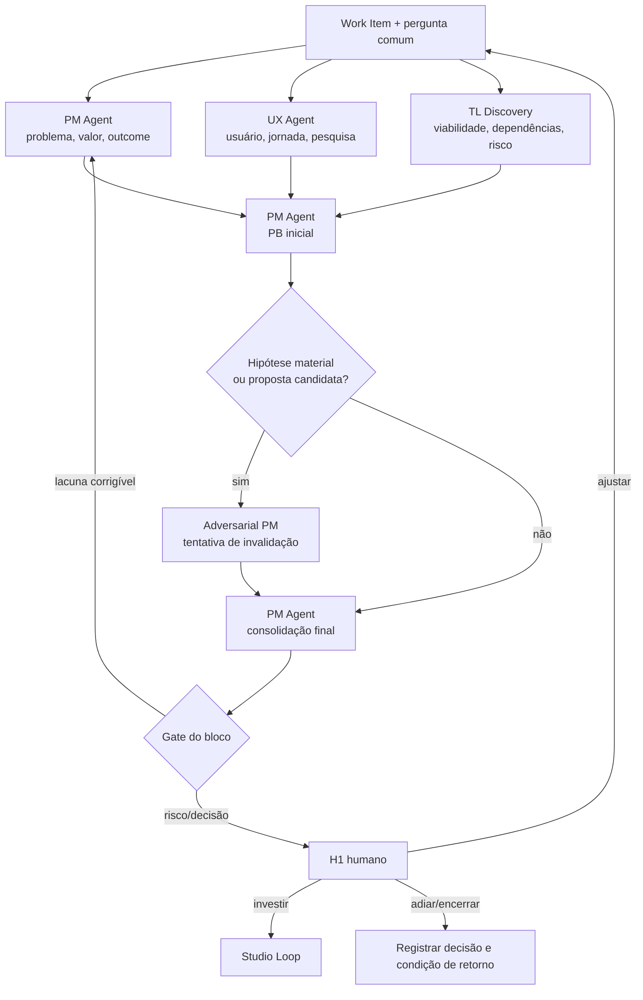

# Workflow 01 — discovery e research

> Bloco executável do [🔦 Scout Loop](../docs/loops/01-discovery-and-research.md): investiga problema, usuário e viabilidade em paralelo e converge em um `PB.md` que preserva incertezas.

O discovery não existe para confirmar a feature pedida. Ele reduz as incertezas que mudariam a decisão de investir e torna visível o que ainda não se sabe. O bloco conecta as investigações independentes de PM, UX e Tech Lead aos três workspaces sem duplicar fontes canônicas.

---

## Resultado do bloco

Uma execução fechada produz um `PB.md` consolidado, contribuições rastreáveis por domínio e um evidence pack de H1 capaz de responder: qual problema existe, para quem, qual mudança observável importa, que evidência sustenta isso e quais riscos ainda podem invalidar o investimento.

| Camada | Condição de fechamento |
|---|---|
| **Loop** | investigações de produto, experiência e viabilidade concluídas dentro do timebox |
| **Agentes** | contribuições independentes entregues; crítica adversarial resolvida ou explicitamente pendente |
| **Workspaces** | PM, UX e Tech Lead persistiram somente em seus domínios e ligaram os artefatos pelo mesmo Work Item |
| **Decisão** | H1 recebeu recomendação, alternativas, riscos, evidências e perguntas abertas |

Sem evidence pack persistido e sem decisão H1 registrada, o workflow não transiciona para planejamento.

---

## Contrato operacional

| Contrato | Definição |
|---|---|
| **Etapa** | 1 — produto e discovery |
| **Unidade de execução** | um Work Item priorizado e uma pergunta de discovery, identificados por `mission_id` |
| **Consolida** | [Product Manager Agent](../agents/product-manager-agent/AGENT.md) |
| **Colaboram** | [UX Specification Agent](../agents/ux-specification-agent/AGENT.md); [Tech Lead Discovery Agent](../agents/tech-lead-discovery-agent/AGENT.md); [Adversarial Product Manager](../agents/adversarial-product-manager-agent/AGENT.md) quando houver hipótese ou proposta candidata |
| **Owners humanos** | PM pelo investimento; UX pela evidência de experiência; Tech Lead pela leitura de viabilidade |
| **Entrada** | Work Item autorizado, pergunta de discovery, dados, pesquisas, restrições, risco e timebox |
| **Saída** | `PB.md`, research, jornada inicial, nota de viabilidade, findings e evidence pack H1 |
| **Gate de conteúdo** | problema, usuário, outcome, experiência desejada, viabilidade inicial e incertezas cobertos |
| **Gate do bloco** | conteúdo + independência das missões + fontes canônicas ligadas + findings tratados + H1 registrado |
| **Volta dominante** | média — crítica adversarial tenta invalidar a hipótese antes da decisão |
| **Próximo workflow** | [02 — planejamento de produto e UX](02-product-and-ux-planning.md), somente com H1 favorável |

---

## Preflight multiworkspace

1. Confirmar no Work Item a decisão de entrada, owner humano, pergunta de discovery, risco, timebox e critérios de parada.
2. Resolver `<pm-workspace>`, `<ux-workspace>` e `<tech-lead-workspace>`; ler os contratos locais e os `CONTEXT.md`/`STATUS.md` do projeto.
3. Confirmar que o Work Item do PM é a unidade que liga as missões; itens auxiliares de UX ou Tech Lead referenciam esse identificador, sem copiar seu estado autoritativo.
4. Recuperar memória permitida com `workspace-memory` e confirmar cada informação material nas fontes canônicas.
5. Fixar a mesma pergunta de discovery para os três agentes e adaptar apenas o recorte de domínio. Perguntas diferentes produzem respostas que não convergem.
6. Criar uma pasta de sessão exclusiva por workspace em `projects/<project>/plans/assets/01-discovery-and-research/<date>-<mission-id>/`.

O preflight bloqueia quando o item não foi autorizado, a pergunta já presume uma solução, o projeto/owner é ambíguo ou o tratamento de dados de pesquisa não está permitido.

### Envelope de abertura

```yaml
mission_id: "DISCOVERY-<id>"
work_item_id: "<WI-id>"
workflow: "01-discovery-and-research"
question: "<pergunta comum em termos de problema>"
sponsor: "product-manager"
owners:
  product: "<owner>"
  ux: "<owner>"
  technical: "<owner>"
sources: []
timebox: "<limite>"
risk: "<classe>"
permissions: []
stop_conditions: []
mode: "execute | dry-run"
```

---

## Plano de missões



| Missão | Responsável | Paralelismo | Saída própria |
|---|---|---|---|
| M1 — problema e outcome | Product Manager Agent | M2 e M3 | hipótese de problema, segmento, valor, outcome e métricas candidatas |
| M2 — usuário e experiência | UX Specification Agent | M1 e M3 | evidências, jornada atual/desejada, limitações da pesquisa e gaps |
| M3 — viabilidade inicial | Tech Lead Discovery Agent | M1 e M2 | dependências, restrições, desconhecidos, risco e spikes recomendados |
| M4 — primeiro consolidado | Product Manager Agent | após M1–M3 | `PB.md` sem apagar divergências |
| M5 — ataque adversarial | Adversarial PM independente | após M4, quando acionado | findings com trecho, impacto, severidade e evidência |
| M6 — resposta e evidence pack | Product Manager Agent | após M5 | respostas por finding e pacote de decisão H1 |
| M7 — decisão | Product Manager humano | após gate do bloco | investir, ajustar, adiar ou encerrar |

As missões M1–M3 não editam o mesmo arquivo. Cada agente persiste sua contribuição no workspace do domínio; o PM referencia essas fontes ao consolidar.

---

## Fronteiras de autoridade

| Participante | Autoridade no bloco | Limite |
|---|---|---|
| **Product Manager Agent** | formula problema/outcome e consolida o `PB.md` | não decide H1 nem converte hipótese em fato |
| **UX Specification Agent** | define qualidade da evidência de usuário e mapeia jornada | não altera prioridade ou substitui pesquisa por heurística sem marcar a limitação |
| **Tech Lead Discovery Agent** | avalia viabilidade, dependências e risco inicial | não escolhe arquitetura final nem produz SPEC |
| **Adversarial PM** | tenta invalidar proposta e métricas | não reescreve o `PB.md` nem aprova o próprio review |
| **PM humano** | decide investimento e destino | silêncio não é aprovação; conflito de UX/TL permanece visível no pacote |
| **Executor/orquestrador** | distribui contexto, aplica timebox e reconcilia envelopes | não força consenso nem substitui consolidador/owners |

---

## Skills e contexto mínimo

| Participante | Skills prioritárias |
|---|---|
| todos os agentes de workspace | `workspace-memory`, `workspace-projects`, `workspace-board` quando houver leitura, escrita ou transição correspondentes |
| Product Manager Agent | `business-discovery`, `write-feature` |
| UX Specification Agent | `business-discovery`, `write-feature`, `update-docs` |
| Tech Lead Discovery Agent | `technical-discovery`, `analyse-bug` quando a viabilidade depender de comportamento existente |
| Adversarial PM | `review-prd`, `review-cross-prd-spec`, `refine-spec` conforme o artefato atacado |

Cada envelope registra `skills_used` com nomes exatos ou a razão de uma skill de domínio não se aplicar. Dados pessoais, transcrições integrais e memória privada não atravessam workspaces; os handoffs carregam síntese, limitações e links autorizados.

---

## Consolidação sem apagar incerteza

O `PB.md` mantém cinco classes separadas:

1. evidência observada e sua fonte;
2. inferência do agente e seu fundamento;
3. hipótese testável e condição de invalidação;
4. restrição confirmada e seu owner;
5. pergunta aberta, impacto e responsável por respondê-la.

Conflito entre domínios não é resolvido por votação. O PM consolida o desacordo, descreve seu efeito sobre H1 e solicita decisão ou nova investigação. A nota técnica pode recomendar spike; não pode antecipar a arquitetura. A pesquisa pode refutar a hipótese de problema; esse achado reabre a pergunta comum.

---

## Persistência e contenção de escrita

| Artefato | Fonte canônica | Writer único |
|---|---|---|
| `PB.md` | `<pm-workspace>/projects/<project>/discovery/PB.md` | Product Manager Agent |
| evidências e plano de pesquisa | `<ux-workspace>/projects/<project>/research/` | UX Specification Agent |
| jornada inicial | `<ux-workspace>/projects/<project>/journeys/` | UX Specification Agent |
| nota de viabilidade | `<tech-lead-workspace>/projects/<project>/engineering/architecture/<discovery-id>.md` | Tech Lead Discovery Agent |
| findings adversariais | `<pm-workspace>/projects/<project>/discovery/reviews/<review-id>.md` | Adversarial PM |
| evidence pack H1 | `<pm-workspace>/projects/<project>/discovery/evidence/<mission-id>.md` | Product Manager Agent, gerado das contribuições e gates |
| material de sessão | `plans/assets/01-discovery-and-research/<date>-<mission-id>/` no workspace de origem | agente da missão |
| handoffs | `.coordination/handoffs/` até promoção | remetente; sempre aponta para fonte canônica |

O fechamento atualiza primeiro os artefatos de domínio, depois o `PB.md`, o Work Item/`STATUS.md` e por último os boards afetados. Snapshots cruzados são entradas identificadas, nunca uma segunda fonte de verdade.

---

## Gates do bloco

### Conteúdo

- [ ] pergunta de discovery está em termos de problema, não de feature;
- [ ] problema, segmento, outcome e experiência desejada possuem evidência ou estão marcados como hipótese;
- [ ] pesquisa registra método, amostra, limitações, consentimento e confiança quando aplicável;
- [ ] dependências, restrições e desconhecidos técnicos estão rastreados;
- [ ] métricas não podem melhorar sem benefício observável ao usuário;
- [ ] riscos, divergências e perguntas abertas sobreviveram à consolidação.

### Execução em bloco

- [ ] M1–M3 receberam a mesma pergunta e retornaram envelopes independentes;
- [ ] writers e destinos canônicos foram respeitados;
- [ ] crítica adversarial foi executada quando o risco/proposta exigiu e cada finding recebeu resposta;
- [ ] `PB.md`, Work Item, `STATUS.md` e boards apontam para o mesmo estado;
- [ ] evidence pack permite ao PM decidir H1 sem reler as sessões;
- [ ] H1 e sua justificativa estão registrados antes da transição.

---

## H1, falhas e retornos

| Resultado | Estado do bloco | Próxima ação |
|---|---|---|
| investir | `completed` / `ready_for_planning` | registrar decisão, critérios e handoff ao Studio Loop |
| ajustar pergunta | `partial` | nova rodada apenas nas missões afetadas, com novo `mission_id` de tentativa |
| evidência crítica ausente | `blocked` ou `partial` | owner define pesquisa, acesso ou timebox adicional |
| valor e viabilidade incompatíveis | `blocked` | apresentar opções e trade-offs ao PM/TL; não escolher silenciosamente |
| hipótese de problema refutada | `returned` | voltar à triagem ou reformular o item sem preservar solução favorita |
| adiar/encerrar | `closed` | registrar motivo, evidência e condição objetiva de reabertura |

Duas tentativas sem reduzir a incerteza material encerram retry automático e escalam. Nova informação que muda problema, usuário, outcome ou risco invalida H1 relacionado.

---

## Envelope final

```yaml
mission_id: "DISCOVERY-<id>"
work_item_id: "<WI-id>"
workflow: "01-discovery-and-research"
status: completed | partial | blocked
transition: awaiting_h1 | ready_for_planning | returned | closed
workspaces_touched: []
agents_run: []
sources_used: []
skills_used: []
outputs_created: []
findings:
  resolved: []
  open: []
decisions_requested: []
decisions_recorded: []
risks: []
open_questions: []
gates:
  passed: []
  failed: []
  not_run: []
handoff_to: []
```

`ready_for_planning` exige H1 explícito, artefatos persistidos e estado reconciliado nos workspaces envolvidos.
