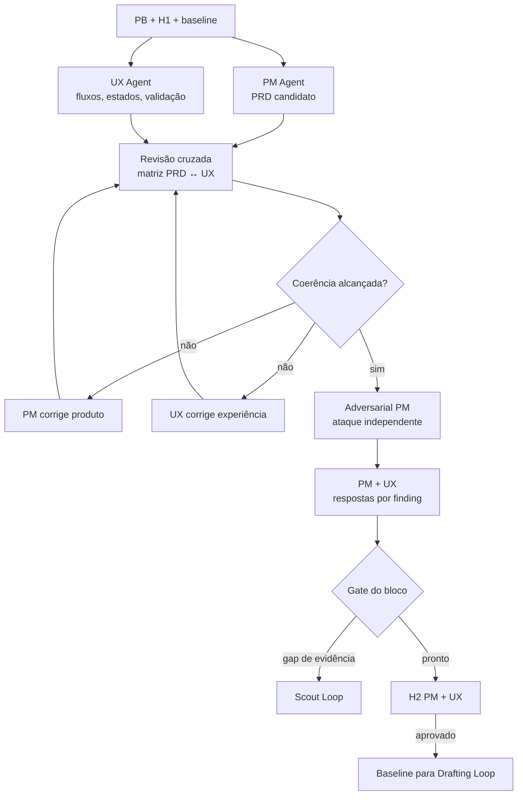

# Workflow 02 — planejamento de produto e UX

> Bloco executável do [🎨 Studio Loop](../docs/loops/02-product-and-ux-planning.md): transforma o problema aprovado em compromisso de produto e experiência verificável, sem subordinar uma fonte canônica à outra.

Este workflow tem dois consolidadores e dois artefatos autoritativos: o Product Manager Agent responde pelo `PRD.md`; o UX Specification Agent responde pela UX spec. O resultado do bloco não é qualquer um deles isoladamente, mas a coerência rastreável entre os dois.

---

## Resultado do bloco

Uma execução fechada deixa `PRD.md` e UX spec mutuamente consistentes, critérios verificáveis, decisões de trade-off registradas e um evidence pack H2 que mostra o delta desde H1. Se um requisito existir em apenas uma fonte, ou se os artefatos apontarem para revisões diferentes, o bloco permanece aberto.

| Camada | Condição de fechamento |
|---|---|
| **Loop** | escopo, fora de escopo, outcome, fluxos, estados e validação estão cobertos |
| **Agentes** | PM e UX consolidaram seus artefatos; crítica independente recebeu resposta por finding |
| **Workspaces** | fontes de PM e UX estão versionadas, cruzadas pelo mesmo Work Item e reconciliadas nos boards |
| **Decisão** | PM e UX humanos receberam H2 com trade-offs e coerência comprovada |

---

## Contrato operacional

| Contrato | Definição |
|---|---|
| **Etapa** | 2 — produto e discovery |
| **Unidade de execução** | um Work Item com H1 favorável e baseline imutável do `PB.md` aprovado |
| **Consolida produto** | [Product Manager Agent](../agents/product-manager-agent/AGENT.md) — `PRD.md` |
| **Consolida experiência** | [UX Specification Agent](../agents/ux-specification-agent/AGENT.md) — UX spec, fluxos e validação |
| **Desafia** | [Adversarial Product Manager](../agents/adversarial-product-manager-agent/AGENT.md), em instância independente |
| **Owners humanos** | PM pelo compromisso de produto; UX pela experiência |
| **Entrada** | `PB.md`, H1, evidências de usuário, restrições e hipóteses abertas |
| **Saída** | `PRD.md`, UX spec, fluxos/estados, protótipo proporcional, validação, reviews e evidence pack H2 |
| **Gate de conteúdo** | rastreabilidade `PB → PRD ↔ UX spec`, sucesso mensurável e gaps críticos tratados |
| **Gate do bloco** | conteúdo + revisão cruzada + writers preservados + estado multiworkspace reconciliado + H2 registrado |
| **Volta dominante** | média — ambiguidades, escopo implícito e casos-limite são atacados antes de H2 |
| **Próximo workflow** | [03 — especificação técnica](03-technical-specification.md), somente com baseline H2 explícito |

---

## Preflight e baseline

1. Confirmar H1, `PB.md` aprovado, Work Item, owners de PM/UX, risco e condição de parada.
2. Resolver os workspaces de PM e UX; ler `CONTEXT.md`, `STATUS.md`, artefatos atuais e handoffs existentes.
3. Registrar a revisão exata do `PB.md` usada como baseline. Mudança material no problema ou outcome devolve ao Scout Loop em vez de ser absorvida silenciosamente.
4. Criar um `mission_id` comum e pastas de sessão separadas em cada workspace.
5. Definir uma matriz inicial de rastreabilidade com IDs estáveis para outcomes, requisitos, fluxos, estados e critérios.
6. Confirmar quem pode aprovar protótipo, pesquisa adicional, conteúdo sensível e trade-offs de escopo.

### Envelope de abertura

```yaml
mission_id: "STUDIO-<id>"
work_item_id: "<WI-id>"
workflow: "02-product-and-ux-planning"
baseline:
  product_brief: "<path@revision>"
  h1_decision: "<path>"
owners:
  product: "<PM>"
  experience: "<UX>"
risk: "<classe>"
sources: []
permissions: []
stop_conditions: []
mode: "execute | dry-run"
```

---

## Plano de missões e barreira de coerência



| Missão | Writer | Dependência | Saída |
|---|---|---|---|
| M1 — compromisso de produto | Product Manager Agent | baseline | outcome, escopo, fora de escopo, métricas e critérios no `PRD.md` |
| M2 — experiência completa | UX Specification Agent | baseline | jornada, fluxos, estados, conteúdo, acessibilidade, protótipo e plano de validação |
| M3 — revisão cruzada | PM + UX, cada um no artefato próprio | M1 e M2 | matriz `requisito ↔ fluxo/estado ↔ critério ↔ método de verificação` |
| M4 — ataque adversarial | Adversarial PM independente | M3 coerente | findings classificados e recomendação de gate |
| M5 — resposta | PM e UX | M4 | resolução, aceitação de risco ou escalonamento por finding |
| M6 — pacote H2 | Product Manager Agent, com ateste do UX Agent | M5 | delta, coerência, riscos e decisões solicitadas |
| M7 — decisão | PM + UX humanos | gate do bloco | compromisso aprovado, ajuste ou retorno |

M1 e M2 podem iniciar em paralelo. M3 é uma barreira: nenhuma trilha avança à crítica enquanto os dois artefatos não apontarem para a mesma revisão e a matriz não estiver completa.

---

## Escrita concorrente e autoridade

| Participante | Escreve | Não escreve |
|---|---|---|
| Product Manager Agent | `PRD.md`, decisões e evidence pack H2 | UX spec, prioridade em nome do PM humano ou solução técnica |
| UX Specification Agent | pesquisa, fluxos, UX spec, protótipos e validação | `PRD.md`, compromisso comercial ou arquitetura |
| especialistas de research/conteúdo/prototipação | contribuições isoladas para o UX Agent | versões concorrentes da UX spec |
| Adversarial PM | review independente | `PRD.md` ou UX spec do autor |
| executor/orquestrador | envelopes, dependências e reconciliação | conteúdo canônico pertencente a PM/UX |

Restrição descoberta no fluxo retorna ao PRD. Requisito novo no PRD retorna à UX spec. Cada owner altera seu próprio artefato; ninguém resolve coerência editando a fonte alheia.

---

## Skills e contexto mínimo

| Agente | Skills prioritárias |
|---|---|
| todos | `workspace-memory`, `workspace-projects`, `workspace-board` conforme operação realizada |
| Product Manager Agent | `business-discovery`, `write-feature`, `review-prd`, `refine-spec` |
| UX Specification Agent | `business-discovery`, `write-feature`, `update-docs` |
| Adversarial PM | `review-prd`, `review-cross-prd-spec`, `refine-spec` |

Os envelopes registram `skills_used`. O PM recebe evidência e restrições de UX por referência; o UX recebe outcome, escopo e critérios por referência. Materiais brutos, dados pessoais e memória privada permanecem no workspace autorizado.

---

## Matriz de coerência

O bloco mantém uma matriz versionada no evidence pack H2:

| Elemento | Deve apontar para |
|---|---|
| outcome do `PB.md` | outcome e métrica do `PRD.md` |
| requisito do `PRD.md` | fluxo/estado correspondente na UX spec |
| estado da UX spec | comportamento esperado e requisito que o justifica |
| critério de aceite | método, ambiente e owner da verificação |
| fora de escopo | ausência explícita nos fluxos ou tratamento como extensão futura |
| hipótese crítica | evidência, plano de validação ou decisão de risco |

O gate falha se um engenheiro ainda precisar escolher qual documento obedecer, se um critério usar linguagem não observável ou se um estado de erro/recuperação não tiver comportamento definido.

---

## Persistência multiworkspace

| Artefato | Fonte canônica | Writer único |
|---|---|---|
| `PRD.md` | `<pm-workspace>/projects/<project>/requirements/prd/<PRD-id>.md` | Product Manager Agent |
| decisões de trade-off | `<pm-workspace>/projects/<project>/decisions/<decision-id>.md` | Product Manager Agent após decisão humana |
| findings adversariais | `<pm-workspace>/projects/<project>/requirements/reviews/<review-id>.md` | Adversarial PM |
| fluxos | `<ux-workspace>/projects/<project>/flows/` | UX Specification Agent |
| UX spec | `<ux-workspace>/projects/<project>/specifications/<UXSPEC-id>.md` | UX Specification Agent |
| protótipo | `<ux-workspace>/projects/<project>/prototypes/` | UX Specification Agent |
| plano/resultado de validação | `<ux-workspace>/projects/<project>/validation/` | UX Specification Agent |
| evidence pack H2 | `<pm-workspace>/projects/<project>/requirements/evidence/<mission-id>.md` | Product Manager Agent; ateste UX referenciado |
| handoffs persistentes | `projects/<project>/handoffs/` de PM e UX | owner remetente |
| assets de sessão | `plans/assets/02-product-and-ux-planning/<date>-<mission-id>/` | agente da sessão |

Fechamento: persistir fontes de UX e PM, atualizar a matriz, responder findings, registrar H2, atualizar Work Items/`STATUS.md` e somente então reconciliar ambos os boards. Handoff ao Tech Lead contém links e revisões; não duplica PRD/UX spec.

---

## Gates

### Gate de produto e UX

- [ ] `PB.md`, `PRD.md` e UX spec formam uma cadeia rastreável;
- [ ] objetivo, escopo, fora de escopo e métricas são observáveis;
- [ ] todos os fluxos cobrem entrada, sucesso, vazio/loading, erro, permissão e recuperação quando aplicáveis;
- [ ] conteúdo e acessibilidade fazem parte dos critérios, não do acabamento posterior;
- [ ] cada requisito possui fluxo/estado e método de verificação correspondentes;
- [ ] hipóteses críticas têm evidência, plano de validação ou risco aceito por owner autorizado.

### Gate de execução em bloco

- [ ] PM e UX escreveram somente em seus domínios;
- [ ] matriz referencia revisões vigentes dos dois artefatos;
- [ ] cada finding adversarial tem resposta e evidência;
- [ ] divergências materiais foram escaladas, não niveladas pelo consolidador;
- [ ] Work Items, `STATUS.md` e boards dos dois workspaces estão coerentes;
- [ ] evidence pack H2 mostra delta desde H1 e decisões solicitadas;
- [ ] PM e UX humanos registraram H2 antes do handoff técnico.

---

## H2, retornos e escalonamento

| Condição | Destino |
|---|---|
| produto e experiência coerentes; H2 aprovado | Drafting Loop com baseline congelado |
| UX contradiz hipótese de problema | Scout Loop, preservando a nova evidência |
| trade-off de escopo sem critério objetivo | decisão conjunta de PM e UX |
| restrição técnica material ainda desconhecida | consulta/spike de Tech Lead Discovery antes de H2 |
| finding crítico aberto | bloco permanece `blocked`; nenhum handoff como pronto |
| mudança material após H2 | invalidar a parte relacionada de H2 e reabrir M1/M2/M3 |

Nenhum agente aprova o próprio artefato. H2 decide compromisso e trade-off; não é sessão de edição linha a linha.

---

## Envelope final

```yaml
mission_id: "STUDIO-<id>"
work_item_id: "<WI-id>"
workflow: "02-product-and-ux-planning"
status: completed | partial | blocked
transition: awaiting_h2 | ready_for_specification | returned_to_discovery | closed
baselines:
  product_brief: "<path@revision>"
  prd: "<path@revision>"
  ux_spec: "<path@revision>"
agents_run: []
workspaces_touched: []
skills_used: []
outputs_created: []
traceability_gaps: []
findings:
  resolved: []
  open: []
decisions_requested: []
decisions_recorded: []
risks: []
gates:
  passed: []
  failed: []
  not_run: []
handoff_to: []
```

`ready_for_specification` exige H2 explícito, revisões coerentes e handoff resolvível pelo Tech Lead sem interpretação oral adicional.
