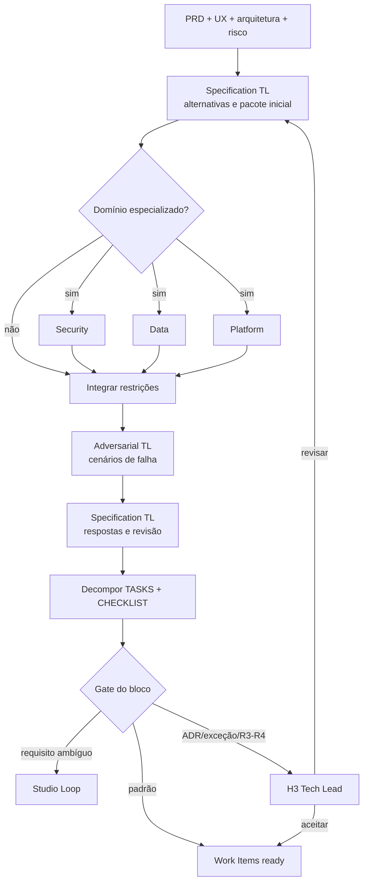

# Workflow 03 — especificação técnica

> Bloco executável do [🗺️ Drafting Loop](../docs/loops/03-technical-specification.md): transforma o baseline aprovado de produto e UX em estratégia técnica, tarefas isoláveis e critérios que as próximas etapas conseguem executar e verificar sem renegociação.

O Drafting Loop é a fronteira entre intenção e execução. Seu produto não é apenas uma `SPEC`: é um pacote coerente em que `PRD → UX → SPEC → TASKS → CHECKLIST` mantém rastreabilidade, writers, dependências e condições de parada explícitas.

---

## Resultado do bloco

Uma execução fechada deixa plano ativo, especificação, decisões estruturais, tarefas elegíveis e checklist de validação sincronizados. O Ralph Loop deve conseguir distribuir as tarefas sem dois agentes disputarem o mesmo arquivo ou contrato; o Red Team deve conseguir provar cobertura usando o checklist sem perguntar ao autor o que ele quis dizer.

| Camada | Condição de fechamento |
|---|---|
| **Loop** | alternativas, contratos, dados, testes, telemetria, rollout e rollback foram tratados proporcionalmente ao risco |
| **Agentes** | especialistas contribuíram antes da crítica; Adversarial TL independente atacou o pacote; especificador respondeu findings |
| **Workspace** | plano, SPEC, ADR, reviews, Work Items, `STATUS.md`, `MEMORY.md` e board estão reconciliados |
| **Execução seguinte** | tarefas têm owner possível, dependências, escopo de escrita, repositório e evidência de conclusão |
| **Decisão** | H3 foi registrado quando houve ADR, exceção, contrato público, migração ou risco R3/R4 |

---

## Contrato operacional

| Contrato | Definição |
|---|---|
| **Etapa** | 3 — especificação |
| **Unidade de execução** | Work Item de produto/UX com baseline H2 e `mission_id` técnico |
| **Consolida** | [Specification Tech Lead Agent](../agents/specification-tech-lead-agent/AGENT.md) |
| **Especializa** | [Security, Data & Platform Specialist](../agents/specialist-security-data-platform-agent/AGENT.md), por domínio e risco explícitos |
| **Desafia** | [Adversarial Tech Lead](../agents/adversarial-tech-lead-agent/AGENT.md), independente do especificador |
| **Owner humano** | Tech Lead |
| **Entrada** | `PB.md`, `PRD.md`, UX spec, arquitetura, repositórios, contratos, SLOs, políticas e risco |
| **Saída** | `PLAN`, `SPEC`, `TASKS`, `CHECKLIST`, ADR e estratégias de teste, observabilidade, rollout e rollback |
| **Gate de conteúdo** | rastreabilidade completa, tarefas pequenas/verificáveis e trade-offs/gaps críticos tratados |
| **Gate do bloco** | conteúdo + crítica independente + persistência/reconciliação + elegibilidade dos Work Items + H3 quando aplicável |
| **Volta dominante** | média — a solução é atacada antes de qualquer tarefa ficar `ready` |
| **Próximo workflow** | [04 — implementação autônoma](04-autonomous-implementation.md) |

---

## Preflight técnico

1. Resolver o workspace de Tech Lead, projeto e Work Item; ler `AGENTS.md`, `WORKSPACE.md`, `CONTEXT.md`, `STATUS.md` e memória permitida.
2. Fixar as revisões aprovadas de `PRD.md` e UX spec. Contradição ou requisito ambíguo devolve ao Studio Loop.
3. Consultar `engineering/repositories.yaml`, instruções locais dos repositórios, arquitetura vigente, contratos, ADRs, SLOs e políticas aplicáveis.
4. Confirmar classe de risco, permissões, domínios especializados e gatilhos de H3. O agente não reduz risco para evitar checkpoint.
5. Criar pasta de sessão em `plans/assets/03-technical-specification/<date>-<mission-id>/`; rascunhos e transcrições permanecem ali até o gate.
6. Registrar no Work Item a assunção da missão e o baseline técnico antes de alterar artefatos.

### Envelope de abertura

```yaml
mission_id: "DRAFTING-<id>"
work_item_id: "<WI-id>"
workflow: "03-technical-specification"
baseline:
  prd: "<path@revision>"
  ux_spec: "<path@revision>"
  architecture: []
repositories: []
risk: "R0 | R1 | R2 | R3 | R4"
specialist_domains: []
h3_triggers: []
permissions: []
stop_conditions: []
mode: "execute | dry-run"
```

---

## Plano de missões



| Missão | Responsável | Depende de | Entrega |
|---|---|---|---|
| M1 — alternativas e desenho inicial | Specification TL | baseline | opções, trade-offs, contratos, dados, falhas e estratégia operacional |
| M2 — análises especializadas | especialistas independentes por domínio | M1 | restrições, controles, testes e critérios adicionais |
| M3 — integração de domínio | Specification TL | M2 | `PLAN`/`SPEC` candidatos e ADRs propostas |
| M4 — ataque técnico | Adversarial TL | M3 | findings com evidência, cenário, impacto, alternativa e severidade |
| M5 — resposta | Specification TL | M4 | resolução ou risco residual por finding; revisão do pacote |
| M6 — decomposição | Specification TL | M5 | `TASKS`, `CHECKLIST` e Work Items com DAG executável |
| M7 — gate/H3 | automação + Tech Lead quando acionado | M6 | baseline técnico aprovado ou retorno explícito |

Análises de Security, Data e Platform podem rodar em paralelo entre si, cada uma com fronteira declarada. A crítica adversarial só começa depois que restrições aceitas foram incorporadas; caso contrário, ela avaliaria uma solução já obsoleta.

---

## Contrato da decomposição

Cada tarefa que alimenta o Ralph Loop declara:

| Campo | Por que é obrigatório |
|---|---|
| objetivo e critério de conclusão | impede agente de girar sem saber quando parar |
| requisitos/SPEC rastreados | prova que a tarefa implementa algo autorizado |
| repositório, paths e contratos afetados | permite detectar colisão de escrita antes da distribuição |
| dependências e bloqueios | forma a DAG real de execução |
| inputs e outputs esperados | define a fronteira do handoff |
| testes e evidências | permite validação independente |
| risco e permissões | limita autonomia e ações externas |
| condição de retry/escalonamento | impede repetição infinita |

Tarefas paralelas não podem possuir o mesmo writer scope. Quando duas mudanças precisam do mesmo arquivo ou contrato, elas são serializadas, fundidas ou recebem uma divisão explícita de ownership.

---

## Fronteiras de autoridade

| Participante | Faz | Não faz |
|---|---|---|
| Specification TL | escreve e consolida plano, SPEC, tarefas, checklist e proposta de ADR | altera outcome/UX, aprova o próprio pacote ou reduz risco |
| especialista | emite parecer limitado ao domínio declarado | amplia conclusão a domínios não avaliados ou edita SPEC diretamente |
| Adversarial TL | modela falhas, acoplamentos, migração, rollback, teste e custo operacional | bloqueia por preferência estética ou reescreve artefato do autor |
| Tech Lead humano | decide H3, exceções, risco e trade-offs estruturais | tem aprovação presumida por silêncio |
| executor/orquestrador | controla DAG, envelopes e reconciliação | escolhe arquitetura ou fecha finding em nome do writer |

---

## Skills e contexto mínimo

| Participante | Skills prioritárias |
|---|---|
| todos | `workspace-memory`, `workspace-projects`, `workspace-board` conforme a operação |
| Specification TL | `technical-discovery`, `create-spec`, `refine-spec`, `review-spec` |
| especialista | `technical-discovery`, `analyse-bug`, `review-spec` |
| Adversarial TL | `review-spec`, `review-cross-prd-spec`, `technical-discovery` |

Cada envelope registra `skills_used`. Especialistas recebem somente SPEC candidata, políticas, paths e perguntas do domínio; o adversarial recebe o pacote integrado e não os raciocínios privados do especificador.

---

## Rastreabilidade e coerência

O evidence pack mantém a cadeia:

```text
PB outcome
  → PRD requisito
    → UX fluxo/estado
      → SPEC contrato/comportamento
        → TASK unidade executável
          → CHECKLIST prova independente
```

Todo elo usa IDs ou links estáveis. Uma `TASK` sem item do checklist correspondente não fica `ready`; um item de checklist sem comportamento autorizado denuncia escopo extra. Mudança em contrato público, modelo de dados ou estratégia de migração exige revisar os elos descendentes.

---

## Persistência e ordem de promoção

| Artefato | Fonte canônica | Writer |
|---|---|---|
| plano ativo | `<tech-lead-workspace>/projects/<project>/plans/active/<PLAN-id>.md` | Specification TL |
| SPEC final | `engineering/specs/<SPEC-id>.md` | Specification TL |
| ADR | `engineering/adr/<ADR-id>.md` | Specification TL após decisão H3 quando aplicável |
| review adversarial | `execution/reviews/spec-<SPEC-id>.md` | Adversarial TL |
| parecer especializado | `execution/reviews/<domain>-<SPEC-id>.md` | especialista do domínio |
| Work Items | `work-items/<WI-id>.md` | Specification TL; fonte de estado/ownership |
| evidence pack técnico | `execution/evidence/spec-<SPEC-id>.md` | gerado de gates, reviews e rastreabilidade |
| rascunhos/transcrições | `plans/assets/03-technical-specification/<date>-<mission-id>/` | agente da sessão |
| estado | `STATUS.md`, `BOARD.md`, `MEMORY.md` | executor autorizado, nessa ordem de autoridade |

Promoção: integrar especialistas → responder review → persistir SPEC/ADR/PLAN → criar Work Items → gerar evidence pack → atualizar `STATUS.md` e memória durável → reconciliar `BOARD.md`. `MEMORY.md` registra decisões e trade-offs com links; não substitui as fontes acima.

---

## Gates

### Gate técnico

- [ ] há pelo menos uma alternativa descartada com custo e consequência;
- [ ] contratos, dados, concorrência, segurança, observabilidade, teste, rollout e rollback foram cobertos proporcionalmente ao risco;
- [ ] decisões estruturais possuem ADR proposta/aceita, nunca comentário perdido na SPEC;
- [ ] cadeia `PRD → UX → SPEC → TASKS → CHECKLIST` está completa;
- [ ] tarefas são pequenas, isoláveis, ordenadas e verificáveis;
- [ ] riscos residuais possuem owner e tratamento explícito.

### Gate de execução em bloco

- [ ] especialistas necessários atuaram antes do Adversarial TL;
- [ ] cada finding possui resposta, evidência e estado;
- [ ] nenhum reviewer alterou artefato do especificador;
- [ ] writer scopes paralelos não colidem;
- [ ] Work Items registram dependências, repositórios, paths, gates e condições de parada;
- [ ] plano, SPEC, ADR, Work Items, `STATUS.md`, memória e board estão reconciliados;
- [ ] H3 foi executado somente quando acionado e sua decisão está ligada ao baseline.

---

## H3, falhas e retornos

| Condição | Destino |
|---|---|
| pacote padrão, sem gatilho H3 | Work Items `ready` para Ralph Loop |
| ADR, exceção, contrato público, migração ou R3/R4 | H3 obrigatório com alternativas e recomendação |
| requisito/UX ambíguo | Studio Loop; não interpretar tecnicamente |
| acesso, fornecedor ou política externa | bloquear e escalar ao owner autorizado |
| risco sem mitigação suficiente | H3 pode aceitar, revisar ou encerrar; agente não reclassifica |
| finding crítico aberto | especificação permanece em revisão |
| mudança material após gate | invalidar tarefas/checklist afetados e reabrir o bloco |

---

## Envelope final

```yaml
mission_id: "DRAFTING-<id>"
work_item_id: "<WI-id>"
workflow: "03-technical-specification"
status: completed | partial | blocked
transition: awaiting_h3 | ready_for_implementation | returned_to_planning
baselines:
  prd: "<path@revision>"
  ux_spec: "<path@revision>"
  spec: "<path@revision>"
agents_run: []
specialist_domains: []
skills_used: []
outputs_created: []
work_items_created: []
dependency_dag: "<path>"
write_collisions: []
findings:
  resolved: []
  open: []
decisions_requested: []
decisions_recorded: []
risks: []
gates:
  passed: []
  failed: []
  not_run: []
handoff_to: []
```

`ready_for_implementation` exige que toda tarefa elegível seja executável e verificável sem decisão arquitetural improvisada pelo agente implementador.
