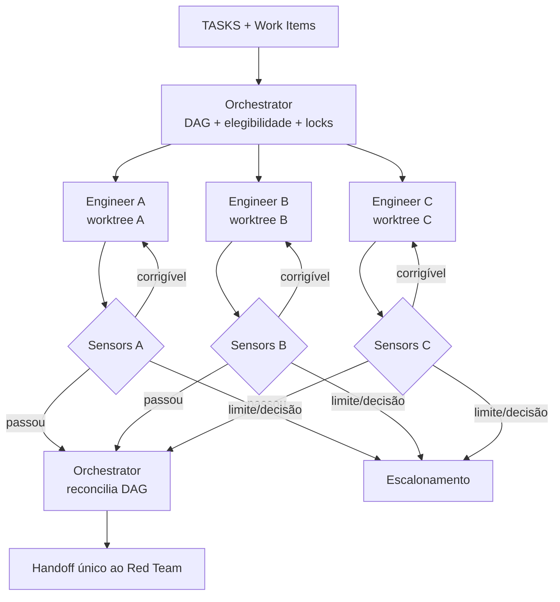

# Workflow 04 — implementação autônoma

> Bloco executável do [🔁 Ralph Loop](../docs/loops/04-autonomous-implementation.md): executa tarefas pequenas e independentes em paralelo, cada uma girando contra gates locais objetivos e sob limites explícitos de retry, escopo e escrita.

O Orchestrator coordena a DAG e consolida estado; ele não escreve código. Cada Software Engineer Agent possui exatamente uma missão, um Work Item e uma superfície de escrita. Paralelismo só existe quando dependências e writer scopes provam independência.

---

## Resultado do bloco

Uma rodada fechada entrega diffs rastreáveis, commits quando autorizados, testes/documentação e evidências locais por Work Item. Dependentes só ficam elegíveis depois que a evidência do predecessor existe; gate verde torna a mudança pronta para ataque adversarial, nunca aprovada.

| Camada | Condição de fechamento |
|---|---|
| **Loop** | cada missão terminou contra sensors e critérios próprios, dentro do budget |
| **Agentes** | Engineers preservaram escopo; Orchestrator consolidou estado e dependências, não código |
| **Repositórios** | branch/base/worktree e estado preexistente estão registrados; writers concorrentes não colidiram |
| **Workspace** | Work Items e evidências foram atualizados antes de `STATUS.md` e `BOARD.md` |
| **Handoff** | Red Team recebe diffs, baselines, resultados brutos, pendências e fora de escopo |

---

## Contrato operacional

| Contrato | Definição |
|---|---|
| **Etapa** | 4 — construção e validação |
| **Unidade de execução** | uma tarefa elegível por missão de Engineer; uma rodada agrega missões independentes |
| **Consolida estado** | [Orchestrator Agent](../agents/orchestrator-agent/AGENT.md) |
| **Implementam** | um ou mais [Software Engineer Agents](../agents/software-engineer-agent/AGENT.md) |
| **Owner humano** | Tech Lead, por política e exceção |
| **Entrada** | Work Items `ready`, SPEC/baseline, critérios, repositórios, permissões, risco e gates |
| **Saída** | diffs, testes, docs, commits autorizados, evidence packs locais e handoff consolidado |
| **Gate por missão** | sensors locais exigidos pelo risco + critérios da tarefa aprovados e registrados |
| **Gate da rodada** | missões terminais reconciliadas; dependências corretas; nenhuma colisão/expansão silenciosa; handoff completo |
| **Volta dominante** | interna — retry do mesmo agente contra gate objetivo, com limite de tentativas e tempo |
| **Próximo workflow** | [05 — validação adversarial](05-adversarial-validation.md) |

---

## Preflight da rodada

1. Ler plano, SPEC, TASKS, CHECKLIST e Work Items; montar DAG com dependências reais.
2. Selecionar apenas itens `ready`, sem `blocked_by`, com owner humano, risco, critérios, repositório e permissões definidos.
3. Resolver cada repositório por `engineering/repositories.yaml`; ler instruções locais e verificar estado Git antes de qualquer edição.
4. Preservar alterações preexistentes e registrar branch, base, worktree e paths autorizados no Work Item.
5. Detectar colisões: duas missões que escrevem o mesmo arquivo, contrato, migração ou recurso externo não rodam em paralelo sem divisão explícita.
6. Fixar concurrency limit, budget, tentativas, sensores, condição de parada e política de commit/push por missão.
7. Registrar a assunção no Work Item e criar estado transitório em `.coordination/active/<mission-id>.md`.

Código e testes nunca são gravados em `plans/assets/`; vivem no worktree. O preflight é bloqueante quando o estado local não pode ser preservado com segurança ou a tarefa exige decisão ausente.

### Envelope de missão

```yaml
mission_id: "RALPH-<id>"
work_item_id: "<WI-id>"
workflow: "04-autonomous-implementation"
task_id: "<TASK-id>"
baseline:
  spec: "<path@revision>"
  commit: "<sha>"
repository:
  id: "<repo-id>"
  branch: "<branch>"
  base_branch: "<base>"
  worktree: "<absolute-or-bound-path>"
write_scope: []
dependencies: []
acceptance_criteria: []
sensors: []
risk: "<classe>"
permissions: []
retry:
  max_attempts: 2
  time_budget: "<limit>"
stop_conditions: []
```

---

## Scheduler e plano de missões



### Ciclo de uma missão

1. confirmar baseline, estado Git e escopo de escrita;
2. ler antes de editar e formular a menor mudança que satisfaz a tarefa;
3. implementar código, testes e documentação afetada;
4. executar sensors na ordem definida pelo harness e risco;
5. registrar comandos, ambiente, resultado e artefatos no evidence pack;
6. em falha corrigível, explicar causa e delta da próxima tentativa antes do retry;
7. ao passar, criar commit rastreável se autorizado e emitir envelope;
8. ao exceder limite ou descobrir decisão nova, parar e escalar sem afrouxar gate.

O Orchestrator desbloqueia dependentes somente após o passo 7 e a persistência da evidência. Resposta textual do Engineer não satisfaz dependência.

---

## Locks e contenção de concorrência

| Recurso | Regra |
|---|---|
| Work Item | um agent owner ativo por missão |
| worktree | exclusivo por Work Item; não reutiliza worktree de outra missão |
| arquivo/contrato | writer scope declarado; sobreposição serializa ou bloqueia |
| migração/schema | um writer por ordem de aplicação; dependentes aguardam |
| serviço externo | concorrência limitada pela política e idempotência comprovada |
| board/status | reconciliados pelo Orchestrator depois dos Work Items, não editados livremente pelos Engineers |

Mudança fora de `write_scope` exige pausa e revisão da missão. Não basta o arquivo ser “necessário”; a expansão altera risco, paralelismo e revisão.

---

## Fronteiras de autoridade

| Participante | Faz | Não faz |
|---|---|---|
| Orchestrator | agenda, limita concorrência, bloqueia dependentes, reúne envelopes e estado | escreve código, fecha critério técnico ou aprova mudança |
| Software Engineer | implementa uma tarefa no worktree designado e prova gates locais | altera SPEC/escopo, afrouxa gate ou usa trabalho preexistente sem autorização |
| Tech Lead humano | resolve arquitetura, exceção, permissão e risco acima da missão | tem decisão presumida por inatividade |

Alterar verificação para fazer o código passar é uma missão separada e precisa de autorização própria. Autor e aprovador permanecem instâncias diferentes.

---

## Skills e contexto mínimo

| Participante | Skills prioritárias |
|---|---|
| todos | `workspace-memory`, `workspace-projects`, `workspace-board` conforme operação |
| Orchestrator | `dev-flow`, `update-docs` |
| Software Engineer | `implement`, `fix-bug`, `test-integration-local`, `dev-flow`, `commit` conforme a tarefa |

Cada envelope registra `skills_used`. O Engineer recebe apenas sua tarefa, trechos de SPEC/contratos necessários, paths, critérios e gates; não recebe memória integral nem tarefas independentes. Skill aderente não pode ser omitida sem justificativa.

---

## Evidência por missão

O evidence pack local registra, no mínimo:

- baseline e commit inicial;
- arquivos alterados e diff/commit resultante;
- critério de aceite → teste/sensor → resultado;
- comandos exatos, ambiente e timestamps;
- falhas de cada tentativa e delta aplicado;
- documentação atualizada ou justificativa verificável;
- fora de escopo, riscos residuais e decisões solicitadas.

O teste prático é reprodução independente. “Passou localmente” sem comando, ambiente e resultado bruto não é evidência.

---

## Persistência e fechamento

| Artefato | Destino | Writer |
|---|---|---|
| código, testes e docs | `repos/worktrees/<org>/<repo>/<WI-id>/` | Engineer da missão |
| Work Item | `projects/<project>/work-items/<WI-id>.md` | owner da missão; fonte autoritativa |
| evidence pack | `projects/<project>/execution/evidence/<WI-id>/` | Engineer; consolidado por links |
| estado da rodada | `.coordination/active/<mission-id>.md` | Orchestrator; trânsito |
| handoff de validação | `projects/<project>/execution/handoffs/` | Orchestrator |
| `STATUS.md`, `MEMORY.md`, `BOARD.md` | workspace de Tech Lead | Orchestrator autorizado, após Work Items |

Ordem: persistir evidência individual → atualizar Work Item → reconciliar DAG → atualizar `STATUS.md`/memória quando aplicável → reconciliar board → promover handoff → remover/referenciar estado transitório conforme política. O Orchestrator lista mudanças e evidências; não combina código de missões por conta própria.

---

## Gates

### Gate por missão

- [ ] baseline, branch, base, worktree e escopo correspondem ao Work Item;
- [ ] mudança permanece dentro da tarefa ou expansão foi autorizada;
- [ ] critérios têm testes/evidências reproduzíveis;
- [ ] hooks pre-commit/pre-push exigidos pelo risco foram executados;
- [ ] documentação afetada foi atualizada;
- [ ] falhas não foram ocultadas e gates não foram enfraquecidos;
- [ ] commit é rastreável quando a missão autoriza commit.

### Gate da rodada

- [ ] DAG final distingue `completed`, `partial` e `blocked` por missão;
- [ ] dependentes só avançaram após evidência persistida;
- [ ] não houve colisão de writer scope ou worktree;
- [ ] todos os envelopes informam `skills_used`, fontes, outputs, riscos e gates;
- [ ] Work Items, evidence packs, `STATUS.md` e board estão reconciliados;
- [ ] handoff ao Red Team cobre baselines, diffs, checklist, tentativas, pendências e fora de escopo.

---

## Retry, falhas e escalonamento

| Condição | Ação |
|---|---|
| falha determinística e corrigível dentro do escopo | retry do mesmo Engineer, registrando causa e delta |
| mesma causa após duas tentativas | bloquear; escalar com opções e evidências |
| requisito contradiz código/contrato | parar e devolver ao Specification TL/Tech Lead |
| mudança exige arquitetura ou permissão nova | bloquear antes da ação |
| dependência circular | Orchestrator interrompe a rodada e solicita replanejamento |
| alteração local de terceiro ou colisão descoberta | preservar estado; não sobrescrever; reatribuir/serializar |
| risco excede missão | Tech Lead decide expansão, mitigação ou retorno |

Rodada pode terminar `partial` com missões independentes concluídas, desde que dependentes bloqueados e impacto estejam explícitos. Ela não entrega ao Red Team uma composição que dependa de trabalho ainda inexistente.

---

## Envelope final da rodada

```yaml
mission_id: "RALPH-BATCH-<id>"
workflow: "04-autonomous-implementation"
status: completed | partial | blocked
transition: ready_for_adversarial_validation | awaiting_dependency | escalated
baseline_spec: "<path@revision>"
missions:
  completed: []
  partial: []
  blocked: []
repositories_touched: []
worktrees: []
skills_used: []
outputs_created: []
commits: []
evidence_packs: []
dependency_changes: []
write_collisions: []
decisions_requested: []
risks: []
gates:
  passed: []
  failed: []
  not_run: []
handoff_to: []
```

`ready_for_adversarial_validation` significa “pronto para ser atacado”, não aprovado.
