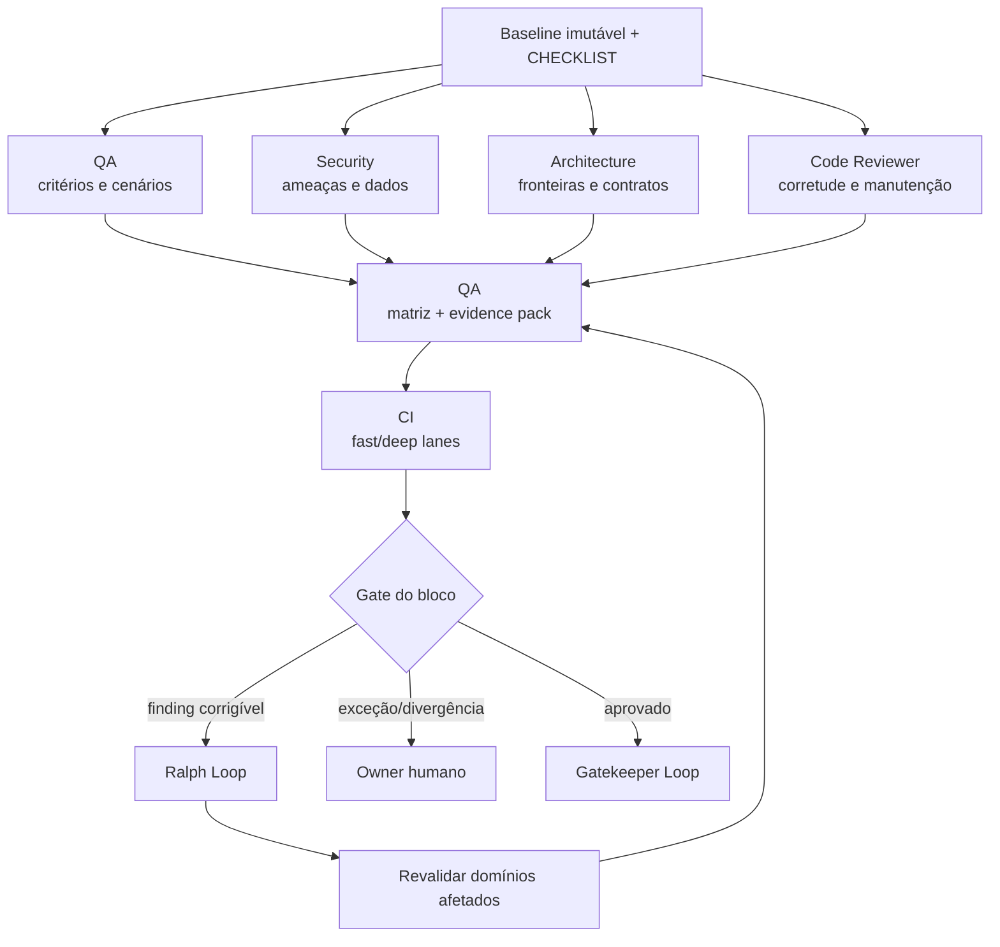

# Workflow 05 — validação adversarial

> Bloco executável do [⚔️ Red Team Loop](../docs/loops/05-adversarial-validation.md): perspectivas independentes atacam a mudança em paralelo e convergem em um evidence pack reproduzível, sem permitir que o consolidador silencie findings.

O autor demonstrou que a mudança pode funcionar; este workflow procura como ela falha. Cobertura nasce do `CHECKLIST.md`, dos contratos e do risco — não dos testes escolhidos pelo implementador.

---

## Resultado do bloco

Uma rodada fechada classifica cada critério como `passed`, `failed` ou `not_testable` com motivo, registra findings por domínio e prova revalidações. O QA Agent monta a visão única, mas o reviewer de origem mantém autoridade sobre o próprio finding.

| Camada | Condição de fechamento |
|---|---|
| **Loop** | cobertura obrigatória executada e nenhum bloqueador aberto |
| **Agentes** | QA, Code, Security e Architecture atuaram com independência e fronteiras explícitas |
| **Repositório/CI** | diff e baseline validados correspondem aos commits que seguirão ao PR |
| **Workspace** | reviews, evidence pack, Work Item, `STATUS.md` e board estão reconciliados |
| **Retorno** | correção material invalida apenas evidências afetadas e volta ao Ralph Loop com finding reproduzível |

---

## Contrato operacional

| Contrato | Definição |
|---|---|
| **Etapa** | 5 — construção e validação |
| **Unidade de execução** | conjunto imutável de commits/diffs por Work Item e `validation_run_id` |
| **Consolida** | [QA & Validation Agent](../agents/qa-validation-agent/AGENT.md) |
| **Revisores** | [Security Review](../agents/security-review-agent/AGENT.md); [Architecture Review](../agents/architecture-review-agent/AGENT.md); [Adversarial Code Reviewer](../agents/adversarial-code-reviewer-agent/AGENT.md) |
| **Owners humanos** | Tech Lead; PM/UX para ambiguidades dos próprios critérios; Security Owner para exceções correspondentes |
| **Entrada** | diff/commits, PRD, UX spec, SPEC, CHECKLIST, evidências locais, risco e matriz de paths |
| **Saída** | reviews independentes, matriz critério-evidência, findings, CI e recomendação de gate |
| **Gate de conteúdo** | todos os checks obrigatórios aprovados e nenhum finding bloqueante aberto |
| **Gate do bloco** | conteúdo + independência + baseline estável + evidence pack reproduzível + estado reconciliado |
| **Volta dominante** | média/externa — correções voltam ao Ralph Loop e CI executa lanes por risco/path |
| **Próximo workflow** | [06 — PR e merge](06-pr-and-merge.md) |

---

## Preflight de validação

1. Fixar `validation_run_id`, Work Item, repositórios, commits/base e diff exato. Novo commit material invalida o run afetado.
2. Confirmar que o autor/instância implementadora não será usado como reviewer independente.
3. Ler PRD, UX spec, SPEC, CHECKLIST, ADRs, políticas e evidence packs locais; registrar revisões.
4. Derivar matriz de cobertura por requisito, path e classe de risco.
5. Selecionar reviewers obrigatórios por política. `not_applicable` exige justificativa baseada em paths/risco; não é omissão silenciosa.
6. Resolver ambientes e permissões. Teste destrutivo, produção ou dado sensível exige autorização específica.
7. Criar arquivos de review separados; nenhum reviewer edita código ou review alheio.

### Envelope de abertura

```yaml
validation_run_id: "REDTEAM-<id>"
work_item_id: "<WI-id>"
workflow: "05-adversarial-validation"
baseline:
  base_commit: "<sha>"
  head_commit: "<sha>"
  spec: "<path@revision>"
  checklist: "<path@revision>"
repositories: []
paths_changed: []
risk: "<classe>"
required_reviewers: []
required_ci_lanes: []
permissions: []
stop_conditions: []
```

---

## Plano de missões



| Missão | Responsável | Recorte independente | Saída |
|---|---|---|---|
| M1 — cobertura funcional | QA Agent | nominal, erro, recuperação, limite, integração, E2E, acessibilidade e regressão | matriz critério-evidência e falhas reproduzíveis |
| M2 — segurança | Security Review | SAST, dependências, secrets, authn/authz, entrada, privacidade e abuso | findings e exceções do domínio |
| M3 — arquitetura | Architecture Review | fronteiras, direção de dependência, ADRs, contratos e ownership | violações/recomendação arquitetural |
| M4 — código | Adversarial Code Reviewer | corretude, concorrência, erro, compatibilidade, manutenção, testes e docs | comentários acionáveis por severidade |
| M5 — consolidação | QA Agent | montagem, não veredito sobre review alheio | evidence pack único e gaps explícitos |
| M6 — CI | automação | lanes requeridas por risco/path | resultados brutos vinculados ao baseline |
| M7 — revalidação | reviewer de origem + QA | apenas domínios/evidências invalidados pela correção | finding resolvido, aberto ou exceção |

M1–M4 rodam em paralelo contra o mesmo baseline. Se qualquer missão alterar o código, sua independência foi quebrada e o run deve ser descartado/reaberto.

---

## Ownership dos findings

Todo finding possui ID estável, reviewer, localização, cenário, evidência, severidade, impacto, ação sugerida e estado.

| Estado | Quem pode atribuir | Requisito |
|---|---|---|
| `open` | reviewer de origem | evidência e reprodução suficientes |
| `resolved` | reviewer de origem após revalidação | link para correção e nova evidência |
| `exception` | owner humano autorizado | justificativa, prazo, compensação e risco residual |
| `false_positive` | reviewer de origem ou owner da política | prova de inaplicabilidade, nunca preferência do autor |

O QA não fecha finding de Security, Architecture ou Code Review. Divergência sem regra objetiva permanece no evidence pack e escala.

---

## Skills e contexto mínimo

| Agente | Skills prioritárias |
|---|---|
| todos | `workspace-memory`, `workspace-projects`, `workspace-board` conforme operação |
| QA | `test-integration-local`, `analyse-bug`, `update-docs` |
| Security | `code-review`, `technical-discovery`, `analyse-bug` |
| Architecture | `review-spec`, `code-review`, `technical-discovery` |
| Code Reviewer | `code-review`, `review-spec`, `analyse-bug` |

Cada envelope registra `skills_used`. Reviewers recebem o mesmo baseline e apenas as políticas/contextos necessários ao domínio. Resultados e logs do autor são referência secundária, não substituto para reprodução independente.

---

## Matriz critério-evidência

O QA consolida sem resumir demais:

| Critério | Baseline | Procedimento | Ambiente | Resultado | Evidência | Reviewer | Estado |
|---|---|---|---|---|---|---|---|
| `<CHECK-id>` | `<sha>` | comando/cenário exato | versão/configuração | observado | link bruto | agente | passed/failed/not_testable |

`not_testable` nunca equivale a aprovado; registra motivo, impacto e decisão solicitada. O evidence pack precisa permitir reprodução sem conversa com o autor ou com o QA.

---

## Invalidação e revalidação

Uma correção material cria novo `head_commit` e invalida:

- testes que executaram código/paths alterados;
- findings cuja reprodução depende do comportamento modificado;
- lanes de CI cujo input mudou;
- conclusões de segurança/arquitetura afetadas pelo novo contrato.

O QA produz um mapa de impacto e solicita revalidação proporcional. Evidência não afetada pode ser preservada com justificativa e baseline composto explícito; copiar o status verde do run anterior é proibido.

---

## Persistência e ordem de fechamento

| Artefato | Destino | Writer |
|---|---|---|
| code review | `execution/reviews/code-<WI-id>.md` | Code Reviewer |
| security review | `execution/reviews/security-<WI-id>.md` | Security Reviewer |
| architecture review | `execution/reviews/architecture-<WI-id>.md` | Architecture Reviewer |
| evidence pack consolidado | `execution/evidence/<WI-id>.md` | QA Agent |
| logs/artefatos reprodutíveis | `execution/evidence/<WI-id>/` | agente/automação produtora |
| Work Item | `work-items/<WI-id>.md` | owner autorizado; links e estado |
| exceções ativas | `.coordination/blockers/` até decisão/promoção | executor |
| `STATUS.md` e `BOARD.md` | workspace Tech Lead | executor autorizado, após Work Item |

Ordem: persistir reviews individuais → gerar matriz/evidence pack → incorporar CI → revalidar resoluções → atualizar Work Item → `STATUS.md` → board → handoff ao PR Agent. Achado aberto em qualquer review bloqueia o gate.

---

## Gates

### Gate adversarial

- [ ] todo item obrigatório do CHECKLIST está `passed`, `failed` ou `not_testable` com motivo;
- [ ] cenários nominais, falhas, recuperação, limites e regressão foram derivados independentemente;
- [ ] reviewers obrigatórios atuaram ou possuem `not_applicable` justificado;
- [ ] findings trazem localização, cenário, consequência e reprodução;
- [ ] CI requerido por risco/path passou no mesmo baseline;
- [ ] nenhum bloqueador permanece `open`.

### Gate de execução em bloco

- [ ] reviewer e implementador são instâncias independentes;
- [ ] reviews foram escritos separadamente e o QA não alterou vereditos alheios;
- [ ] correções materiais tiveram impacto e revalidação registrados;
- [ ] evidence pack reproduz a verificação e referencia resultados brutos;
- [ ] Work Item, reviews, evidence, `STATUS.md` e board estão coerentes;
- [ ] handoff carrega baseline exato, riscos residuais e exceções válidas.

---

## Retornos e escalonamento

| Condição | Destino |
|---|---|
| defeito corrigível | Ralph Loop, com finding e reprodução |
| requisito de produto/UX ausente ou ambíguo | Studio Loop |
| contrato/SPEC inadequado | Drafting Loop |
| falso positivo ou divergência sem regra | Tech Lead/owner da política |
| exceção de risco | owner autorizado, com prazo e compensação |
| ambiente impede teste obrigatório | `blocked`; não converter em aprovação |
| vulnerabilidade crítica/dado exposto | interromper testes, preservar evidência com segurança e escalar imediatamente |

---

## Envelope final

```yaml
validation_run_id: "REDTEAM-<id>"
work_item_id: "<WI-id>"
workflow: "05-adversarial-validation"
status: completed | partial | blocked
transition: ready_for_pr | returned_to_implementation | returned_to_specification | escalated
baseline:
  base_commit: "<sha>"
  head_commit: "<sha>"
reviewers_run: []
reviewers_not_applicable: []
skills_used: []
outputs_created: []
checklist:
  passed: []
  failed: []
  not_testable: []
findings:
  open: []
  resolved: []
  exceptions: []
ci_lanes: []
evidence_invalidated: []
decisions_requested: []
risks: []
gates:
  passed: []
  failed: []
  not_run: []
handoff_to: []
```

`ready_for_pr` exige que o head validado seja exatamente o head entregue ao Gatekeeper Loop.
